# When Cooler Is Not Safer: Peak and In-Depth Thermal Optimisation of Atmospheric Re-entry

Adithya Kesan Jayakanth · independent capstone · 2026

*Draft status, 2026-09-21. This text was drafted by an AI assistant from the repository's result files at commit `de2a834` and has not yet been revised by the author. Every number is read from a file named in the text, a table note or a caption. The author must revise it, check it against the files, and own it before it is submitted anywhere. See §19.*

---

## 1. Abstract

A re-entry heat shield is normally designed against peak heat flux, the worst instant of heating on its outer surface, but it does not fail there. It fails at the bondline, where the thermal protection meets the structure, and the bondline responds to the heat that gets past the surface over the whole entry. This work asks whether the two quantities are minimised by the same entry, and whether optimising both together finds designs that optimising the peak alone would miss.

A reduced-order chain (US Standard Atmosphere 1976, point-mass entry, Sutton–Graves stagnation heating with an effective nose radius taken from measured stagnation-point velocity gradients, and one-dimensional transient conduction with a radiating surface) was checked against published references before use. The conduction solver agrees with an analytical solution to 0.002%, and the trajectory integrator reproduces a published closed-form-versus-numerical comparison to within 0.92 percentage points. Drag comes from a response surface fitted to 69 inviscid perfect-gas CFD cases.

Over a 41-point sweep of entry angle, peak heat flux and peak bondline temperature are strictly monotone with opposite signs. On the final model, the knee of the two-objective Pareto front runs 14.9 K cooler at the bondline than the peak-flux-only optimum, for 21.5 kW/m² more peak flux; under the declared uncertainties the paired difference is −14.31 K (s.d. 1.45 K) and is negative in all 3000 draws. That result is a statement about entry steepness at a geometry fixed by placeholder constraints, not about a located capsule shape. The hypothesis that adaptive use of CFD would reduce the number of CFD runs needed was not supported. The physical coupon experiment has not been run.

All results are model predictions within a documented set of assumptions; no flight or experimental validation is claimed.

---

## 2. Introduction

A thermal protection system (TPS) is sized against two different numbers, and the design literature is explicit about which does which job. NASA's aerothermodynamics training material states that heat flux, with pressure and shear, selects the TPS material, while heat load, the time integral of that flux, determines its thickness [2]. The same source states the consequence for trajectory design as a known trade: "The selection of γ becomes a trade between peak heat rate (TPS material selection), and total heat load (TPS thickness and mass)" [2]. A steeper entry gives a higher peak; a shallower one gives a higher total.

So the trade is known. What is stated less often is where the failure it guards against occurs. The outer surface of a heat shield is designed to get very hot and to radiate most of the incoming energy back out. The plane that matters structurally is the bondline, and the accepted in-depth criterion is a maximum temperature at that single plane, held below an allowable that comes from the structure rather than from the insulator [2].

That allowable differs between flown vehicles. The Space Shuttle Orbiter's aluminium primary structure carried a design limit of 350 °F, 449.8 K [12]. The Apollo Command Module's ablator-to-stainless-honeycomb interface was held to 600 °F, 588.7 K [11]. Orion's Avcoat over a composite skin on a titanium skeleton is quoted against 500 °F, 533.2 K [13]. In each case the number is set by what is behind the heat shield.

Peak heat flux is an instantaneous surface quantity. Bondline temperature is what remains after the whole pulse has been filtered by conduction through the stack, and it peaks late, after aeroheating has stopped, because heat already inside the material keeps diffusing inward. Stagnation heating goes as V³√ρ, so a shallower entry, which decelerates higher in thinner air, has a lower peak. It also lasts much longer. Whether that matters depends on one comparison: the diffusion time of the stack, L²/α, against the duration of the entry. If the stack is much thicker than the diffusion length √(αt), the bondline never registers the entry. If it is much thinner, the bondline tracks the surface. When the two timescales are comparable, the duration of the pulse changes the answer as well as its size. A heat shield with no spare insulation sits in that regime, because spare insulation is mass.

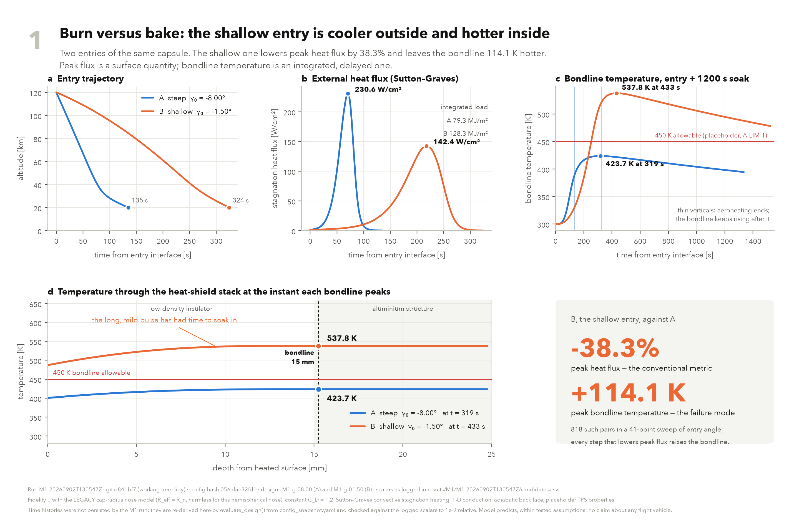

*Figure 1. Burn versus bake, the mechanism: a shallow entry lowers peak heat flux by 38.3% and raises the peak bondline temperature by 114.1 K (M1, Fidelity 0, run `M1-20260902T130547Z`). Explanatory figure: the heat-flux and in-depth histories are re-derived through `evaluate_design()` from the run's configuration snapshot and the scalars are asserted equal to `candidates.csv`; legacy cap-radius nose model, as the M1 run used. File `reports/figures/infographics/01_burn_vs_bake_mechanism.png`.*

This project asks what follows. Can minimising peak external heat flux alone select a trajectory that is worse at the bondline? Does optimising the peak and the in-depth response jointly find designs a peak-only procedure would miss? The objective is kept as a multi-objective problem throughout and is never collapsed into a weighted score.

The approach was to build a reduced-order chain, check each component against a reference outside the project before using it, demonstrate the effect where the model is defensible, and then add a CFD-derived drag model under an explicit gate: no CFD result could enter the optimisation until mesh independence, force convergence and a published blunt-body comparison were documented. Optimisation, an optimiser comparison, an adaptive-fidelity study and an uncertainty study followed on that model.

The claim is narrow on purpose. Within a verified reduced-order model and a documented set of assumptions, peak heat flux and peak bondline temperature are optimised by different entries, and the knee of the joint front has a cooler bondline than the peak-flux-only optimum by an amount that survives the declared uncertainties. The paper claims nothing about a flight vehicle, a qualified material or a flight condition, and no experimental validation exists.

One thing about provenance belongs here and not in a footnote. The research question, the locked objective and the three hypotheses were set out in a project specification that I received and accepted. The framing that minimising peak heat flux may not give the thermally safest entry came from that specification, not from an observation made during this work. What was done here is the modelling, the verification, the attempts to falsify, and the decisions about what the evidence supports. The dated record of how the question developed is `docs/research_story.md`.

---

## 3. Related Work

Every citation in this section was opened and read during the project and recorded in `docs/validation/sourcing_report.md` or `docs/theory/*`, or is marked as secondary. Sources that could not be obtained are named as gaps. Tiers appear in the reference list.

### 3.1 Stagnation-point heating correlations

Sutton and Graves fitted a stagnation-point heating coefficient to equilibrium boundary-layer solutions across nine base gases and twenty-two mixtures [1]. Their equation is written in stagnation pressure and enthalpy, q̇_w = K √(p_s/R)(h_s − h_w), with K = 0.1113 kg·s⁻¹·m⁻³ᐟ²·atm⁻¹ᐟ² for air, an average correlation error of 3.3% and a maximum of 9.8%, fitted over stagnation enthalpies of 2.3 to 116.2 MJ/kg and pressures of 0.001 to 100 atm. The report states that radiative heating was neglected.

The form used throughout the entry literature, q̇″ = k √(ρ_∞/R_n) V_∞³, does not appear in that report, and neither does the constant usually attributed to it. Reaching it needs three substitutions: a Newtonian stagnation pressure, a total enthalpy of V²/2, and a cold wall. The chain is given in NASA training material [2] and in Carroll and Brandis [3], both secondary. Section 6.3 reports what happened when I carried the algebra through from the primary.

The largest unquantified term in this class of correlation is surface catalycity. Secondary sources characterise the equilibrium-boundary-layer basis as equivalent to a fully catalytic wall, and report catalytic heat flux at roughly twice non-catalytic values for comparable conditions [4]. This project does not quantify it.

The standard critical review of these correlations is attributed to Tauber. The repository's own records of whether that document was read contradict each other, so no claim in this paper rests on it (see the second block of §20).

### 3.2 Stagnation-point velocity gradients on blunt bodies

The 1/√R_n scaling is a statement about the stagnation-point velocity gradient, and it is exact only for a sphere. Zoby and Sullivan treat the general blunt body by defining an effective radius: the radius of the hemisphere whose stagnation velocity gradient equals the body's, R_b/R_eff = (dU/dS)_BB/(dU/dS)_hemi, their equation (5) [5]. Their method rests on the stagnation-region pressure distribution being invariant above about Mach 3.5. Ellison measured the same quantity on nine models at Mach 8, tabulating R_b/R_eff over K = R_b/R_n in {0, 0.417, 0.707} and corner ratio R_c/R_b in {0, 0.2, 0.4} [6]. Two features of that table matter here. The effective radius saturates: a flat face with a sharp corner reaches 3.155 R_b, not infinity. And a rounder corner raises stagnation heating.

Ellison states the disagreement between the two sources himself: within 10% at K = 0 and K = 0.707, and about 20% at K = 0.417 with a sharp corner [6]. K = 0.417 is where this project's optimised designs sit. Substituting an effective radius into a Sutton–Graves-form correlation has a published precedent in Zoby's own later work [7].

Neither source publishes a formula. The interpolation used here is this project's construction over their data points. A 2026 paper whose title describes a closed-form reconstruction of the Zoby–Sullivan scaling exists and is paywalled; it has not been read.

### 3.3 Ballistic entry trajectory solutions

Allen and Eggers give the classical closed-form treatment under a straight flight path, negligible gravity, an exponential atmosphere and constant drag coefficient [8]. Because the closed form neglects gravity, a correct numerical integrator must disagree with it, more so as entry flattens. Putnam and Braun quantify that disagreement for three entry cases, with peak-deceleration differences of +34.9%, −5.1% and −57.3% for sample-return, steep-strategic and shallow LEO-return entries [9]. That published disagreement is the validation target used in §6.2. The Stardust reconstruction gives a flight value, 32.89 g measured against 32.86 g predicted [10], but comparing against it needs a drag coefficient for that capsule that could not be sourced. Two standard textbooks on entry mechanics (Vinh, Busemann and Culp; Regan and Anandakrishnan) could not be obtained.

### 3.4 TPS sizing criteria and limits

NASA training material describes baseline TPS sizing as computed to a bondline temperature limit, with thermal margin applied to that criterion [2]. The three flown limits of §2 are all read from primaries [11–13]. One qualification: CR-159900 states 350 °F as the aluminium airframe's design limit and rates the RTV-560 adhesive itself to 500 °F; no primary sentence was found tying 350 °F to the adhesive line.

For deceleration, no document states a flat scalar. NASA-STD-3001 gives a duration-dependent sustained-acceleration curve; for a deconditioned crew it runs from 14.0 g at 0.5 s to 4.0 g beyond 150 s [14]. Published peak decelerations of crewed entries are 7.6 to 11.1 g for Mercury, 4.3 to 7.7 g for Gemini, 3.3 to 6.8 g for Apollo and 3 to 4 g for nominal Soyuz [15].

### 3.5 Cumulative thermal-exposure metrics

The project defined and tested a Thermal Penetration Index (TPI), a weighted double integral of temperature exceedance over depth and time. Such metrics have several independent literatures: integrated heat load in aerothermal design [2]; the CEM43 thermal dose in hyperthermia, read through a consensus paper that reproduces it [16]; and the Arrhenius damage integral of burn-injury work, read through a review [17]. A search for a named metric of the TPI's exact shape in TPS design found none in the sources it could reach. That is a negative search result, not a proof of absence and not a novelty claim; paywalled, industry-internal and export-controlled material was not reachable.

### 3.6 Base drag, and flown capsule shapes

The CFD here computes forebody drag only, so base drag comes from a stated assumption. Chapman [18] and Love [19] give the semi-empirical foundations; Miller's wind-tunnel study of blunted 9° cones at Mach 10.5 to 20 reports base drag under about 2% of total for bluntness ratios of 0.55 to 0.8 [20]; Hoerner gives the qualitative trend [21]. Every quantitative dataset found is low-Reynolds-number tunnel data. Flight backshell pressure from Mars 2020 exists and was reached at abstract level only [22].

Nine flown vehicles were checked in primaries to place the design box [23]. Shallow spherical-cap capsules cluster at R_n/D of about 1.0 to 1.2 (Apollo 1.20, Mercury 1.07); blunted sphere-cones cluster at 0.25 to 0.5. Apollo's commonly quoted 32.5° half-angle could not be confirmed in a primary, whose baseline configuration gives 33.0°.

No literature on multi-objective optimisation or on machine-learning surrogates was opened for this project, so none is cited.

---

## 4. Hypotheses

Three hypotheses were frozen in the specification before any model was built, and are reproduced verbatim.

> **H0.** Minimising peak heat flux alone does not necessarily produce the thermally safest re-entry solution.
>
> **H1.** Joint optimisation of peak heat flux and in-depth TPS response can identify safer feasible designs than peak-heat-only optimisation.
>
> **H2.** Surrogate-assisted and AI-guided adaptive-fidelity search can approach the Pareto frontier with fewer expensive CFD evaluations than unguided or brute-force search.

H0 is an existence claim. It asks for one pair of designs A and B with q″_max(B) < q″_max(A) and T_bond,max(B) > T_bond,max(A) inside the model's valid domain, and it is falsified by searching and finding none. The search is automated, and a pair counts only if the flux reduction is at least 1.0% and the bondline penalty at least 1.0 K; both thresholds were declared in advance. The falsifying outcome is reachable and was reached once: with a 40 mm insulator the bondline rose 8.8 K over a whole entry, so for that stack the two metrics are effectively independent (NR-03). That is what makes the later positive result a statement about a regime.

H1 is a comparison, falsified if a joint optimiser and a peak-flux-only optimiser over the same feasible set select designs whose bondline temperatures do not differ beyond the model's resolution. Two definitions were fixed first. "Joint" means the knee of the combined feasible front, the point furthest from the chord joining the front's extremes in normalised objective space, which contains no weights. "Safer" is reported as an absolute temperature difference, because a margin ratio swings from 37.5× to 1.6× as the bondline allowable moves from 445 K to 500 K.

H2 was given a criterion in `configs/adaptive_fidelity.yaml` before any run. Cost is the number of CFD calls charged when an arm's truth hypervolume first reaches 95% of a reference value. H2 is `SUPPORTED` only if the arm that buys no CFD fails to reach the target in at least three of five seeds, the adaptive arm does reach it, its median cost is below the best non-adaptive arm's, and a one-sided exact permutation test gives p < 0.05. If the no-CFD arm reaches the target the verdict is `NOT_TESTABLE`, since "fewer calls" means nothing if none were needed.

| Hypothesis | Status | Evidence | Model |
|---|---|---|---|
| H0 | Supported in the tested domain | §7; `reports/milestones/M1_burn_vs_bake.md`, `M1_signature_counterexample.md`; restated under uncertainty in §13 | Fidelity 0 (constant C_D), then Fidelity 1 |
| H1 | Supported, narrowly (see §10.4) | §7.4 (Fidelity 0); §10 and §13 (Fidelity 1) | both |
| H2 | Not supported | §12; `reports/milestones/M6_adaptive_fidelity.md` | Fidelity 1 |

None of the three says anything about a real vehicle or a qualified material. H0 and H1 are statements about a model. H2 is a statement about search efficiency in that model. Whether the conduction physics behaves as modelled in a real solid is the business of the coupon experiment, which has not been run (§14).

---

## 5. Methods

Two model versions appear in this paper. Fidelity 0 has a constant drag coefficient of 1.20, so forebody shape has no aerodynamic consequence and only diameter acts, through reference area. Fidelity 1 replaces the constant with the CFD-derived drag surface of §9. Every result is labelled with the one it came from.

### 5.1 The canonical evaluator

One function, `evaluate_design(config)`, runs the whole chain: validate the geometry, obtain the aerodynamic model, integrate the trajectory, compute the heat-flux history, solve the TPS response, compute objectives, check constraints, attach provenance, return a status. No study bypasses it. The uncertainty propagation, which would naturally loop over draws outside the optimiser, was implemented by appending the draw index to the design space as one synthetic variable, so each design-and-draw pair is an ordinary design vector that is charged and logged like any other (A-UQ; `uncertainty/space.py`). Three runs of the evaluator on one configuration produce identical result fingerprints covering every metric, margin, diagnostic, the provenance block and the velocity history (`reports/milestones/M3_coupled_model.md` §10).

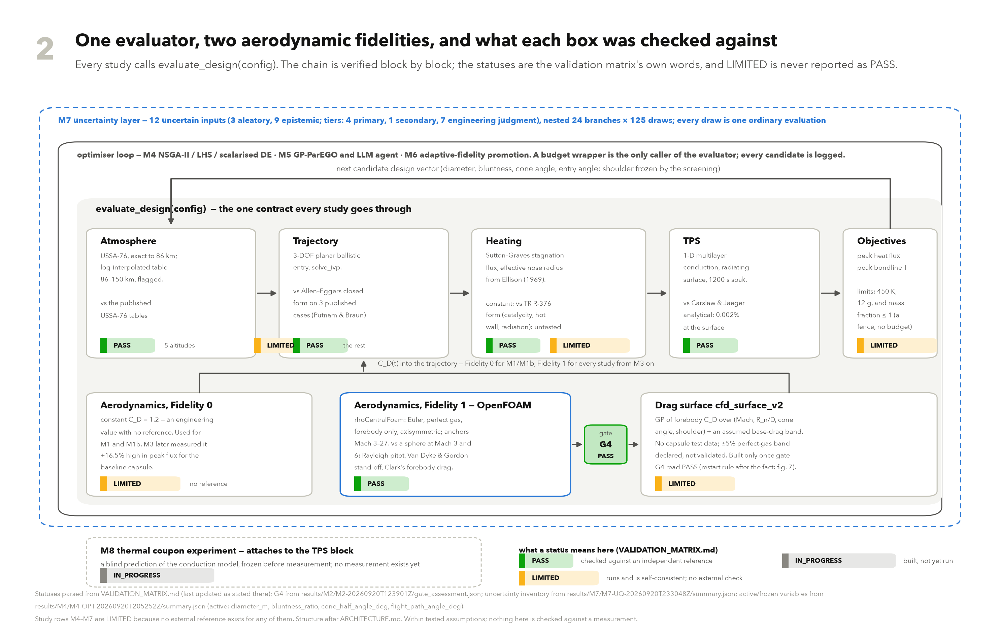

*Figure 2. The pipeline and what is validated against what. Gate statuses are the validation matrix's own (`VALIDATION_MATRIX.md`, 2026-09-21); G4 `PASS` carries its restart history (§8.2). Box descriptions paraphrase the matrix's validation-source column; no number on the figure is typed by hand. Sources: `results/M2/M2-20260920T123901Z/gate_assessment.json`, `results/M4/M4-OPT-20260920T205252Z/summary.json`, `results/M7/M7-UQ-20260920T233048Z/summary.json`, `ARCHITECTURE.md`. File `reports/figures/infographics/02_pipeline_validation.png`.*

### 5.2 Atmosphere

From 0 to 86 km the US Standard Atmosphere 1976 layer profile is integrated exactly in geopotential altitude with an ideal-gas closure [24]. From 86 to 150 km density is log-interpolated from a transcribed table, a stand-in for the species-diffusion model the standard defines there, and every value from that region is flagged `extrapolated`. Above 150 km the model raises an error (A-ATM-1 to A-ATM-3).

The assumption first attached to the upper region was that its contribution is negligible. That is true for peak heat flux and false for the bondline (§17.1).

### 5.3 Trajectory

A point-mass, three-degree-of-freedom planar entry over a non-rotating spherical Earth, state [altitude, velocity, flight-path angle, range], integrated with an adaptive Runge–Kutta scheme and terminal events; inverse-square gravity; Earth radius 6371 km; integration ends at 20 km and the thermal solve continues past that (A-TRAJ-1 to A-TRAJ-5). Earth rotation would change relative velocity by up to about 0.46 km/s at the equator, which is up to about 19% on heat flux; it shifts magnitudes and does not reverse the ordering between steep and shallow entries. There is no lift, bank or angle of attack, and mass is constant. An ablator would carry energy away as mass loss, more in the long shallow case, which would reduce the reported effect.

### 5.4 Aeroheating

Stagnation-point convective heating, q̇″ = k √(ρ_∞/R_eff) V_∞³ with k = 1.7415×10⁻⁴ kg^½ m⁻¹, and the integrated external heat load as its time integral (A-HEAT-1 to A-HEAT-4). It is convective only and cold-wall. It is evaluated at the stagnation point only: the model says nothing about the shoulder or afterbody, which is a limitation and not a conservatism, and §10 shows an optimiser finding it.

#### The effective nose radius

The radius fed to the correlation is not, in general, the nose cap radius. For a sphere the only available length is its radius, so the stagnation velocity gradient goes as 1/R and the 1/√R heating law follows. For a shallow spherical cap the pressure falls from its stagnation value over a distance set by the body radius and the corner, so the benefit of flattening the nose saturates. The repair used by both primaries is to keep the sphere formula and feed it the radius of the hemisphere that would give the body's actual gradient [5, 6]. The implementation interpolates Ellison's nine measured values of R_b/R_eff, with an exact hemisphere anchor at K = 1, shape-preserving cubic in K and linear in corner ratio. That interpolation is this project's own construction (A-GEO-3a). For K > 1 the model falls back to R_eff = R_n and flags the result. Validity from the primaries: zero angle of attack, K in [0, 1], R_c/R_b ≤ 0.4, Mach above about 3.5.

The two models agree identically at K = 1. The burn-versus-bake results of §7 use a hemisphere-nosed body (R_n = D/2), so they are unchanged by the correction, and a test reproduces the persisted results bit for bit under the legacy default. The optimised designs of §10 sit at K ≈ 0.42, where the correction raises peak flux by about 20% (§17.1).

### 5.5 Thermal protection system

One-dimensional transient conduction through a multilayer stack: finite volumes, harmonic-mean interface conductivities, backward Euler (A-TPS-1 to A-TPS-9). The harmonic mean is what series thermal resistances give, and it matters most at the insulator-on-aluminium interface that sets the bondline temperature. Backward Euler is unconditionally stable; the explicit limit for this mesh is about 0.018 s, against roughly 2800 implicit steps per evaluation. It is first order in time, and Crank–Nicolson remains an open item.

The surface balance, q_net = q_conv − εσ(T_s⁴ − T_sink⁴) with ε = 0.85 and a 4 K sink, is Newton-linearised about the current surface estimate. The first implementation used fixed-point iteration and diverged (NR-01). The back face is adiabatic, which over-predicts the bondline for every case alike. The solve continues for 1200 s past the end of the trajectory at zero incident flux, because the bondline peak lags the pulse; omitting that phase under-predicted the bondline peak by about 50 K on a 20 mm stack (NR-02). Each candidate carries its bondline warming rate at the end of the window so a truncated solve is visible.

Material properties are placeholders of the right order for a low-density insulator on an aluminium-like structure (A-TPS-7). They are not those of any qualified TPS material, so absolute temperatures are indicative only. The insulator is 15 mm. At the original 40 mm the bondline moved 8.8 K over a whole entry, because √(αt) with α ≈ 8.9×10⁻⁷ m²/s over a 245 s entry is about 15 mm (NR-03). The effect studied here can be designed away with insulation, at a mass cost.

### 5.6 Geometry

The forebody is parametrised as sphere, cone, torus, cone, flat base, with a pure spherical segment as the limit of zero fore-cone length. `CapsuleGeometry.validate()` decides validity inside the evaluator. An invalid capsule is returned as an infeasible candidate with the validator's message and stays in the log, so the boundary of the valid region is data.

### 5.7 Constraints and metrics

Every evaluation returns peak heat flux, integrated external heat load, peak surface temperature, peak bondline temperature, a bondline exposure metric, thermal penetration depth, maximum deceleration, maximum dynamic pressure, entry duration, feasibility and every constraint margin. An unsourced limit is stored as `null` and skipped, never treated as satisfied (A-LIM-2).

Three limits are active in the optimisation studies, and their standing differs.

- Bondline allowable, 450 K. Sourced: the Shuttle's aluminium-structure design limit, 449.8 K [12]. It is a substrate limit, right here only because the modelled structure is aluminium-like (A-LIM-1a).
- Deceleration, 12 g. Not sourceable as a flat number (A-LIM-1b). It matches no documented sustained-g curve. I have not changed it, because the choice between relabelling it as an emergency envelope and adopting the NASA-STD-3001 duration curve decides what kind of vehicle this is. It is an open decision (§16).
- Heat-shield mass fraction, ≤ 1.0. A logical necessity, not a mass budget (A-OPT-6): the forebody TPS cannot outweigh the vehicle. It was added after the optimiser produced shields heavier than the vehicle (§17.1).

Each candidate also carries audit diagnostics: the share of heat load accrued above 86 km, the soak-out warming rate, bluntness ratio and heat-shield mass fraction.

### 5.8 Fidelity 1 and the studies built on it

The CFD model and its gate are §8; the drag surface is §9. Optimisation methods and budgets are in §10, the optimiser comparison in §11, the adaptive-fidelity design in §12 and the uncertainty design in §13. Each study's success criterion was written into a configuration file before the study ran, and each long run hashes the physics source at launch and aborts if it changes (§17.4).

---

## 6. Verification and Validation

Verification asks whether the equations are solved correctly; validation asks whether they are the right equations. Status vocabulary is fixed: `NOT_STARTED`, `IN_PROGRESS`, `PASS`, `FAIL`, `LIMITED`. A row is `PASS` only when checked against an independent reference, and `LIMITED` is never written as `PASS`. The full matrix is `VALIDATION_MATRIX.md`; Table 1 summarises it.

**Table 1. Gate statuses (source: `VALIDATION_MATRIX.md`, 2026-09-21).**

| Gate | Subject | Reference | Measured | Status |
|---|---|---|---|---|
| G1A | Atmosphere 0–86 km | published USSA-76 layer-base values [24] | within 0.01% on T, 0.1% on p | PASS |
| G1A′ | Atmosphere 86–150 km | primary Table I at 90, 100, 110, 120, 150 km [24] | agreement to every printed digit at those five | PASS at five altitudes, LIMITED elsewhere |
| G1B | Trajectory | Putnam & Braun Table 2 [9] | nine figures within 0.92 points (allowance 1.0) | PASS |
| G2 | Heating constant | TR R-376 eq. (33), Table II [1] | re-derived to +0.39% (primary's own error 3.3%) | PASS |
| G2′ | Heating model form | none | not attempted | LIMITED |
| G3 | TPS conduction | semi-infinite solid, constant flux (see §20, second block) | 0.002% at surface; energy residual ~1e-14 | PASS |
| G3b | Bench boundary terms | closed forms | 1e-4 steady state, 2e-3 lumped decay | PASS (internal) |
| G-GEO | Capsule geometry | internal cross-checks | 42 tests | PASS (internal) / LIMITED |
| G-GEO2 | Effective nose radius | Ellison Table I [6]; Zoby & Sullivan [5] | exact at nine points and both limits | PASS implementation / LIMITED physics |
| G4 | CFD | §8 | §8 | PASS, with a history (§8.2) |
| G5 | Coupled evaluator | self-equality of fingerprints | identical over three runs | PASS (software gate only) |
| M3 | Drag surface | none for capsules | §9 | LIMITED |
| M4–M7 | Studies | none external | §10–§13 | LIMITED |
| M8 | Coupon experiment | none yet | no measurement exists | IN_PROGRESS |

### 6.1 Atmosphere

G1A′ was opened because a widely used online table labels its data above 84.852 km as a different atmosphere model in a place that is easy to miss. The transcribed values at five altitudes were diffed against 300 dpi renders of the primary with tolerance set to half the primary's printed resolution. They agree to every printed digit; the largest relative difference is 1.6×10⁻¹⁵. That does not establish the 86, 95 and 130 km rows, the pressure column, or the log-interpolation between rows. This matters because 5 to 20% of a feasible design's integrated heat load accrues above 86 km (§17.1), and the bondline objective responds to integrated load.

### 6.2 Trajectory

The validation reproduces a published disagreement instead of seeking agreement with the closed form. Under Putnam and Braun's stated assumptions (exponential atmosphere with ρ₀ = 1.215 kg/m³ and 8500 m scale height, constant gravity 9.81 m/s², radius 6378 km, no lift) the integrator reproduces all nine published figures. The largest residual is 0.92 percentage points, on sample-return peak deceleration (+35.82% against a published +34.9%).

One artefact found on the way looked like physics. The steep case peaks near 6 km altitude at 4.4 km/s, so consecutive output samples are about 440 m apart and the raw peak altitude was quantised; the first test reported +5.16% against a published +3.6%. Parabolic refinement through the three samples around the peak removed it. G1B validates the integration under an exponential atmosphere, constant gravity and constant C_D. It does not validate the production configuration, and no flight trajectory has been reproduced.

### 6.3 Heating: the constant, and the model form

The primary's equation and K = 0.1113 for air, carried through the three substitutions with the units handled explicitly, give

    k = K_air / (2√101325) = 0.1113 / 636.632 = 1.74826×10⁻⁴,

which is +0.39% from the 1.74150×10⁻⁴ in the code. The declared tolerance is the primary's own 3.3%.

I did not change the constant, because the derivation is less accurate than the gap it measures. At the baseline condition the exact perfect-gas stagnation-pressure coefficient is 1.83937, not the Newtonian 2, worth −4.10% on k; the cold-wall assumption is worth −1.10%; the dropped freestream enthalpy +0.81%. Applying all three gives 1.6717×10⁻⁴, which is −4.01% in the opposite direction. The code's value sits between two defensible derivations and the evidence cannot separate them. The exact digits 1.7415 could not be reconstructed from the primary by any route tried. The useful output is a bound: treat the correlation as ±4% at best and propagate that (A-HEAT-1, NR-12).

G2′, the model form, is `LIMITED` and was not attempted: catalycity (roughly a factor of two [4]), the cold-wall assumption applied to a surface near 2400 K, neglected radiation, and no rejection of inputs outside the primary's fitted domain. Every uncertainty figure in §13 is therefore a lower bound.

### 6.4 Conduction

G3 compares the solver with the analytical solution for a semi-infinite solid under constant surface flux, at four depths and at the surface, against a declared tolerance of 0.2%. Measured: 0.002% at the surface and an energy residual near 1e-14, with grid and timestep convergence demonstrated (`tests/test_tps.py`). A residual at that level is round-off, the expected signature of a conservative finite-volume scheme in which each face flux appears once with each sign. This is the `PASS` the headline result rests on. The citation for the analytical solution has not itself been checked against a copy of the book (§20).

### 6.5 What the gates do not establish

G1A′ validates a transcription at five altitudes. G1B validates an integration under assumptions chosen so that a closed form exists. G2 validates a constant, not a correlation. G4 validates a CFD pipeline on a sphere at Mach 3 and 6 (§8). Nothing in the matrix is validated against a physical measurement.

The sourcing pass that produced three of these rows changed no number. The baseline was re-run before and after and is bit-identical: 160.28 W/cm², 494.8 K, 11.89 g. I had written beforehand that at least one of the numbers would turn out wrong.

---

## 7. Burn-vs-Bake Result

Everything in this section is Fidelity 0: constant C_D = 1.20, and the legacy effective-radius setting R_eff = R_n. For these geometries (hemisphere nose, K = 1) the legacy and corrected heating models agree identically, so the numbers are unaffected by the correction of §5.4. They are affected by the constant drag coefficient: §9 shows that the CFD-derived surface raises the baseline capsule's peak flux by 16.52% and its bondline by 9.56 K. Read the magnitudes here as legacy-model numbers. Run `M1-20260902T130547Z`.

### 7.1 The sweep

Entry flight-path angle was swept from −8.00° to −1.50° in 41 steps with every other variable at baseline. Each candidate ran the full chain; none was discarded.

**Table 2. Endpoints of the sweep (source: `reports/milestones/M1_burn_vs_bake.md`).**

| | A: steep, γ₀ = −8.00° | B: shallow, γ₀ = −1.50° |
|---|---|---|
| Peak heat flux | 230.64 W/cm² | 142.38 W/cm² |
| Integrated external load | 79.3 MJ/m² | 128.3 MJ/m² |
| Entry duration | 134.8 s | 324.1 s |
| Peak bondline temperature | 423.7 K | 537.8 K |

B reduces peak flux by 38.3% and runs the bondline 114.1 K hotter. An automated search over all 1640 ordered pairs, with the thresholds of §4, found 818 counterexample pairs (`M1_signature_counterexample.md`).

What this establishes is monotonicity. Over the whole range, every step that lowers peak flux raises bondline temperature, and no interior angle improves both. That is enough for H0. The Spearman rank correlation over the sweep is −1.000, and that number is tautological: two strictly monotone functions of one swept variable can only give ±1. It restates "both are monotone in γ with opposite signs" and measures nothing about a design space, because this domain is a line segment.

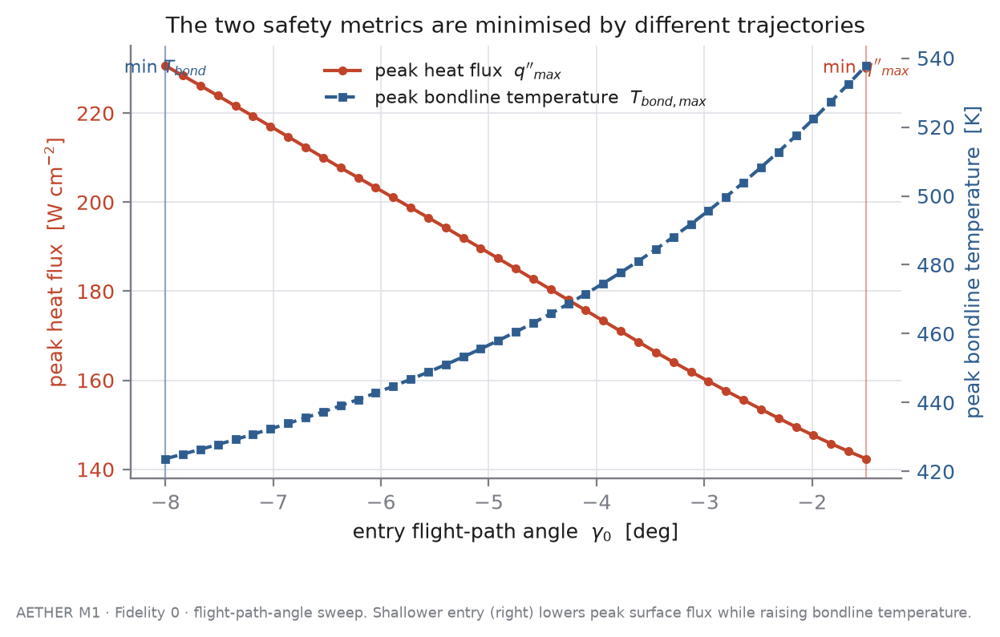

*Figure 3. Peak stagnation heat flux (W/cm²) and peak bondline temperature (K) against entry flight-path angle (degrees), 41-point sweep, Fidelity 0, run `M1-20260902T130547Z`. File `reports/figures/M1_anticorrelation.png`.*

### 7.2 Mechanism

The shallow entry decelerates in thinner air for longer. Peak flux falls, the pulse lengthens from 135 s to 324 s, and the integrated load rises from 79.3 to 128.3 MJ/m². The stack's diffusion length over a 245 s entry is about its own thickness. A short intense pulse is absorbed near the surface and re-radiated at T⁴ before it diffuses inward; a long mild pulse reaches the bondline.

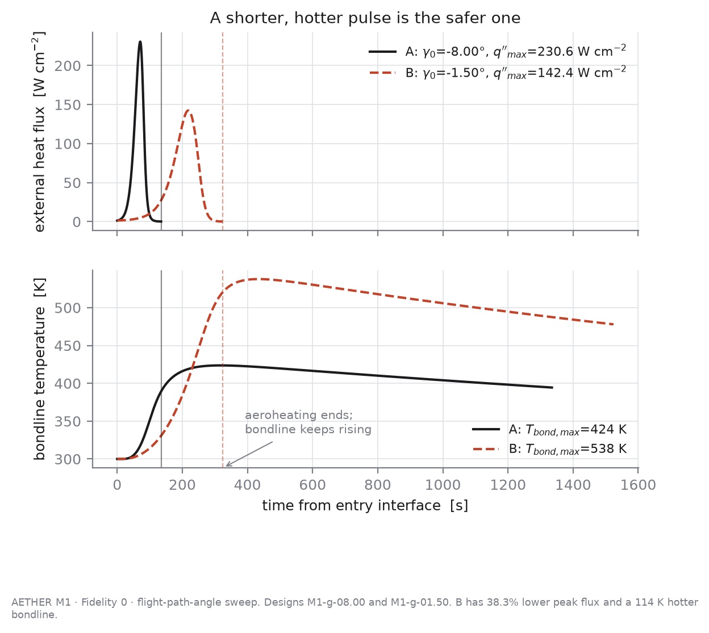

*Figure 4. Heat-flux histories and in-depth temperature response for the steep and shallow entries of Table 2, Fidelity 0, run `M1-20260902T130547Z`. File `reports/figures/M1_mechanism.png`. The depth-against-time field is `reports/figures/M1_temperature_field.png`; integrated load against bondline temperature is `M1_integrated_vs_bondline.png`.*

### 7.3 No candidate was feasible

Zero of the 41 candidates satisfy both hard constraints. Steep entries exceed 12 g; shallow ones exceed 450 K at the bondline. I did not anticipate this. With geometry frozen, trajectory shape cannot produce a valid design, which is why the geometry axis was opened immediately.

### 7.4 Opening the diameter axis

A full-factorial grid over entry angle and diameter, 140 evaluations with mass and bluntness ratio held constant, recovers 21 feasible designs.

**Table 3. Fidelity-0 optimiser comparison (source: M1 report §M1b).**

| | Baseline | Peak-flux-only optimum | Joint optimum |
|---|---|---|---|
| Entry angle | −3.00° | −1.50° | −3.50° |
| Diameter | 1.20 m | 3.00 m | 3.00 m |
| Ballistic coefficient | 257.9 kg/m² | 41.3 | 41.3 |
| Peak heat flux | 160.28 W/cm² | 37.01 | 44.27 |
| Integrated load | 112.5 MJ/m² | 32.1 | 26.5 |
| Peak surface temperature | 2381 K | 1626 | 1699 |
| Peak bondline temperature | 494.8 K | 444.1 | 411.6 |
| Maximum deceleration | 11.89 g | 9.13 | 11.69 |
| Feasible | no | yes | yes |

The joint optimum runs 32.5 K cooler at the bondline for +19.6% peak flux. Both optima sit on the 3.0 m diameter bound, so the bound is selecting them, and they should be read as "at least this far in this direction". What happened when the bound was widened is in §17.1.

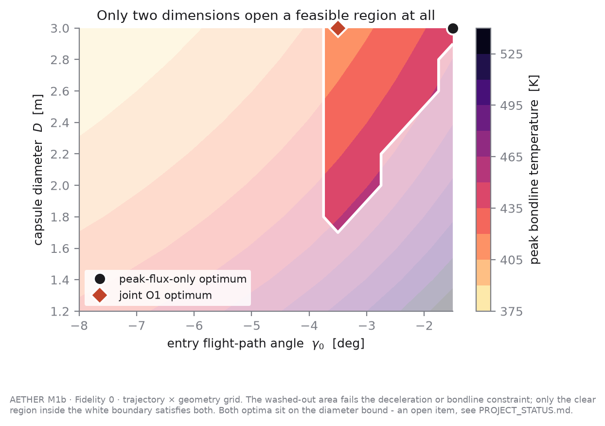

*Figure 5. Feasible region on the entry-angle (degrees) by diameter (m) grid with the 12 g and 450 K constraints, 140 designs, Fidelity 0, run `M1-20260902T130547Z`. File `reports/figures/M1b_feasible_region.png`. The two selected designs are compared in `M1b_optimiser_comparison.png`; the trade space of the one-parameter sweep is `M1_trade_space.png`.*

The deceleration limit decides this region. On the stored grid, a 10 g limit leaves 4 of 140 designs feasible and an 8 g limit leaves none (`ASSUMPTIONS.md`, open decision under A-LIM-1b).

---

## 8. CFD

### 8.1 Model and scope

`rhoCentralFoam`, axisymmetric Euler equations on a 5° wedge, calorically perfect air (γ = 1.4), Kurganov flux with van Leer reconstruction, local time stepping, forebody-only domain ending in a supersonic outflow plane. OpenFOAM v2512 was used; the specification names v2606 (A-CFD-6). The forebody-only domain was chosen because an inviscid wake never reached a steady base pressure (NR-06), so base drag is an assumption with a band (§9).

Within its tested assumptions the CFD may be used for forebody pressure-drag coefficients, forebody surface pressure and perfect-gas shock shape. It may not be used for heating of any kind, base drag, flight shock stand-off, shock-layer temperatures, lift, moments or stability (`docs/validation/M2_model_form_limits.md`). No heating quantity in this paper comes from CFD.

### 8.2 Gate G4

Benchmark: a sphere of radius 0.5 m at Mach 3 and 6 on three meshes (3,072, 12,288 and 49,152 cells). Run `M2-20260920T123901Z`. The force criterion, declared before the runs, requires forebody C_D over the final 2000 iterations to have peak-to-peak variation ≤ 0.1% and half-window drift ≤ 0.02%.

**Table 4. Mesh study and benchmark (source: `reports/milestones/M2_cfd_validation.md`).**

| Mach | C_D coarse / medium / fine | observed order | GCI_fine | p₀/p∞ vs Rayleigh pitot | stand-off vs Van Dyke & Gordon [26] | C_D,fore vs Clark's expression [27] |
|---|---|---|---|---|---|---|
| 3 | 0.84440 / 0.84613 / 0.84692 | 1.13 | 0.098% | +0.14% (±1%) | +0.95% (±5%) | −0.32% (±3%) |
| 6 | 0.86890 / 0.87090 / 0.87199 | 0.88 | 0.187% | −0.44% (±1%) | +0.65% (±5%) | −1.82% (±3%) |

The gate reads `PASS`, and it has a history that belongs next to it. On the original runs both fine-mesh cases ended in a bounded limit cycle, peak-to-peak 0.282% and 0.223% after 100,000 iterations with drift one to two orders below its limit, and the gate read `LIMITED` (`gate_assessment_20260921_0057_before_restarts.json`, kept). The criterion was not changed. Following the specification's failure-handling order, each fine case was continued as a new case at a lower Courant limit (0.1), and met the criterion in two consecutive blocks (0.033% and 0.077%). The restart rule and the rule for which solution is "of record" were written after the original results had been seen (NR-25). A reader who does not accept a rule written after the fact should read G4 as `LIMITED`; the evidence for both readings is in the run directory.

Other things a reader should know. The observed order at Mach 6 is below one, and it is computed from a fine-to-medium difference of about 0.1%, so it is weakly determined. Stagnation pressure and stand-off are single final-iteration snapshots; for p₀/p∞ the snapshot noise is as large as the mesh-to-mesh differences, so its Richardson value is not relied on. The Mach 6 convergence margin is thin. Sphere total drag is not validated: the measured free-flight totals are forebody plus base plus friction, and this CFD computes the first only. A full-body negative case was run inside the pipeline and fails the criterion, as it should.

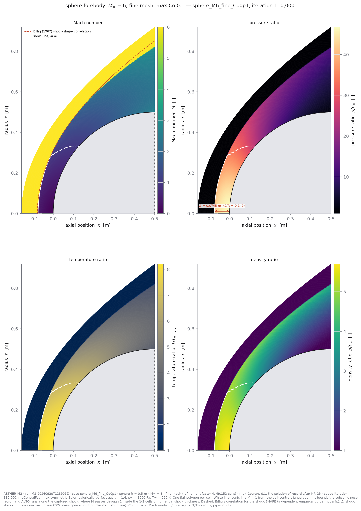

*Figure 6. Sphere, R = 0.5 m, M∞ = 6, fine mesh (refinement factor 4, 49,152 cells), the max-Courant-0.1 solution of record after NR-25, saved iteration 110,000: Mach number, p/p∞, T/T∞ and ρ/ρ∞ in the meridional plane, one flat-shaded polygon per cell, run `M2-20260920T123901Z`, case `sphere_M6_fine_Co0p1`. rhoCentralFoam, axisymmetric Euler, calorically perfect gas γ = 1.4, p∞ = 1000 Pa, T∞ = 220 K. White line: sonic line M = 1 from the cell-centre triangulation; it bounds the subsonic nose region and also runs along the captured shock, where M passes through 1 inside the one to two cells of numerical shock thickness. Dashed: Billig's correlation for the shock shape, an independent empirical curve, not a fit. Δ: shock stand-off from `case_result.json` (50% density-rise point on the stagnation line). Colour bars: viridis (Mach, ρ/ρ∞), magma (p/p∞), cividis (T/T∞). Within its tested assumptions this CFD is used for forebody pressure drag, surface pressure and perfect-gas shock shape only; it is not used for shock-layer temperatures or heating of any kind (§8.1). File `reports/figures/cfd/M2_sphere_M6_fine_fourpanel.png`.*

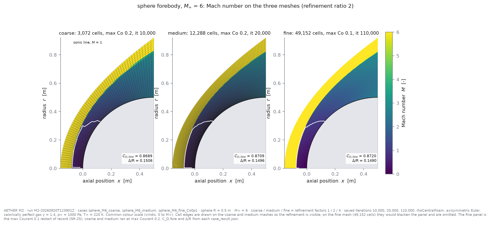

*Figure 7. Mach number for the sphere at M∞ = 6 on the coarse, medium and fine meshes (refinement factors 1, 2, 4; saved iterations 10,000, 20,000 and 110,000), common colour scale (viridis, 0 to M∞), run `M2-20260920T123901Z`, cases `sphere_M6_coarse`, `sphere_M6_medium`, `sphere_M6_fine_Co0p1`. Cell edges are drawn on the coarse and medium meshes so the refinement is visible; on the fine mesh (49,152 cells) they would blacken the panel and are omitted. The fine panel is the max-Courant-0.1 restart of record (NR-25); coarse and medium ran at max Courant 0.2. C_D,fore and Δ/R are read from each `case_result.json`. Same gas model and freestream as Figure 6. File `reports/figures/cfd/M2_sphere_M6_mesh_levels.png`.*

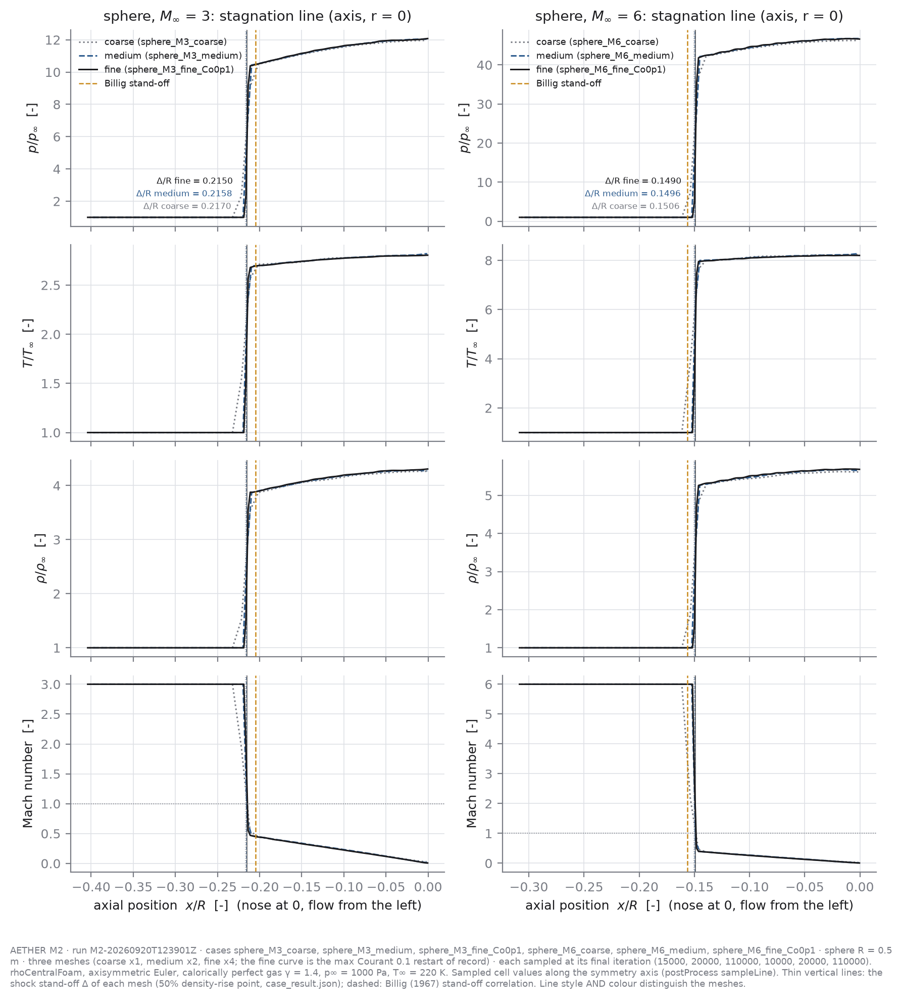

*Figure 8. Sampled cell values of p/p∞, T/T∞, ρ/ρ∞ and Mach number along the symmetry axis (`postProcess sampleLine`) for the sphere at M∞ = 3 and 6 on the three meshes, each at its final iteration (15,000, 20,000 and 110,000 at Mach 3; 10,000, 20,000 and 110,000 at Mach 6; the fine curves are the max-Courant-0.1 restarts of record), run `M2-20260920T123901Z`. Thin vertical lines: the shock stand-off Δ of each mesh (50% density-rise point, `case_result.json`); dashed: the Billig (1967) stand-off correlation, which is cited but not verified in primary by this project (§20). Line style and colour distinguish the meshes. Same gas model and freestream as Figure 6. File `reports/figures/cfd/M2_sphere_stagnation_line_profiles.png`.*

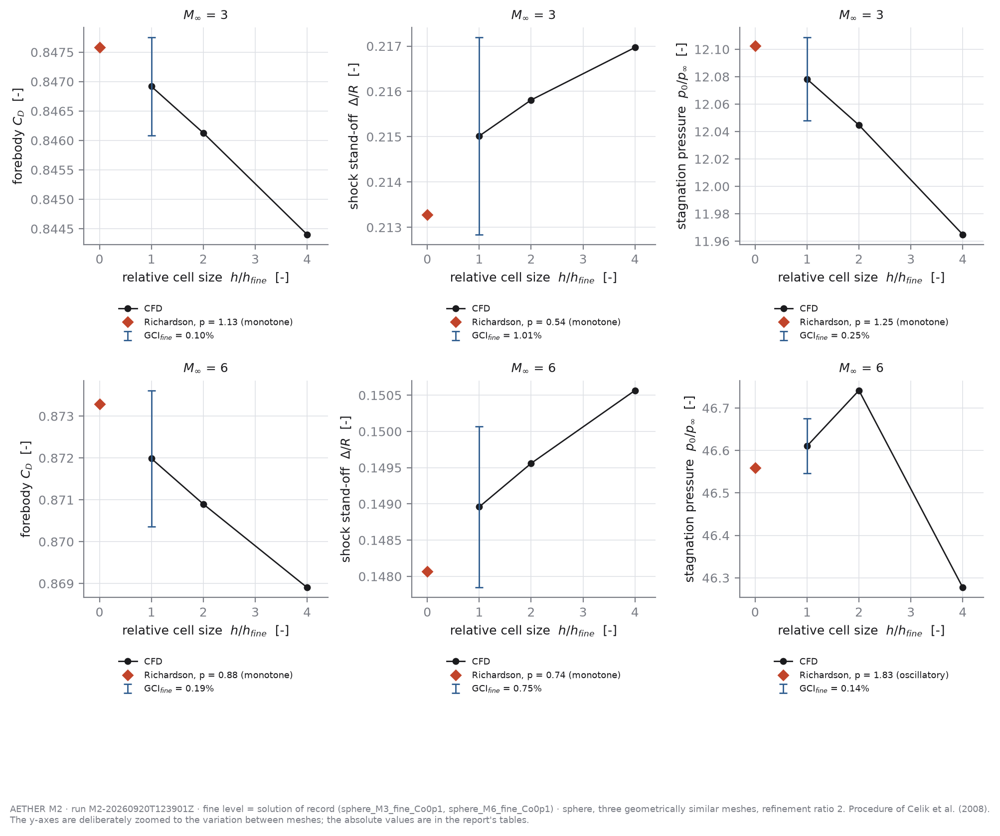

*Figure 9. Forebody drag coefficient, stand-off distance and stagnation pressure ratio against mesh level for the sphere at Mach 3 and 6, run `M2-20260920T123901Z`. File `reports/figures/M2_mesh_convergence.png`. Force histories against the declared criterion: `M2_force_convergence.png`; the fine-mesh limit cycle: `M2_limit_cycle.png`; benchmark comparison: `M2_benchmark.png`; residuals: `M2_residuals.png`.*

The GCI follows the three-grid procedure with safety factor 1.25, with formulae as given in NASA's NPARC verification tutorial [25]. The paper usually cited for the procedure could not be opened (§20).

---

## 9. Coupled Model

### 9.1 The drag surface

C_D(M, shape) = C_D,fore(M, shape) + C_D,base(M). The first term is a Gaussian process (Matérn-5/2, one length scale per input) through converged CFD cases over log Mach and three forebody ratios: bluntness R_n/D, cone half-angle, shoulder ratio R_c/D. The second is a stated assumption. Angle of attack is zero by construction. The trajectory consumes a per-capsule one-dimensional interpolant and never calls CFD or the GP inside a time step. Surface `cfd_surface_v2`, hash `b63b68a40321f38b`, run `M3-DP-20260920T1610Z`.

Of 76 planned design points, 69 were usable, 5 were rejected for missing the unchanged force criterion and 2 crashed; all stay on disk. Every point is on the coarse mesh, not the medium mesh first intended, because a medium case cost about eight times a coarse one on the available laptop. Six coarse-to-medium pairs on capsule shapes differ by at most 0.411% in C_D,fore, which shows the size of the effect and does not bound the error. The discretisation band, 0.628%, is transferred from the sphere's GCI by assumption (A-CFD-9). Scale invariance was measured: the same shape at 1.2 m and 3 m gives identical C_D,fore to the digits printed.

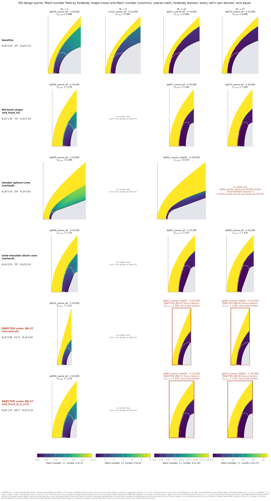

*Figure 10. Mach-number fields for six design-point shapes at M∞ = 3, 6, 20 and 27 on the coarse mesh (refinement factor 1, 3,072 cells), forebody domain from the nose to the maximum-radius station closed by a supersonic outflow, D = 1.2 m, each panel at its case's final saved iteration (in its title), run `M3-DP-20260920T1610Z`. Colour: viridis, one scale per column (0 to M∞); thin white line: sonic line; C_D,fore from each `case_result.json`. Rows 5 and 6 are the two shapes that stayed `REJECTED` under NR-27 at Mach 20 (force criterion never met in two consecutive blocks at Courant 0.2, 0.1 and 0.05) and, as NR-28 records, at Mach 27; their fields are the final saved solution of the last Courant restart, shown for what they are and not on the drag surface. There is no Mach-12 column: the design sampled Mach 12 (and Mach 6, except the baseline scale-check case `sc1p2`) only at fill-point shapes, so no usable case exists for these six shapes there. `dp062` at Mach 27 crashed in all three domain attempts without writing a second-order field (NR-28; Figure A.4). Outlines are drawn to the maximum-radius station only, where the domain ends. Same gas model and freestream as Figure 6; a calorically perfect γ = 1.4 gas is the wrong gas at Mach 20 to 27 and is carried as a declared ±5% band on C_D,fore (A-CFD-12). File `reports/figures/cfd/M3_design_point_grid_mach.png`.*

**Table 5. Surface accuracy (source: `reports/milestones/M3_coupled_model.md` §6; C_D,fore spans 0.352 to 1.553).**

| Set | n | RMSE | R² | z-score s.d. | 68% coverage |
|---|---|---|---|---|---|
| Held-out test | 8 | 0.0234 | 0.9958 | 1.70 | 0.25 |
| k-fold, all | 69 | 0.0130 | 0.9983 | 1.13 | 0.74 |

The GP is overconfident. A sigma inflation factor of 1.21 is stored with the surface and applied before sampling; the held-out spread of 1.70 on n = 8 is larger than that. A shape outside the convex hull of the CFD points is refused and returned as a rejected candidate, so failed CFD cases shrink the usable design space.

The baseline entry reaches Mach 27.1, and 55% of its heat load accrues above Mach 20, so the design includes a Mach 27 node (9 of 14 anchors usable, NR-28). Running a perfect gas to Mach 27 closes an extrapolation in Mach number. It does nothing about model form: a calorically perfect γ = 1.4 gas is the wrong gas at these speeds, and that is carried as a declared ±5% half-band on C_D,fore which this project has not validated (A-CFD-12). Base drag is bounded, not predicted, from the vacuum limit and a base-pressure ratio read off a graph in Miller [20].

### 9.2 What a constant drag coefficient was hiding

**Table 6. Same designs, constant C_D against the surface (source: M3 report §10).**

| Design | C_D constant | C_D surface at peak heating | peak flux | bondline | heat load |
|---|---|---|---|---|---|
| Baseline capsule | 1.200 | 0.8899 | +16.52% | +9.56 K | +16.08% |
| Five Fidelity-0 front designs | 1.200 | 1.3634–1.3643 | −6.02 to −5.89% | −3.15 to −2.46 K | −6.37 to −6.19% |

One placeholder number was wrong in two directions at once, and the direction depended on shape. The substitution penalises the slender-to-moderate baseline, whose drag had been over-estimated, and mildly rewards blunt shapes.

Over 12 swept shapes inside the hull at fixed diameter, mass and entry state, C_D at peak heating ranges from 0.496 to 1.378, which acting through drag alone moves peak flux by −6.35% to +60.84% and bondline temperature by −4.2 to +29.7 K. The model predicts that shape now matters. How much of that survives a finer mesh and real-gas effects is not established here.

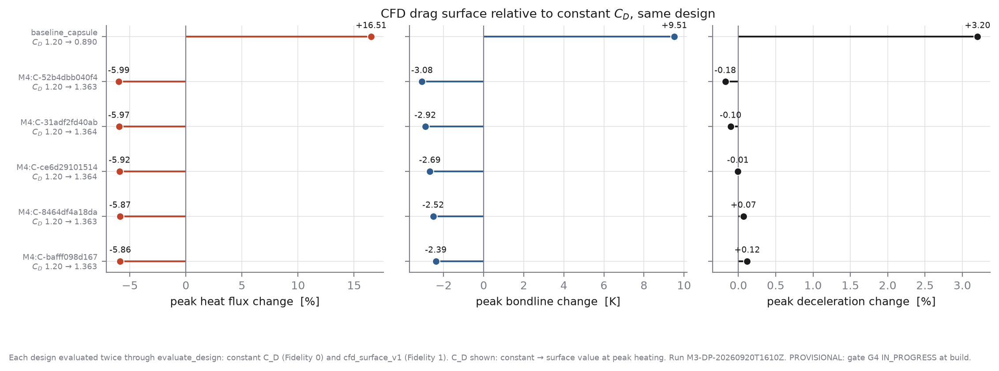

*Figure 11. Change in peak heat flux (%), bondline temperature (K) and maximum deceleration (%) when the constant C_D = 1.20 is replaced by `cfd_surface_v2`, for the baseline capsule and five Fidelity-0 front designs, run `M3-DP-20260920T1610Z`. File `reports/figures/M3_constant_vs_surface.png`. Design coverage: `M3_design_coverage.png`; C_D against Mach: `M3_cd_vs_mach.png`; cross-validation: `M3_surface_cv.png`; shape sweep: `M3_shape_sweep.png`; base-drag share: `M3_base_drag_fraction.png`; capsule family: `M3_capsule_family.png`.*

Gate G5 is a software gate. It says the coupled evaluator is deterministic and labels its aerodynamics. It says nothing about whether the drag is right.

---

## 10. Optimization

Fidelity 1. DOE run `M4-DOE-20260920T204844Z`, optimisation run `M4-OPT-20260920T205252Z`. An earlier Fidelity-0 version of this study is archived unchanged (`M4_pareto_optimisation_fidelity0.md`); its fronts were computed under the legacy heating model behind a bluntness cap since removed, and nothing here reuses them.

### 10.1 Design space and screening

Seven design variables (diameter, bluntness ratio, shoulder ratio, cone half-angle, aft cone angle, fineness ratio, entry angle), two mission givens (entry velocity, mass) and one deferred variable (insulator thickness, which with no mass objective would simply park on its upper bound). One coupled evaluation takes a median 0.150 s, so variance-based sensitivity was affordable. Of 3000 Latin Hypercube samples, 1328 were geometrically valid and 186 feasible.

Sobol' indices (Saltelli design, 6144 evaluations, output centred; estimator citations in §20) were computed on a sub-box in which every capsule exists, covering 11.8% of the shape box, and they describe only that fraction. Peak flux is dominated by diameter (S_T 0.896); bondline temperature by diameter (0.429), insulator thickness (0.377) and entry angle (0.239); deceleration by entry angle (0.979). The freeze rule, declared before the run, freezes a design variable whose total-order upper confidence bound is below 0.01 on every output and whose validity index is below 0.03. It left four active variables: diameter, bluntness, cone half-angle (which moves no objective but decides validity) and entry angle. It froze the shoulder ratio, a decision §10.3 returns to.

*Figure 12. Sobol' first- and total-order indices with 95% bootstrap intervals for peak heat flux, peak bondline temperature, maximum deceleration and heat-shield mass fraction, Saltelli sub-box, Fidelity 1, run `M4-DOE-20260920T204844Z`. File `reports/figures/M4_doe_sobol.png`. One-at-a-time sweeps: `M4_doe_oat.png`; Latin Hypercube cloud: `M4_doe_lhs.png`.*

### 10.2 Methods and fronts

Two objectives, both minimised: peak heat flux and peak bondline temperature. The TPI was studied and discarded (§17.2), so integrated load is reported on every design and not optimised. Three methods each received exactly 1000 evaluations per seed over 7 seeds, through one budget meter in which an invalid geometry costs one evaluation and a repeat costs none.

**Table 7. Method comparison, normalised hypervolume against the fixed reference point (2.5×10⁶ W/m², 450 K) (source: M4 report §8).**

| Method | Final hypervolume, mean ± s.d. | Feasible found (mean) | Front size (mean) |
|---|---|---|---|
| Latin Hypercube search | 0.2874 ± 0.0214 | 38 | 3.0 |
| NSGA-II | 0.3467 ± 0.0055 | 703 | 32.1 |
| Scalarised differential evolution | 0.2997 ± 0.0150 | 112 | 4.3 |

No significance test was applied; with seven seeds, overlapping ranges mean no measured difference. The scalarised baseline's number is a statement about its declared configuration at this budget. The combined front has 78 designs.

**Table 8. Selected designs from the combined feasible front (source: M4 report §10).**

| Design | Peak flux [W/m²] | Heat load [J/m²] | Peak surface T [K] | Peak bondline T [K] | Max g | Entry angle | Diameter [m] | Feasible |
|---|---|---|---|---|---|---|---|---|
| Reference, unoptimised | 1.868×10⁶ | 1.306×10⁸ | 2476.1 | 504.3 | 12.25 | −3.00° | 1.2 | no |
| Peak-flux-only optimum | 2.295×10⁵ | 1.975×10⁷ | 1427.7 | 418.4 | 9.22 | −1.502° | 3.37 | yes |
| Joint knee | 2.510×10⁵ | 1.781×10⁷ | 1458.7 | 403.5 | 10.35 | −2.497° | 3.367 | yes |
| Bondline-only optimum | 2.783×10⁵ | 1.621×10⁷ | 1495.7 | 391.7 | 11.98 | −3.565° | 3.355 | yes |

Relative to the peak-flux-only optimum, the knee's bondline runs 14.9 K cooler and its peak flux is 2.146×10⁴ W/m² higher. The whole front spans 26.6 K and 4.882×10⁴ W/m². The model predicts a trade-off, so H1 is supported within the tested assumptions: a search that looked at peak flux alone would have stopped at the hottest-bondline end of the front.

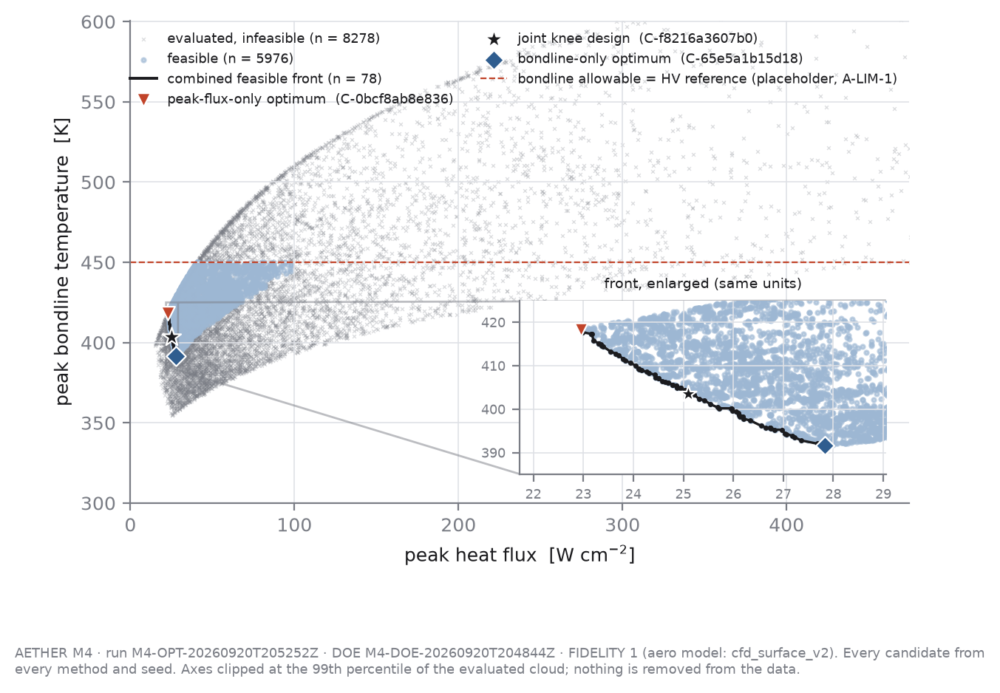

*Figure 13. Combined feasible Pareto front, peak heat flux (W/m²) against peak bondline temperature (K), with the peak-flux-only optimum, the knee and the bondline-only optimum marked; Fidelity 1 (`cfd_surface_v2`), run `M4-OPT-20260920T205252Z`. File `reports/figures/M4_pareto_front.png`. Hypervolume histories: `M4_hypervolume.png`; front in design space: `M4_front_variables.png`.*

### 10.3 The audit: what is selecting these designs

The study includes a metric-gaming audit on the 78 front designs. Its findings decide how Table 8 should be read.

Every front diameter lies between 3.355 and 3.376 m, and 50 of 78 designs are within 1% of the heat-shield mass-fraction limit. The knee is a 3.37 m, 350 kg vehicle whose forebody TPS weighs 346 kg. That is not a capsule. Vehicle mass is fixed while diameter varies, so the optimiser buys a low ballistic coefficient (about 29 kg/m²) with a shield no real vehicle could carry, until the one constraint that knows about mass stops it. There is no sourced mass budget in this project. Removing the constraint gives a front of six designs, all of which violate it.

28 of 78 designs sit on the edge of the CFD hull in bluntness, at R_n/D near 1.2. The hull ends there because that is where CFD anchors were placed, and they were placed there because the Fidelity-0 front sat on an earlier bluntness cap at 1.2. Labelled GP extrapolations beyond the hull are worth about 1% of peak flux, because the corrected nose model has nearly saturated.

64 of 78 designs have the cone half-angle within 1% of its 70° bound, held in a window of about a degree between geometric validity and the box.

The shoulder ratio was frozen at 0.10 by the screening rule, on a total-order upper bound of 0.0048. Probes through the canonical evaluator, entering no front, show that moving the three selected designs to the box minimum of 0.02 lowers peak flux by 16.6 to 19.9 kW/m², about 7%, and bondline temperature by 3.1 to 3.9 K (NR-29). A Sobol' index is a share of variance over the sub-box, where diameter carries about 0.90 of the peak-flux variance, so a lever worth 7% at the front rounds to zero. The lever is also one this heating model rewards for the wrong reason: it sees the larger effective radius a sharp corner gives and cannot see the corner's own heating. The freeze stands, labelled as a fence that happens to be in the right place.

Every front design accrues more than 5% of its heat load above 86 km, up to 20.9%.

Surface C_D at peak heating spans 1.363 to 1.364 across the front, about 0.1%. Capsule shape, which Fidelity 1 was built to let matter, does not vary along this front.

### 10.4 What H1 amounts to

Diameter is set by the mass fence, bluntness by the hull edge, cone angle by validity and the box, shoulder by the freeze. The only variable that trades the two objectives along the front is entry flight-path angle, from −1.50° (a box bound) to −3.57° (the 12 g limit). The Fidelity-1 front is a burn-versus-bake curve in entry angle drawn at a geometry chosen by fences. H1 is supported within the model by the same mechanism as §7. It is not evidence that joint optimisation finds a better capsule shape.

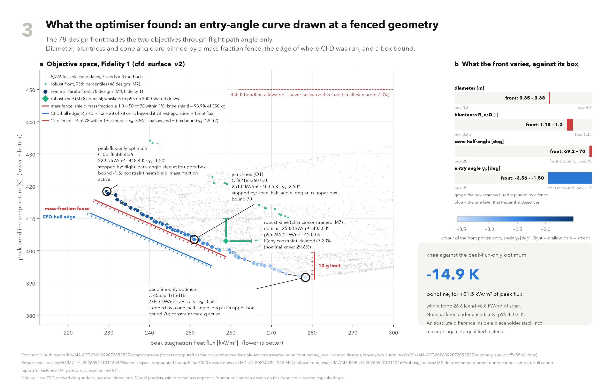

*Figure 14. What the optimiser found: the combined feasible front of §10.2 is an entry-angle curve at a geometry fixed by fences, with the robust knee of §13.5 and its 95th-percentile whiskers. Explanatory figure. The fences are drawn in objective space as pickets hugging the front; they are constraints in design space and the picket positions are illustrative, while the counts on them are the audit's (§10.3). Sources: `results/M4/M4-OPT-20260920T205252Z/candidates.csv` and `summary.json`, `results/M7/M7-LFL-20260921T011854Z/likeforlike.json`, `results/M7/M7-UQ-20260920T233048Z/summary.json`, `results/M7/M7-ROBUST-20260920T211216Z/robust_front.csv`, `reports/milestones/M4_pareto_optimisation.md`. File `reports/figures/infographics/03_pareto_front_fences.png`.*

---

## 11. AI/Surrogate Comparison

Fidelity 1. Run `M5-ABL-20260920T211134Z`. The study compared a large-language-model engineering agent with conventional optimisers at 200 evaluations per seed over 5 seeds, on the four active variables of §10. No CFD solver ran during this study; evaluations went through the drag surface.

### 11.1 Rule, methods, asymmetries

Declared before any run (`configs/ai_ablation.yaml`): at 50, 100 and 200 evaluations the agent is compared with the non-LLM method of highest mean hypervolume. "AI helped" requires a mean gain of at least 0.005 and a one-sided exact permutation test at p < 0.05 after Holm correction; "AI hurt" is the mirror; anything else is "no measured difference".

Methods: Latin Hypercube, NSGA-II at two populations, a Gaussian-process Bayesian optimiser with ParEGO scalarisation (`bo_parego`), and the agent (model `claude-sonnet-5`), which proposes batches from structured tables under a strict schema. The agent and `bo_parego` start from the same seeded initial design. The agent ran in an empty directory with tools and file discovery disabled and was told neither the model's equations nor any earlier finding.

Three asymmetries are part of what is measured. Variable and metric names carry aerospace meaning, so the agent has prior knowledge the numeric optimisers lack. The agent reads the geometry validator's failure messages, which name the variable to move; the numeric optimisers see only a violation. And the model may have seen similar problems in training.

Two disclosures. The Bayesian optimiser was changed twice after a one-seed smoke test and before any study run, and that seed was removed (NR-17). An earlier study run was aborted when the physics changed under it, and no number from it was inspected (NR-18).

### 11.2 Result

**Table 9. Pre-declared comparison (source: `reports/milestones/M5_ai_ablation.md` §4).**

| Evaluations | Best conventional (mean HV) | Agent mean HV | Difference | Holm p | Verdict |
|---|---|---|---|---|---|
| 50 | `bo_parego` 0.3145 | 0.3428 | +0.0283 | 0.0278 | AI helped |
| 100 | `bo_parego` 0.3465 | 0.3550 | +0.0085 | 0.0119 | AI helped |
| 200 | `bo_parego` 0.3520 | 0.3556 | +0.0036 | 0.0119 | no measured difference |

At 200 evaluations the test rejects (every agent seed is above every `bo_parego` seed), and the verdict is "no measured difference" because the mean gain is under the threshold declared in advance. The agent was distinguishably ahead by an amount I had declared too small to count. With n = 5 the smallest attainable one-sided p is 1/252, so only complete separation can reject. NSGA-II at 200 evaluations reached 0.2803 ± 0.0253; the same algorithm reached 0.3467 after 1000 evaluations in §10.

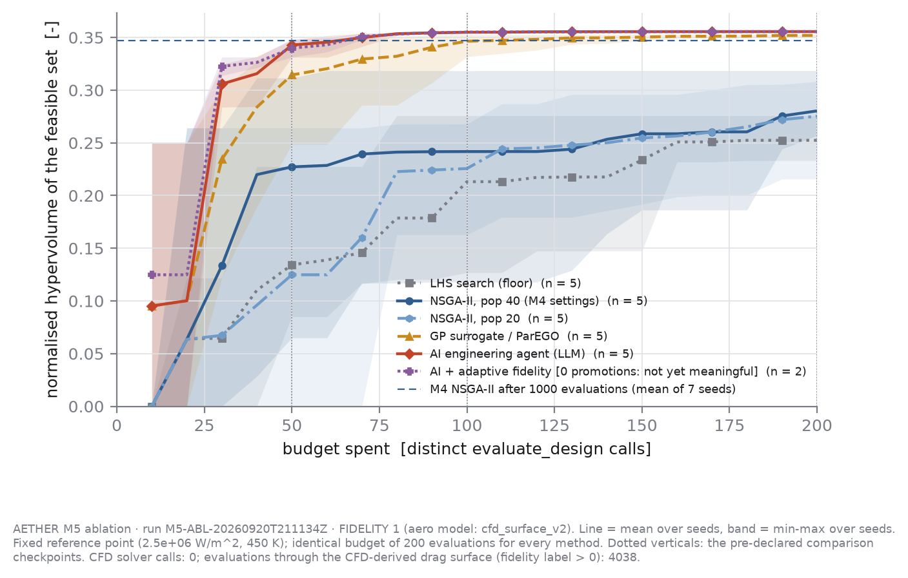

*Figure 15. Normalised hypervolume against evaluations for each method, mean and min–max band over 5 seeds, Fidelity 1, run `M5-ABL-20260920T211134Z`. File `reports/figures/M5_hypervolume.png`. Per-seed curves: `M5_hypervolume_per_seed.png`; fronts: `M5_fronts.png`; budget use: `M5_budget_use.png`; surrogate calibration: `M5_surrogate_calibration.png`.*

### 11.3 What the agent did

A hand-written audit of all 67 agent rounds (`M5_qualitative_audit.md`) is the only handle on the prior-knowledge question. Its findings:

The direction of every lever was stated in round 1, before any seed had more than three feasible designs. 35 of 47 rounds say explicitly that they rely on prior knowledge, 12 naming Allen–Eggers and 9 Sutton–Graves. First-round proposals had the direction right on 88 of 95 stated flux changes and 86 of 93 bondline changes. The agent starts where the other optimisers have to get to, and its lead at 50 evaluations measures priors plus data. The study cannot separate the two.

Some things came from the data and nowhere else. Three seeds derived in round 1, from the validator's messages, a closed-form validity rule that agrees with the evaluator on all 5400 paid designs of the run. Every seed found the CFD-hull edge from extrapolation refusals by its second or third call. Every seed stated within three to five rounds that the front is a one-parameter curve in entry angle closed by the g-limit and the mass fraction, which is §10.4's reading.

The agent is the most precise fence-parker in the study: 64% of its front designs have a mass-fraction margin below 10⁻⁴. Dropping every design within 0.1% of any constraint reduces its final lead over `bo_parego` from 0.0036 to 0.0020. 195 of its 1000 paid designs lie within 10⁻³ of an earlier one in the unit cube; removing them lowers its mean hypervolume from 0.35557 to 0.35517. In 67 rounds it never asked whether a shield weighing as much as the vehicle was a meaningful place to be (NR-32).

It also lost a correct rule. Seed 37 derived the validity rule in round 1; the prompt's digest of earlier rounds carries only the first 400 characters of one field; in round 2 the agent refitted a looser rule and sent all 20 proposals into the invalid region. That is a property of the harness.

Surrogate accuracy for `bo_parego` was scored prospectively on 900 logged predictions: 83% of its picks lay outside the training hull and were flagged as extrapolations when made; bondline RMSE was 0.811 K inside the hull and 1.49 K outside, with intervals somewhat overconfident (z-score spread 1.2 to 1.6).

The comparison holds for this model and this design space. The problem has one real trade-off and monotone free improvements, the most favourable case for prior knowledge, and it says nothing about a problem where the textbook direction is wrong. One model, five seeds.

---

## 12. Adaptive Fidelity

Fidelity 1 with real OpenFOAM calls. Run `M6-AF-20260920T211148Z`. Five arms (adaptive promotion, random, greedy, up-front space-filling, and no CFD) each ran NSGA-II for 200 cheap evaluations with a budget of 8 coarse-mesh CFD calls, over 5 seeds, all starting from the 69-point surface. A usable CFD case joins that arm's training set and the surface is refitted. Every arm was scored on a pooled-truth surface through all 178 CFD points, on the designs the arm's own final belief recommends, with recommendations that truth calls infeasible dropped. The reference hypervolume, 0.3436, comes from a dedicated 2 × 1000-evaluation search on the truth surface.

The LLM-guided adaptive arm declared in the configuration was not run; its live calls were not authorised for this run and it lies outside the declared criterion. H2's "AI-guided" clause is therefore untested.

The verdict, by the pre-declared rule, is `NOT_SUPPORTED`. The adaptive arm reached the 95% target (0.3264) in 0 of 5 seeds; it needed 3. No arm reached it in any seed. The verdict is not `NOT_TESTABLE`, which is reserved for the no-CFD arm reaching the target.

**Table 10. Arm scores (source: `reports/milestones/M6_adaptive_fidelity.md` §4; `M6_addendum_posthoc.md`).**

| Arm | Truth hypervolume, mean ± s.d. | CFD calls (mean) | Failed calls (mean) |
|---|---|---|---|
| Up-front | 0.2972 ± 0.0262 | 8.0 | 0.6 |
| Adaptive | 0.2835 ± 0.0389 | 3.6 | 0.4 |
| Greedy | 0.2823 ± 0.0395 | 7.2 | 0.8 |
| No CFD | 0.2754 ± 0.0375 | 0.0 | 0.0 |
| Random | 0.2652 ± 0.0254 | 8.0 | 0.8 |

No paired comparison of the adaptive arm with any other is distinguishable from zero at n = 5 (p from 0.11 to 0.73). With five seeds that is weak evidence of equivalence.

Three facts explain the result. First, extra CFD did not change what the designs are worth: the no-CFD arm's recommended sets score 0.2753 on the starting surface and 0.2754 on pooled truth, so 109 additional CFD points moved it by 0.0001. No arm made a false feasibility claim, and the largest optimism gap is 0.0004. The starting surface was already accurate where the objectives are decided, consistent with C_D at peak heating varying by about 0.1% across the front.

Second, the target was out of reach of the study's own search budget, a sizing flaw (NR-35). All 25 arm-seeds pooled, 5000 evaluations, reach 94.1% of the reference, below the 95% target. A saving in CFD calls could not have shown up in this criterion. The configuration's sizing had checked statistical power and machine time, not reachability.

Third, the searches never reached the front's region. Reference-front shapes have R_n/D from 0.999 to 1.133; no arm found a feasible design above 0.984 in 200 evaluations, and none of the promoting arms' 94 calls was at R_n/D ≥ 1.0. Seed explains 68.7% of the variance in final hypervolume and arm 10.6%.

The adaptive arm matched the greedy arm's score on half the calls. That is true, and it is not the criterion, so it is not claimed as support. 11 of 125 CFD cases failed and stay on record, charged.

In this design space at this budget, extra CFD bought nothing measurable, so adaptive allocation had nothing to save. H2 is not supported. It is not contradicted in general either: a space where the cheap model is materially wrong near the front is where H2 would have something to show, and this study as sized could not have detected it. A reachable criterion would be a new pre-declared study. I have left this one as written and not re-scored it.

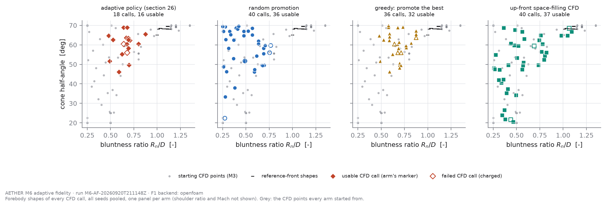

*Figure 16. Where each arm spent its CFD calls in bluntness ratio and cone half-angle (degrees), against the reference-front shapes, run `M6-AF-20260920T211148Z` (shoulder ratio and Mach not shown). File `reports/figures/M6_cfd_spend_map.png`. Truth hypervolume against CFD calls: `M6_hv_vs_cfd_calls.png` (curves rise with calls partly because search progresses while calls are spent); hold-out error of the truth surface: `M6_surface_error_vs_truth.png`.*

---

## 13. Uncertainty

Fidelity 1. Propagation and attribution run `M7-UQ-20260920T233048Z`; robust optimisation run `M7-ROBUST-20260920T211216Z`; like-for-like propagation of the robust knee `M7-LFL-20260921T011854Z`.

### 13.1 Inventory and sampling

Twelve active inputs: three aleatory (atmospheric density, vehicle mass ±2% 1σ, delivered entry angle) and nine epistemic. The epistemic set includes a discrete 50/50 switch between the two effective-nose-radius primaries, the Sutton–Graves constant ±4%, a 0.5 to 1.5 multiplier on heating above 86 km, TPS conductivity ±15%, specific heat ±10%, and four drag terms (GP, discretisation, the perfect-gas ±5% band, base drag). Seven of the twelve are engineering judgment, including both TPS property bands and the high-altitude multiplier. Density dispersions below 86 km are NASA-published standard deviations [28]; those above are this project's conversion of observed ranges.

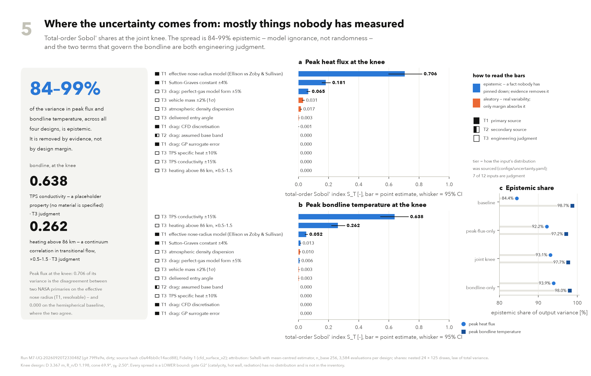

*Figure 17. Where the uncertainty comes from: 84 to 99% of the output variance is epistemic, and the two dominant bondline terms (TPS conductivity, heating above 86 km) are engineering judgment. Explanatory figure; tier and aleatory/epistemic labels are the inventory's own fields, read from `results/M7/M7-UQ-20260920T233048Z/summary.json` (attribution, propagation decomposition, uncertainty model). Every spread shown is a lower bound (§13.1). File `reports/figures/infographics/05_uncertainty_sources.png`.*

Sampling is nested: 24 epistemic branches × 125 aleatory draws with common random numbers, 3000 full evaluations per design. Aleatory and epistemic uncertainty are kept apart by the sample shape, so the primary output is a band of distributions across branches.

This is an uncertainty study of a model. It cannot cover model-form error that is not in the inventory, above all G2′. Every spread below is a lower bound.

### 13.2 Propagation

**Table 11. Peak bondline temperature under uncertainty, K (source: `reports/milestones/M7_uncertainty_robust.md` §3.1.2).**

| Design | Nominal | Mean | s.d. | p95 | p95 band over branches |
|---|---|---|---|---|---|
| Baseline | 504.3 | 503.4 | 13.75 | 523.1 | [478.7, 526.2] |
| Peak-flux-only | 418.4 | 415.1 | 7.632 | 426.2 | [404.2, 430.3] |
| Joint knee | 403.5 | 400.8 | 6.464 | 410.4 | [391.2, 412.7] |
| Bondline-only | 391.7 | 389.5 | 5.638 | 398.0 | [380.8, 399.1] |

The epistemic share of variance is 84.4 to 93.9% for peak flux and 97.2 to 98.7% for bondline temperature. Ignorance of this kind is removed by evidence, not by design margin.

The pre-declared convergence check, a bootstrap over rows, is met by all eight statistics. It understates the sampling error: rows within a branch are not independent, and resampling whole branches gives half-widths 9 to 18 times larger. On that stricter reading the baseline mean marginally misses the 1% tolerance (1.06%). Absolute means are known to a few kelvin. More branches would tighten them; more draws would not (NR-34).

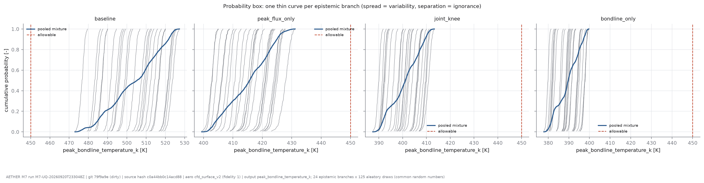

*Figure 18. Probability boxes for peak bondline temperature (K): one empirical distribution per epistemic branch for each design, 24 branches × 125 draws, Fidelity 1, run `M7-UQ-20260920T233048Z`. File `reports/figures/M7_pbox.png`. Input inventory: `M7_input_inventory.png`; pooled output distributions: `M7_output_distributions.png`; convergence: `M7_convergence.png`.*

### 13.3 Is the knee's advantage larger than the uncertainty on it?

Each design's own s.d. is 6.5 to 7.6 K, so read as independent clouds the 14.9 K difference would look marginal. That reading is wrong, because all designs were propagated on one shared draw set: draw *i* is the same atmosphere, mass, conductivity and nose-radius model for every design.

**Table 12. Paired same-draw differences in peak bondline temperature, K (source: `M7_addendum_posthoc.md` §1; `paired_difference.json`).**

| Difference | Mean | s.d. | Range | Draws with Δ < 0 | 95% CI on mean (branch bootstrap) |
|---|---|---|---|---|---|
| Knee − peak-flux-only | −14.31 | 1.45 | −17.85 to −10.80 | 3000 / 3000 | [−14.88, −13.76] |
| Bondline-only − peak-flux-only | −25.64 | 2.44 | −31.55 to −19.79 | 3000 / 3000 | [−26.59, −24.73] |

The branch-mean difference for the knee lies in [−17.05, −11.41] K and is negative in all 24 branches. Which model is right changes the size of the advantage by about ±3 K, not its sign. The knee's peak flux is higher in all 3000 draws, by 20.5 kW/m² on average. Zero of 3000 is an upper bound of 0.13% at 95% confidence, within the declared uncertainty model. A model error common to all designs moves them together, and a paired test cannot see it.

### 13.4 What drives the spread

**Table 13. Largest total-order Sobol' indices (source: M7 report §4).**

| Output | Baseline (K = 1, hemisphere) | Joint knee (K = 0.417) |
|---|---|---|
| Peak heat flux | Sutton–Graves constant 0.609; perfect-gas C_D form 0.258; mass 0.122; nose-radius model 0.000 | nose-radius model 0.706 [0.599, 0.819]; Sutton–Graves 0.181; perfect-gas form 0.065 |
| Peak bondline T | TPS conductivity 0.883; heating above 86 km 0.086 | TPS conductivity 0.638; heating above 86 km 0.262; nose-radius model 0.052 |
| Max g | entry angle 0.340; density 0.285; base drag 0.155; perfect-gas form 0.154 | entry angle 0.487; density 0.338; base drag 0.121 |

At the front, the disagreement between the two NASA primaries carries 71% of the peak-flux variance. It is exactly zero on the hemispherical baseline, where the two agree identically. It is a term that evidence could resolve. The bondline is governed by the insulator's conductivity and by heating above 86 km, both engineering judgment. The second objective is dominated by the two numbers the project has least evidence for. The GP surrogate term (≤ 0.020) and the mesh term (≤ 0.003) are negligible for every output.

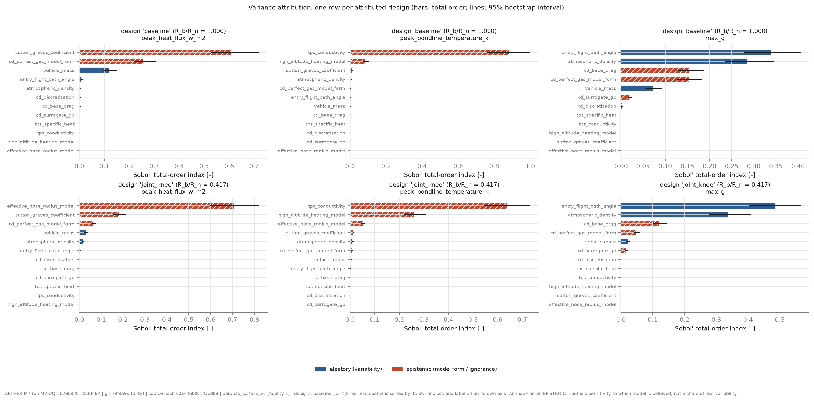

*Figure 19. Total-order Sobol' indices over the uncertain inputs for peak heat flux, peak bondline temperature and maximum deceleration, designs `baseline` and `joint_knee`, run `M7-UQ-20260920T233048Z` (regenerated 2026-09-21; an earlier version of this figure was mislabelled, NR-34). File `reports/figures/M7_attribution.png`.*

### 13.5 Fragility of the nominal optima, and the chance-constrained front

None of the three nominal optima is chance-feasible at the declared 5%. P(any constraint violated) is 34.40% [32.72, 36.12] for the peak-flux-only design, 29.60% [27.99, 31.26] for the knee and 46.60% [44.82, 48.39] for the bondline-only design. None of it is thermal: the bondline constraint is violated in 0 of 3000 draws for each. The crossed constraint is the mass-fraction fence, pushed over by the ±2% mass dispersion on a 350 kg placeholder, plus the 12 g limit for the bondline-only design (36.00%). The designs sit 0.84%, 1.09% and 0.19% from their binding constraint at nominal, which is where an optimiser leaves them. The fragility is a fact about this model's constraint set, two placeholders and a fence.

Robust optimisation minimised the 95th percentiles of both objectives under chance constraints at 5%, with 32 inner draws per candidate under common random numbers, 3 seeds × 30,000 inner evaluations. Eight front designs were re-scored with 1000 fresh independent draws. The pre-declared shortcut verification passed: relative bias −1.61% and +0.32%, Spearman 1.000 on both objectives, largest probability error 2.60%.

Two things sit beside that pass. All 46 robust-front designs show a mass-fraction violation probability of exactly 1/32 on the inner sample: the optimiser used its allowance to the last draw on 32 draws it could learn. And on fresh draws one of the eight checked designs, at the low-bondline end, reads P(any) = 5.7% against the 5% limit. A flipped verdict is not one of the three declared tolerances, so the check passes, and the flip is reported as its own line (NR-33).

The trade-off survives among chance-feasible designs: the robust front spans 30.6 K of 95th-percentile bondline temperature, and its flux-minimising end is its hottest-bondline end. At the knee, robustness costs +7.8 kW/m² (+3.1%) of nominal peak flux, through a diameter 1.0 to 1.5% smaller, and brings P(any violation) from 29.60% to 3.20% [2.63, 3.89] on the same 3000 draws. Paired with the nominal knee, its bondline is lower by 0.42 K (s.d. 0.12 K) in all 3000 draws.

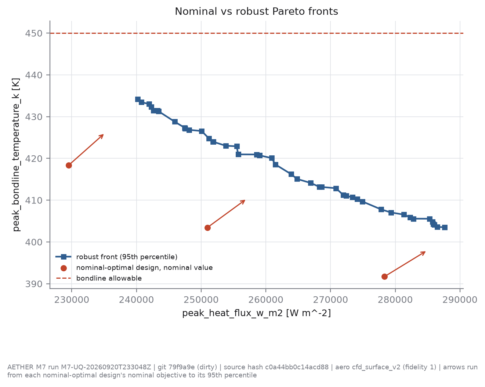

*Figure 20. Nominal Pareto front (78 designs, run `M4-OPT-20260920T205252Z`) and chance-constrained robust front (95th percentiles, run `M7-ROBUST-20260920T211216Z`), peak heat flux (W/m²) against peak bondline temperature (K); arrows join each nominal design to its own 95th percentile. File `reports/figures/M7_robust_vs_nominal.png`. Shortcut verification: `M7_shortcut_verification.png`.*

### 13.6 Final comparison

**Table 14. Final comparison. All four designs were re-evaluated under one evaluator source hash; Fidelity 1 (`cfd_surface_v2`); uncertainty rows from 3000 nested draws, seed 20260921 (source: M7 report §6; `comparison.csv`).**

| Metric | Baseline | Peak-heat-only optimised | Joint O1 optimised (knee) | Robust O1 optimised (knee) |
|---|---|---|---|---|
| Peak heat flux [W/m²] | 1.868×10⁶ | 2.295×10⁵ | 2.510×10⁵ | 2.588×10⁵ |
| Integrated external heat [J/m²] | 1.306×10⁸ | 1.975×10⁷ | 1.781×10⁷ | 1.801×10⁷ |
| Peak surface temperature [K] | 2476 | 1428 | 1459 | 1471 |
| Peak bondline temperature [K] | 504.3 | 418.4 | 403.5 | 403.0 |
| Thermal penetration depth [m] | 0.02475 | 0.01281 | 0.01256 | 0.01256 |
| TPI [K·m·s], for completeness only | 2875 | 1011 | 831.6 | 828 |
| Max g | 12.25 | 9.216 | 10.35 | 10.48 |
| Max dynamic pressure [Pa] | 4.184×10⁴ | 2618 | 2940 | 3065 |
| Entry duration [s] | 240 | 390.7 | 340.1 | 333.9 |
| Feasible at nominal | no | yes | yes | yes |
| p95 peak heat flux [W/m²] | 1.952×10⁶ | 2.352×10⁵ | 2.571×10⁵ | 2.651×10⁵ † |
| p95 peak bondline T [K] | 523.1 | 426.2 | 410.4 | 410.0 † |
| P(any constraint violated) | 100.00% [99.87, 100.00] | 34.40% [32.72, 36.12] | 29.60% [27.99, 31.26] | 3.20% [2.63, 3.89] † |

† Like-for-like cell from run `M7-LFL-20260921T011854Z`: the robust knee propagated through the same 3000 nested draws as the other columns, under a later source hash that first reproduced 120 of the study's own evaluations to 3.5×10⁻¹⁴ relative. As the study originally generated it, this cell was n = 500 mixed draws on a different seed: p95 flux 2.699×10⁵ W/m², p95 bondline 414.1 K, P(violation) 2.80% [1.68, 4.64] (14 of 500). That cell is kept in the milestone report and superseded here only because it could not be paired with the other columns.

"Feasible" is measured against a 12 g limit that is an open decision, a 450 K substrate-specific allowable, and a mass-fraction fence. Under option A of the deceleration decision it means survivable in a contingency, not acceptable for a nominal crewed entry. The TPI row is printed so a reader can check the redundancy claim of §17.2 on these designs; it ranks nothing.

---

## 14. Physical Experiment

**The experiment has not been run.** No coupon has been printed, no heater switched on, and no measurement exists anywhere in the repository. This section describes the designed experiment and the blind-prediction protocol, and leaves a marked slot for results.

### 14.1 Purpose and design

The headline result rests on one piece of physics: a slab of solid acts as a diffusive low-pass filter on a heat pulse, so interior temperature history depends on the pulse's shape as well as its energy. That has been checked only against an analytical solution, which verifies arithmetic. The experiment heats a 60 × 60 × 10 mm solid-printed polymer coupon, instrumented at four or more depths plus ambient, with two heating histories carrying the same integrated energy, one high-peak and short, one lower-peak and long, and asks whether the conduction model, calibrated on different runs and then frozen, predicts both in-depth histories (`experiments/thermal_coupon/README.md`).

It is a thermal-transient validation experiment. It is not a re-entry simulator: a hobby heater on a plastic plate near 350 K shares nothing with a 2 MW/m² stagnation point. It is also not a test of the burn-versus-bake conclusion. In §7 the longer pulse also carries a larger integrated load; here energy is held fixed on purpose, which isolates duration and, according to the package's own design calculation, reverses the ordering. The predicted difference between the two cases at the deepest sensor is a few kelvin (about 3.5 K for the placeholder properties), so sensor resolution and repeatability matter more than range. The fitted properties will be effective through-thickness values for one printed part, not datasheet values.

### 14.2 Blind-prediction protocol

1. Two-point sensor calibration and a calorimetric calibration of heater flux.
2. A dedicated steady-state run to measure heater-to-coupon contact resistance, which is then held fixed.
3. Two calibration runs: a cool-down, which pins the loss coefficients, and a constant-flux step held for at least two to three diffusion times, about an hour for a 10 mm coupon, which separates conductivity from specific heat.
4. Declare, in a committed notebook entry, the RMSE, peak error and time-to-peak error that will count as agreement, before any validation run. The comparison script assigns no verdict.
5. Freeze the parameters. Generate predictions for both validation cases. The prediction script refuses to run if the measurement file already exists. Commit and push predictions and manifests.
6. Run each validation case at least twice, logging through the post-heating soak, then compare on RMSE, peak error, time-to-peak error, residual structure and uncertainty coverage.

Steps 2 and 3, and the choice of peak estimator, came from exercising the whole chain on synthetic data before anything was built (§17.5). With those fixes the synthetic chain recovers conductivity, specific heat and both loss coefficients to better than 0.5%, fitting on a coarser mesh than the one that generated the data, and predicts an unseen pulse to better than 0.1 K against noise-free truth. That is a statement about the software. No real material was involved.

Still open and the author's to decide: which polymer and therefore the temperature ceiling, which heater, thermocouples or thermistors, how flux is known, and the tolerance of step 4.

### 14.3 Results

> **[PENDING — STUDENT] Results slot.** To be filled only after the protocol has been run: declared tolerance and its commit hash; frozen parameters; archived prediction manifest hashes; for each validation case and sensor, RMSE, peak error (smoothed-plateau estimator), time-to-peak error, residual plots and uncertainty coverage; whether the two cases differ in the predicted direction and by the predicted magnitude; anything that went wrong.

---

## 15. Discussion

The mechanism is verified and the magnitudes are model-dependent. That separation runs through every result above.

The mechanism is a comparison of two timescales inside a conduction solver that matches an analytical solution to 0.002%. Within the model it holds across every perturbation tried: across the one-parameter sweep, across a change of drag model that moved the baseline's peak flux by 16.52%, across a correction to the heating model worth 20% on the optimised designs, and across 3000 draws and 24 epistemic branches of the declared uncertainties. The ordering of the three front designs is not an artefact of the nominal point.

The magnitudes are less secure. The 14.9 K at the knee is a temperature difference inside a placeholder stack, at a geometry selected by a mass fence, a CFD hull edge, a box bound and a frozen shoulder. The Fidelity-1 drag model was built so that shape could matter, and the front it produced has the same shape everywhere. H1 is supported by the same physics as H0, entry steepness, and says nothing yet about capsule shape. A study in which shape could trade the objectives needs a mass model in which vehicle mass grows with size, a heating model that can see the shoulder, and CFD anchors beyond R_n/D = 1.2.

What would change the conclusions, in order of likely size. A catalycity or hot-wall treatment would move every heat flux, possibly by a factor near two, but in common mode; it would change levels and allowable margins more than orderings. An ablating TPS would carry energy away disproportionately in the long shallow entry and shrink the effect. A stack with much more insulation would remove the effect, as it did at 40 mm. A sourced mass budget would move the front to smaller diameters and higher heating throughout. Adopting the documented deceleration curve would empty the Fidelity-0 feasible region, and its effect on the Fidelity-1 front has not been measured because the evaluator stores peak g only. And a finding that the conduction model mispredicts a real coupon would undercut the one `PASS` the result rests on.

The uncertainty attribution reads as a list of evidence to obtain. For peak flux at the front, it is the effective nose radius at K ≈ 0.42: the single highest-value follow-up has a title and a DOI (10.2514/1.T7458) and is paywalled. For the bondline, it is a measured conductivity for an actual insulator and a defensible treatment of heating above 86 km, where a continuum correlation is being applied to transitional flow and an interpolated atmosphere.

On the two method questions. The language-model agent reached the front's structure sooner than the numeric optimisers and parked closer to two placeholder limits; nothing shows it found a design or lever that NSGA-II with five times the budget did not. The adaptive-fidelity study found that extra CFD bought nothing here, because §9's surface was already accurate where the objectives are decided. Read with §13.4, where the surrogate and mesh terms carry at most 0.02 of any output's variance, the second finding says that the drag model is not where this project's uncertainty lies.

---

## 16. Limitations

Assembled from `ASSUMPTIONS.md` and the limitation sections of the milestone reports.

### 16.1 Fidelity of reported numbers

§7 is Fidelity 0 with the legacy nose-radius setting (harmless at K = 1) and a constant C_D that §9 shows to be wrong by +16.52% in peak flux for the baseline. §10 to §13 are Fidelity 1, which means a better drag model, not a validated one.

### 16.2 Gate statuses

`LIMITED`: G1A′ outside five altitudes; G2′ entirely; G-GEO2 physics; the drag surface (no capsule validation data, coarse mesh, sphere-derived discretisation band, perfect gas, assumed base drag, per-case iterative scatter up to about 0.2%); every study row M4 to M7 (no external reference exists for any of them). G4 is `PASS` under a restart rule written after the first results were seen. G5 is a software gate. M8 is `IN_PROGRESS`.

### 16.3 Heating, aerodynamics and TPS

Heating is stagnation point only, convective only, cold wall, catalycity unquantified. Heating above 86 km, 5 to 21% of integrated load for feasible and front designs, lies outside the continuum regime Sutton–Graves describes. The effective-nose-radius model rests on Mach 8 tunnel data transferred by a pressure-invariance argument, on this project's own interpolation between nine points, and on two primaries that disagree by about 20% where the front sits.

The aerodynamics are inviscid, perfect gas, zero angle of attack, forebody only. The ±5% model-form band is declared and has not been validated. No lift, trim or stability exists in the model, so the stability constraint named in the objective is not checked at all.

The TPS model has placeholder properties, constant with temperature, no ablation, adiabatic back face, no contact resistance, one-dimensional.

### 16.4 Constraints

The deceleration limit is an open decision for the author. Flat 12 g appears in no NASA document found. Option A keeps 12 g and relabels it an emergency envelope; option B adopts the NASA-STD-3001 deconditioned duration curve, which needs a pulse-duration metric the evaluator does not compute and which, measured on the Fidelity-0 grid, leaves 4 of 140 designs feasible at 10 g and none at 8 g. The mass-fraction limit of 1.0 is a fence; no sourced mass budget exists, and the knee's shield is 346 kg of a 350 kg vehicle. Variable ranges are engineering choices.

### 16.5 Statistics and process

Five seeds for the optimiser comparison and the adaptive-fidelity study; seven for §10 with no significance test. Twenty-four epistemic branches. Seven of twelve uncertainty inputs are engineering judgment. Every uncertainty figure is a lower bound.

Most of the code was AI-generated and most of it has not yet been read line by line by the author (§19). No external technical review has been requested or received. The physical experiment has not been run. Several milestone reports carry a dirty-working-tree flag in their headers.

---

## 17. Negative Results

Thirty-five entries are kept in `docs/negative_results.md`, including ones whose evidence is a scratch run that no longer exists, labelled as such. This section reports those that changed what the project claims. It sits before the conclusion because several numbers above cannot be read correctly without it.

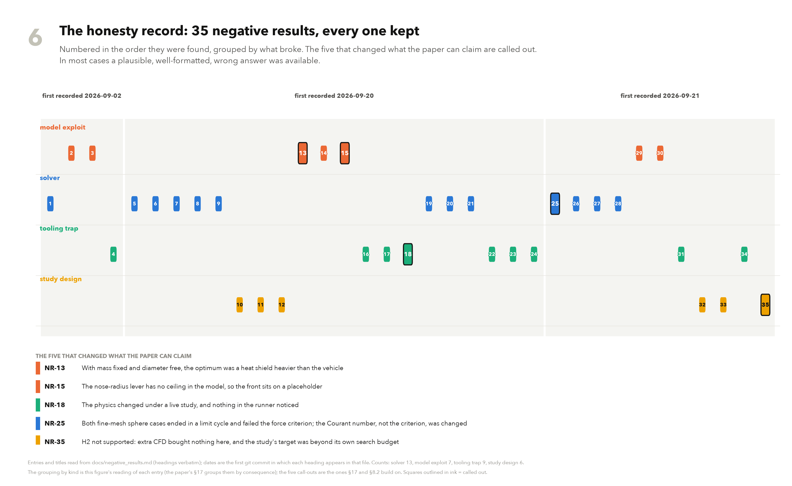

*Figure 21. The negative-results timeline: the thirty-five entries of `docs/negative_results.md` in four kinds, with five called out. Explanatory figure; titles are the file's verbatim headings, dates are from `git log -S` on that file, and the grouping by kind is the rendering script's own classification, labelled as such on the figure. File `reports/figures/infographics/06_negative_results_timeline.png`.*

### 17.1 The model had holes, and the optimiser found them

#### A heat shield heavier than the vehicle (NR-13)

Drag area grows with D² while vehicle mass was a fixed configuration value, so both objectives improve with diameter and nothing charged for it. I had anticipated this by arithmetic, and the first Latin Hypercube confirmed it. Under the two original constraints the non-dominated set was four designs at 3.9 to 4.5 m whose forebody TPS alone weighed 1.29 to 2.81 times the entire vehicle, and 482 of 1328 evaluable samples violated mass closure. A constraint at 1.0 excludes only the impossible, and the front then sits on it (§10.3). It is the earlier finding that both Fidelity-0 optima sat on the diameter bound, seen from the other side.

#### An unbounded nose-flattening lever (NR-15)

With R_eff taken as the cap radius, flattening the nose lowered both objectives and cost nothing. All 64 designs on the Fidelity-0 front ended at a bluntness ratio of 1.18 to 1.20 against a cap of 1.2. The cap had been placed in advance, and recorded at the time as the wrong kind of fix: a constraint at the edge of validity is a fence, not a model, and "the optimiser chose 1.2" meant "the fence is at 1.2". What the fence was hiding, measured once the corrected model existed:

| Bluntness change | Δ peak flux, legacy R_eff = R_n | Δ peak flux, corrected |
|---|---|---|
| 1.2 → 1.26 (where geometry refuses) | −2.41% | −0.92% |
| 1.2 → 1.35 (box edge) | −5.72% | −2.15% |
| 1.2 → infinitely flat | −98.90% | −21.31% |

An infinitely flat nose removing 98.9% of stagnation heating is wrong by construction, because 1/√R_n goes to zero while a flat face has a finite velocity gradient. Re-evaluating the 64 designs under both models: R_eff is 0.685 to 0.693 of the cap radius, peak flux rises 20.2 to 20.8%, bondline temperature by 6.7 to 9.1 K, and all stay feasible. All 64 landed essentially on one of Ellison's nine tabulated bodies, so the correction interpolates almost nothing, which was luck. The stated uncertainty got worse, because the primaries disagree by about 20% at exactly that geometry.

#### The fix moved the exploit (NR-15 follow-up, NR-29, NR-30)

Under the corrected model a sharper shoulder lowers stagnation heating, and the model cannot see shoulder heating. I wrote that down before the next run. The optimiser then never touched the shoulder, because the screening rule froze it, and the probes of §10.3 show the frozen lever is worth about 7% at the front. The bluntness cap, removed from the configuration, came back as the edge of where CFD had been run. Three fences in sequence, each standing where the previous one stood, each labelled.

#### "Negligible above 86 km" was false for the bondline (NR-14)

Over the first Latin Hypercube the share of integrated heat load accruing above 86 km had a median of 9.5% and a maximum of 27%, and among feasible designs was never below 5.0%. It rises with diameter (correlation 0.83), so the designs both objectives favour spend longest where the atmosphere is an interpolated table and the heating correlation is out of regime. Nothing was tuned; the share became a per-candidate diagnostic.

### 17.2 A metric proposed, tested against a threshold declared first, and discarded (NR-10)

The specification asked for a Thermal Penetration Index. It was implemented, verified on closed-form cases, and evaluated over the 140-design grid against a redundancy criterion written into a configuration file before the run (run `TPI-20260920T124732Z`). Its ranking is 99.94% reconstructible by rank regression on peak bondline temperature and integrated load; Spearman ρ against bondline temperature alone is +0.9992; 91 of 9730 ordered pairs are ranked differently; a TPI-minimising optimiser selects the same design as a bondline-minimising one. All 16 combinations of reference temperature and weighting fail together. Verdict: discard.

The pre-registered prediction was half wrong. The theory note predicted the outcome and gave a mechanism, that the integrand would be dominated by the outer millimetre or two. The outermost 20% of depth carries only 27.6 to 40.6% of the integral. The real mechanism is shape invariance: normalised exceedance profiles of all 140 designs have a minimum pairwise cosine similarity of 0.9366, so any weighted depth integral recovers one scale factor. The distinction changes what future work should try: the stack would have to change, not the weighting. The prediction text is left as written with the addendum beside it.

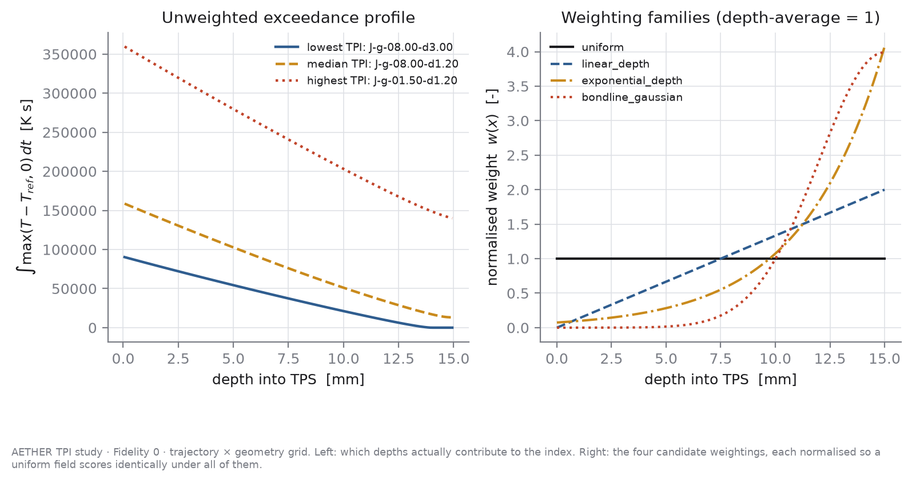

*Figure 22. Depth weightings and normalised time-integrated temperature-exceedance profiles for the 140 grid designs, reference configuration T_ref = 400 K, insulator depth 15 mm, run `TPI-20260920T124732Z`. File `reports/figures/TPI_weighting_and_profile.png`. TPI against bondline temperature: `TPI_vs_bondline.png`; sensitivity to the 16 configurations: `TPI_sensitivity.png`; rank residuals: `TPI_rank_residual.png`.*

### 17.3 Tools that produced a plausible number instead of an error

#### The Pareto front was wrong and a figure caught it (NR-04)

The first dominance test had inverted control flow and returned all 21 feasible designs as non-dominated. The plotted front zigzagged. A two-objective front must be monotone, so the plot falsified the code. No test had asserted monotonicity.

#### A variance estimator gave impossible intervals (NR-16)

First-order Sobol' intervals on the bondline came out as wide as [−0.41, 1.15]. The estimator's variance was dominated by the output's 400 K mean. Centring the output, on the same 6144 evaluations, gave [0.30, 0.45]. Total-order indices were unaffected, so no screening decision changed.

#### A Bayesian optimiser quietly stopped optimising (NR-17)

A GP classifier returned NaN, the acquisition became all-NaN, and the loop fell through to space-filling samples. Hypervolume did not show it, because on this problem the front is found early. It showed in where the budget went. A second fault sent 60% of the budget to capsules that cannot exist. These observations came from a scratch run no longer on disk and are recorded as mechanism, not results.

#### A hull test depended on the triangulation (NR-23)

After one arm bought one CFD point, 6 of its next 20 designs were rejected as extrapolations. A convex hull cannot shrink when a point is added. A frozen variable written as a length and divided back gave a unit coordinate of 1 + 2.2×10⁻¹⁶, exactly on a facet, and membership depended on which triangulation was built: 48 of 48 query points inside the 56-point hull, 1 of 48 inside the 57-point hull. In the adaptive-fidelity study this would have punished every arm that buys CFD. It was found because an aborted run's log was read before being set aside.

#### A convergence pass nearly admitted two drifting CFD cases (NR-27)

The restart code stopped as soon as the criterion was met after two blocks. Two cases met it in exactly one window that followed windows which had not; one's window-mean C_D alternated by 0.45% between blocks. The rule now requires two consecutive passing blocks. It was written during the run after an interim look, which is disclosed; it is stricter, and it removed two points the looser reading would have put into the surface.

#### Generated reports carried sentences from an older model (NR-31, NR-34)

The optimiser-comparison report labelled 4038 drag-surface look-ups as "CFD calls" in a study that ran the solver zero times. The uncertainty report printed a projected throughput as a measured one, understated its sampling error about tenfold, and drew an attribution figure whose y-axis labels belonged to another panel: the 0.609 bar labelled as entry angle was the Sutton–Graves constant. Every table number matched its JSON. The generators were corrected once no study held the source tree, and a checker confirmed that no stored value moved: 2,551 and 13,744 prior values unchanged, and 272 of 275 table rows identical with 3 differing for declared reasons (`REPORT_REGENERATION_2026-09-21.md`).

### 17.4 The failure that was organisational (NR-18, NR-24)

A two-hour optimiser-comparison study was launched as a detached job. While it ran, a concurrent work-stream changed the evaluator's physics. The runner had snapshotted its configuration, but worker processes import the package when spawned, so an edit to the source can split one candidate log between two physics models with nothing in the log to say which row is which. The header said only "dirty tree". The run was killed; no summary was written and no number from it was inspected; the directory is kept with a note that it must not be analysed.

A configuration snapshot, a commit hash and a dirty flag are not provenance for a long run in a repository several processes edit at once. Every long study now hashes each source file of the physics package at launch, re-checks after every logged batch, and on a mismatch logs what was paid for, writes an abort marker and stops. A study refuses to start on a screening made for a different design space. Report generators no longer contain pre-written findings. The guard then aborted two adaptive-fidelity development runs, correctly, because of another work-stream's edits. This failure would have produced a complete, plausible, well-formatted report.

### 17.5 A gate that first read LIMITED (NR-25)

§8.2 gives the account. The point for this section is that the `LIMITED` assessment is kept on disk beside the `PASS`, and that the mean of the limit cycle was not the fixed point: the converged C_D differs from the oscillating window mean by about 0.03%, a third of the fine-to-medium difference, which moved the observed order from 0.67 and 0.60 to 1.13 and 0.88.

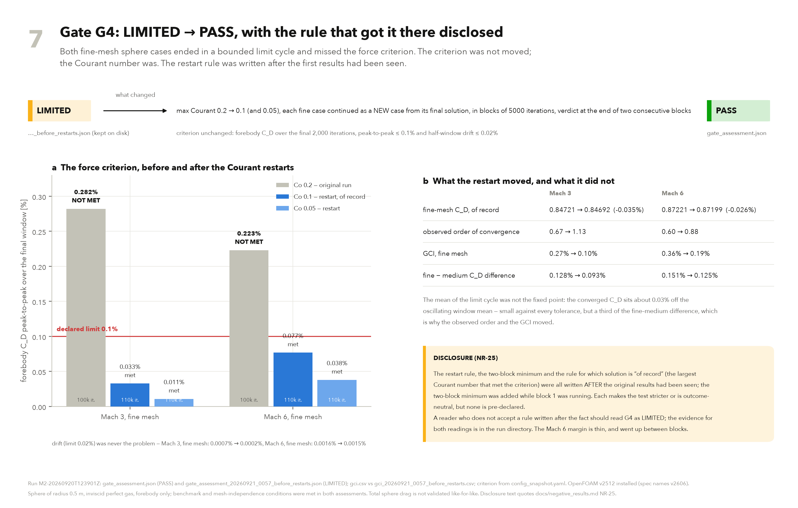

*Figure 23. Gate G4 history: `LIMITED` to `PASS` by lowering the maximum Courant number from 0.2 to 0.1 on the fine-mesh cases; the restart rule was written after the first result had been seen and is disclosed (NR-25, §8.2). Explanatory figure read from `results/M2/M2-20260920T123901Z/gate_assessment.json`, `gate_assessment_20260921_0057_before_restarts.json`, `gci.csv`, `gci_20260921_0057_before_restarts.csv` and `config_snapshot.yaml`. File `reports/figures/infographics/07_gate_G4_history.png`.*

### 17.6 The experiment's traps, found before anything was built (NR-11)

Four traps surfaced on synthetic data, each of which would have been invisible in a real experiment because the calibration would have fitted well with wrong parameters. Contact resistance, fitted freely under a prescribed flux, came back 186 to 531% wrong and dragged conductivity and specific heat 5 to 12% low. A calibration step of about one diffusion time left conductivity and specific heat each about 12% low while their ratio was recovered to 0.4%. The maximum of a noisy record is biased high, and averaging the near-peak plateau left +1.36 K of bias because the window is selected by the noisy maximum; smoothing first cut it to +0.08 K. And the "seeded" synthetic data used Python's salted string hash, so it differed between processes while looking deterministic within one.

### 17.7 H2, and a study sized against an unreachable target (NR-35)

§12 gives the result. The lesson recorded is procedural: before fixing a hypervolume target, run the no-CFD arm and the reference search at the planned budgets and check that the target can be reached.

### 17.8 A validation exercise that changed nothing (NR-12)

Three long-standing citations were opened for the first time, and not one number changed (§6.3, §6.5). The same pass found that a deceleration limit nobody had questioned corresponds to no document.

### 17.9 Why these are kept

Several numbers elsewhere depend on them: the Fidelity-0 fronts are superseded because of §17.1, the TPI is absent from the objectives because of §17.2, and the front of §10 has to be read through its fences. In most of these cases a plausible, well-formatted, wrong answer was available, and what caught it was not the test suite. It was a figure with real axes, an interval outside its possible range, a budget that went somewhere unexpected, a log that was read, or a guard that fired when it was inconvenient.

---

## 18. Conclusion

Within a reduced-order model whose conduction solver, trajectory integrator and heating constant were each checked against an external reference, peak external heat flux and peak bondline temperature are minimised by opposite ends of the tested range of entry angle. H0 is supported in that domain.

On the final model, with drag from a CFD-derived surface and heating corrected for the stagnation velocity gradient, the knee of the two-objective front runs 14.9 K cooler at the bondline than the peak-flux-only optimum for 21.5 kW/m² more peak flux, and the paired difference under the declared uncertainties is −14.31 K, negative in every draw and every epistemic branch. H1 is supported, narrowly: it is a statement about entry steepness at a geometry set by an unsourced mass-fraction limit, the edge of where CFD was run, a box bound and a frozen shoulder. The knee's heat shield is 346 kg of a 350 kg vehicle. The nominal optima violate a non-thermal constraint in 29.6 to 46.6% of draws; a chance-constrained knee reduces that to 3.20% for 3.1% more peak flux.

H2 was not supported. Adaptive use of CFD reached the pre-declared target in none of five seeds, the target was unreachable at the study's budget, extra CFD changed the no-CFD arm's score by 0.0001, and the AI-guided arm was not run. A language-model agent beat the best conventional optimiser at 50 and 100 evaluations and showed no measured difference at 200 under a rule declared in advance; its early lead cannot be separated from prior knowledge.

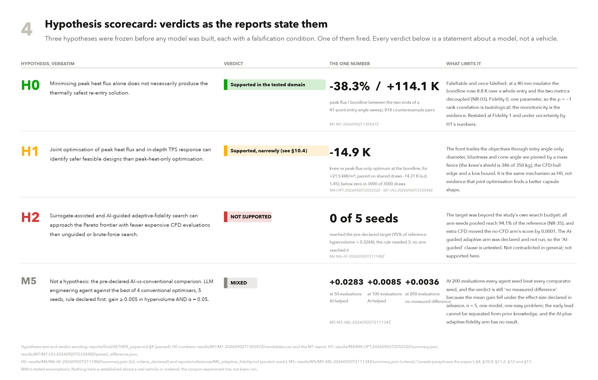

*Figure 24. Hypothesis scorecard: H0 supported in the tested domain; H1 supported narrowly; H2 not supported; the optimiser comparison of §11 mixed. Explanatory figure; the caveat text paraphrases §4 of this paper and every numeral is read from a file: `results/M1/M1-20260902T130547Z/candidates.csv`, `results/M4/M4-OPT-20260920T205252Z/summary.json`, `results/M7/M7-UQ-20260920T233048Z/paired_difference.json`, `results/M6/M6-AF-20260920T211148Z/summary.json`, `results/M5/M5-ABL-20260920T211134Z/summary.json`, `reports/milestones/M6_adaptive_fidelity.md`. File `reports/figures/infographics/04_hypothesis_scorecard.png`.*

Nothing here is established about a real vehicle or material. The coupon experiment has not been run and no external review has taken place.

A design chosen on peak heat flux alone is, in this model, the design with the hottest bondline on the front.

---

## 19. Reproducibility

### 19.1 Environment and commands

Python 3.12; numpy, scipy, matplotlib, pyyaml, pandas, pyarrow. OpenFOAM is needed only for the CFD stages, and the version used was v2512. Full instructions and measured runtimes are in `REPRODUCIBILITY.md`.

| Command | Produces | Measured wall time |
|---|---|---|
| `make test` | verification suite (497 passed, 1 skipped at the 2026-09-21 regeneration) | see note below |
| `make burn-vs-bake` | §7 | about 4 min |
| `make cfd-validate` | §8, gate G4 (OpenFOAM) | hours; fine cases 14,247 s and 8,911 s on a loaded machine |
| `make cfd-design-points`, `make aero-surface`, `make m3-coupled` | §9 (OpenFOAM for the first) | about 55 min + 27 min for the v2 extension; seconds; about 1 min |
| `make doe && make optimize` | §10 | 3 min 20 s; 7 min 23 s on 6 workers |
| `make ablation-replay RUN_ID=M5-ABL-20260920T211134Z` | §11, with no LLM access | a few minutes |
| `make adaptive` | §12 (OpenFOAM) | 3 h 44 min |
| `make robust`, `make uncertainty` | §13 | 2 h 18 min; 25.0 min on 4 workers |

Wall times were measured on one fanless laptop, mostly while other studies shared it. `REPRODUCIBILITY.md`'s `make test` line was corrected in the 2026-09-21 consistency sweep to match the 498-test suite (497 passed, 1 skipped) above; it previously described an earlier 38-test count.

### 19.2 Determinism and provenance

The Fidelity-0 chain contains no random sampling; repeated runs on one commit give bit-identical candidate files. Every stochastic study takes and records explicit seeds. Every run writes an immutable configuration snapshot with run ID, config hash, git commit, dirty flag and timestamp, and an append-only candidate log that includes infeasible and invalid designs. Milestone reports are generated from result files, and a hand edit is overwritten by the next run. The three hand-written companions (the agent audit and the two post-hoc addenda) are labelled as such and override no number. Aborted and rejected runs ship with the repository.

The language-model study is reproducible as a run, not as a model. Every prompt and raw response is persisted, and a strict replay with no model access reproduced every method's per-seed hypervolume exactly with zero prompt mismatches, including after the report-generator edits, under a different source hash which the replay records. Issuing new calls will give different numbers.

The repository is not yet public or archived at a clean commit. The paper was drafted against `de2a834`.

### 19.3 AI usage

Most of the software was written by Claude through Claude Code, working from the project specification: the physics models, geometry, CFD pipeline, optimisation, surrogate, adaptive-fidelity and uncertainty machinery, test suite, and figure and report generators. This paper was also drafted by the assistant from the result files. `AI_USAGE.md` records each component in one of four categories.

Rows marked *review pending* mean that I have not yet read that code line by line. As of the last measurement recorded in `AI_USAGE.md` the package was 23,869 lines of Python with 6,587 lines of tests, nearly all added in one day, and almost none of it read. A reading order of about 16 hours is in `docs/ai_usage_proposed_update.md`. Twenty-two modelling decisions are recorded in `AI_USAGE.md` as AI-proposed with my approval pending, and none has been approved. Where this paper says "I did not change the constant" or "I have left the criterion as written", the decision was proposed by the assistant and has stood; formal approval is one of the things that remains for me to do.

Defects introduced by generated code are documented: a divergent boundary-condition solve (caught by the solver failing), a truncated thermal solve (caught by physical reasoning about a number that looked low), an inverted dominance test (caught by a figure), an estimator with impossible intervals (caught by the interval), a surrogate that returned NaN (caught by where the budget went), and report sentences written for an older model (caught by reading reports against their own data and figures).

The assistant did not contribute the research question, the hypotheses, the frozen scope, or the choice of the bondline as the failure mode of interest. Those came from the specification.

---

## 20. References

Tiers follow the project's scale: ✅ T1 opened and read in the primary document; 🟡 T2 reputable secondary, or primary reached only in part. How each was read is recorded in `docs/validation/sourcing_report.md`, `docs/theory/*` or the data file named.

### Verified by this project

1. ✅ T1. Sutton, K. and Graves, R. A. Jr., *A General Stagnation-Point Convective-Heating Equation for Arbitrary Gas Mixtures*, NASA TR R-376, 1971. NTRS 19720003329.
2. 🟡 T2. NASA TFAWS 2012, *Aerothermodynamics Course*, Lecture 1. NASA-authored training material, not peer reviewed; opened and read.
3. 🟡 T2. Carroll, B. and Brandis, A., "Stagnation Point Convective Heating Correlations for Entry into H₂/He Atmospheres", AIAA Aviation 2022. NTRS 20220018610.
4. 🟡 T2. ONERA/CNES, "Noncatalytic and Finite Catalytic Heating Models for Atmospheric Re-entry Codes", 1st International Orbital Debris Conference, 2019.
5. ✅ T1. Zoby, E. V. and Sullivan, E. M., *Effects of Corner Radius on Stagnation-Point Velocity Gradients on Blunt Axisymmetric Bodies*, NASA TM X-1067, 1965. NTRS 19660017753.
6. ✅ T1. Ellison, J. C., *Experimental Stagnation-Point Velocity Gradients and Heat-Transfer Coefficients for a Family of Blunt Bodies at Mach 8 and Angles of Attack*, NASA TN D-5121, 1969. NTRS 19690013192.
7. ✅ T1. Zoby, E. V., *Empirical Stagnation-Point Heat-Transfer Relation in Several Gas Mixtures at High Enthalpy Levels*, NASA TN D-4799, 1968. NTRS 19680025996.
8. ✅ T1. Allen, H. J. and Eggers, A. J. Jr., NACA Report 1381, 1958. NTRS 19930091020.
9. ✅ T1. Putnam, Z. R. and Braun, R. D., "Extension and Enhancement of the Allen–Eggers Analytical Ballistic Entry Trajectory Solution", *JGCD* 38(3), 2015. DOI 10.2514/1.G000846.
10. ✅ T1. Desai, P. N. and Qualls, G. D., "Stardust Entry Reconstruction", AIAA 2008-1198. NTRS 20080008567.
11. ✅ T1. Pavlosky, J. E. and St. Leger, L. G., *Apollo Experience Report: Thermal Protection Subsystem*, NASA TN D-7564, 1974. NTRS 19740007423.
12. ✅ T1. Smith, Hamermesh and Hogenson, NASA CR-159900, 1979. NTRS 19790012947.
13. ✅ T1. Vander Kam and Gage, "Estimating Orion Heat Shield Failure Due to Ablator Cracking During the EFT-1 Mission". DOI 10.2514/1.A35003; NTRS 20160007549.
14. ✅ T1. NASA-STD-3001 Vol 2 Rev F, Table 6.5-1.
15. ✅ T1. NASA TM-104753, 1992. NTRS 19930020462.
16. 🟡 T2. Martin et al., "ITRUSST Consensus on Standardised Reporting for Transcranial Ultrasound Stimulation", arXiv:2402.10027, 2024. Opened; reproduces the CEM43 formula. The Sapareto and Dewey original was not opened.
17. 🟡 T2. Ye, H. and De, S., "Thermal injury of skin and subcutaneous tissues", 2016. PMC5459687. Opened; the Henriques originals were not.
18. ✅ T1. Chapman, D. R., NACA Report 1051, 1951. NTRS 19930090963.
19. ✅ T1. Love, E. S., NACA TN 3819, 1957. NTRS 19930084517.
20. ✅ T1. Miller, C. G. III, NASA TN D-4800, 1968. NTRS 19680026196.
21. ✅ T1. Hoerner, S. F., *Fluid-Dynamic Drag*, 1965, Ch. XVI.
22. 🟡 T2. Karlgaard, Schoenenberger and Van Norman, "Base Drag Model Derived from Mars 2020 Backshell Pressure Measurements", *JSR* 60(6), 2023. DOI 10.2514/1.A35774. Paywalled; abstract level only.
23. ✅ T1. Capsule geometry set: NASA/TM-2005-213457 (Apollo, NTRS 20060008942); Erb and Jacobs (Mercury); Wilmoth, Mitcheltree and Moss, AIAA 97-2510 (Stardust); NTRS 20060017066 (Viking); Spencer et al., AAS 98-146 and NTRS 20040090463 (Pathfinder); NTRS 20120011936, 20090024218 (MSL); NTRS 20160000307 (Hayabusa).
24. ✅ T1. *U.S. Standard Atmosphere, 1976*, NOAA-S/T 76-1562 / NASA-TM-X-74335, Table I pp. 68–69.
25. ✅ T1. NASA Glenn NPARC Alliance, "Examining Spatial (Grid) Convergence", CFD verification and validation tutorial, grc.nasa.gov/www/wind/valid/tutorial/spatconv.html. Source of the GCI formulae as used.
26. Opened and read; recorded in `data/reference/sphere_supersonic.yaml`, not in the sourcing report's graded list. Van Dyke, M. D. and Gordon, H. D., *Supersonic Flow Past a Family of Blunt Axisymmetric Bodies*, NASA TR R-1, 1959, Table III. NTRS 19980223623.
27. Opened and read; recorded in the same data file. Bailey, A. B. and Hiatt, J., AEDC-TR-70-291, 1971 (DTIC AD0721208): Table II (sphere total drag) and Sec. 4.5 (Clark's forebody pressure-drag expression as quoted there; Clark's and Hoerner's originals were not fetched).
28. Tiered ✅ T1 in `configs/uncertainty.yaml` as reported by the M7 milestone report: NASA-TM-4715, Tables 3.1 and 3.3; NASA/TM-20210022157, pp. 63–65 (density standard deviations below 86 km).

### Cited but not verified in primary by this project

These are used by the code or named in generated reports. None has been checked against the primary text. Each should be verified before submission, or the dependent statement reworded.

- Celik, I. B. et al., "Procedure for Estimation and Reporting of Uncertainty Due to Discretization in CFD Applications", *J. Fluids Eng.* 130(7), 078001, 2008. DOI 10.1115/1.2960953. Bibliographic record verified via Crossref; content not opened. The sign term in the apparent-order iteration and the oscillatory-convergence rule in `cfd/gci.py` are unverified against any opened text.
- Roache, P. J., the GCI and its safety factors. Nothing opened; citation details are from memory. Not cited directly; [25] is cited instead.
- Billig, F. S., "Shock-Wave Shapes around Spherical- and Cylindrical-Nosed Bodies", *J. Spacecraft Rockets* 4(6), 822–823, 1967. DOI 10.2514/3.28969. Record verified; formula confirmed from secondary sources, one of which prints the exponent as 3.2 where two print 3.24. Used for domain sizing and one comparison that decides nothing in G4.
- Carslaw, H. S. and Jaeger, J. C., *Conduction of Heat in Solids*, 2nd ed., §2.9 (semi-infinite solid under constant surface flux). The solution is standard and the agreement is 0.002%, but the edition, section and printed form have not been checked against a copy. Gate G3 is measured against it.
- Saltelli (2010) first-order and Jansen total-order Sobol' estimators. No provenance record. The implementation is pinned against the Ishigami function's analytical indices.
- Tauber, M., NASA TP-2914, 1989; Tauber and Sutton, 1991. Provenance is contradictory inside this repository: one engineering-notebook entry lists TP-2914 among primaries obtained and read, while the sourcing report and the validation matrix record it as not opened (❌ T3). No claim in this paper rests on it.
- Anderson, J. D., *Hypersonic and High-Temperature Gas Dynamics*, 2nd ed., AIAA, 2006, §4.3 "Mach-Number Independence". Chapter and section titles verified against the Library of Congress table of contents; the text was not opened.
- NACA Report 1135, eq. 100 (Rayleigh pitot relation). Used as a closed form; no record that the report was opened.
- Rodrigues, "Closed-Form Reconstruction of Zoby–Sullivan Stagnation-Point Heat-Flux Scaling", *JTHT*, 2026. DOI 10.2514/1.T7458. Paywalled, not opened (❌ T3).
- Vinh, Busemann and Culp (1980); Regan and Anandakrishnan (1993); Cooper and Holloway, "The Shuttle Tile Story" (1981). Not obtainable (❌ T3); named as gaps only.
- NSGA-II and ParEGO are named as algorithms (the former through the pymoo library). No primary source for either was opened.

---

## Appendix A. CFD flow-field gallery

Generated by `scripts/render_cfd_gallery.py` (`make cfd-gallery`) from the case directories under `cfd/generated/` and the result tables under `results/`. Every figure is written as PNG and vector PDF. Colour scales are perceptually uniform (viridis / magma / cividis) and stated on each colour bar. All fields are drawn in the meridional plane (x, r), axis equal, one flat-shaded polygon per cell of the wedge mesh (no interpolation). "Time step" is the saved iteration of the local-time-stepping pseudo-time march. The index of all twelve gallery figures, with cases and saved iterations, is `reports/figures/cfd/INDEX.md`; four of them appear in the body (Figures 6, 7, 8 and 10). Within its tested assumptions the CFD is used for forebody pressure drag, surface pressure and perfect-gas shock shape only (§8.1).

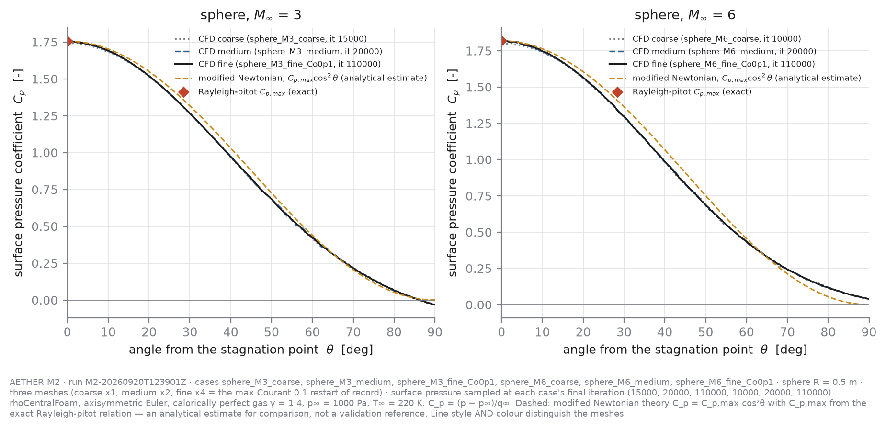

*Figure A.1. Run `M2-20260920T123901Z`, cases `sphere_M3_coarse`, `sphere_M3_medium`, `sphere_M3_fine_Co0p1`, `sphere_M6_coarse`, `sphere_M6_medium`, `sphere_M6_fine_Co0p1`, sphere R = 0.5 m, three meshes (coarse ×1, medium ×2, fine ×4 = the max-Courant-0.1 restart of record), surface pressure sampled at each case's final iteration (15,000, 20,000, 110,000 at Mach 3; 10,000, 20,000, 110,000 at Mach 6). rhoCentralFoam, axisymmetric Euler, calorically perfect gas γ = 1.4, p∞ = 1000 Pa, T∞ = 220 K. C_p = (p − p∞)/q∞. Dashed: modified Newtonian theory C_p = C_p,max cos²θ with C_p,max from the exact Rayleigh-pitot relation, an analytical estimate for comparison, not a validation reference. Line style and colour distinguish the meshes. File `reports/figures/cfd/M2_sphere_cp_meshes.png`.*

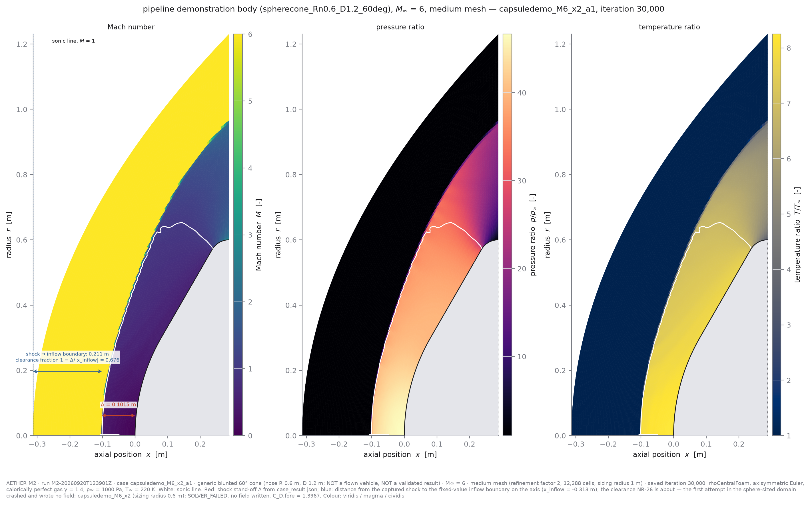

*Figure A.2. Run `M2-20260920T123901Z`, case `capsuledemo_M6_x2_a1`: a generic blunted 60° cone (nose R 0.6 m, D 1.2 m; not a flown vehicle, not a validated result), M∞ = 6, medium mesh (refinement factor 2, 12,288 cells, sizing radius 1 m), saved iteration 30,000: Mach number, p/p∞ and T/T∞. rhoCentralFoam, axisymmetric Euler, calorically perfect gas γ = 1.4, p∞ = 1000 Pa, T∞ = 220 K. White: sonic line. Red: shock stand-off Δ from `case_result.json`; blue: distance from the captured shock to the fixed-value inflow boundary on the axis (x_inflow = −0.313 m), the clearance NR-26 is about: the first attempt in the sphere-sized domain, `capsuledemo_M6_x2` (sizing radius 0.6 m), failed in the solver and wrote no field. C_D,fore = 1.3967. Colour: viridis / magma / cividis. File `reports/figures/cfd/M2_demo_capsule_M6_fields.png`.*

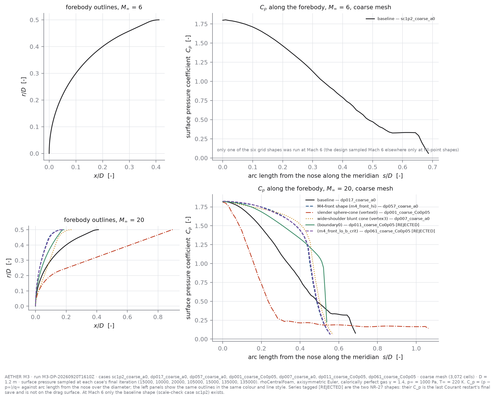

*Figure A.3. Run `M3-DP-20260920T1610Z`, cases `sc1p2_coarse_a0`, `dp017_coarse_a0`, `dp057_coarse_a0`, `dp001_coarse_Co0p05`, `dp007_coarse_a0`, `dp011_coarse_Co0p05`, `dp061_coarse_Co0p05`, coarse mesh (3,072 cells), D = 1.2 m, surface pressure sampled at each case's final iteration (15,000, 10,000, 20,000, 105,000, 15,000, 135,000, 135,000). rhoCentralFoam, axisymmetric Euler, calorically perfect gas γ = 1.4, p∞ = 1000 Pa, T∞ = 220 K. C_p = (p − p∞)/q∞ against arc length from the nose over the diameter; the left panels show the same outlines in the same colour and line style. Series tagged `[REJECTED]` are the two NR-27 shapes: their C_p is the last Courant restart's final save and is not on the drag surface. At Mach 6 only the baseline shape (scale-check case `sc1p2`) exists. File `reports/figures/cfd/M3_design_point_cp.png`.*

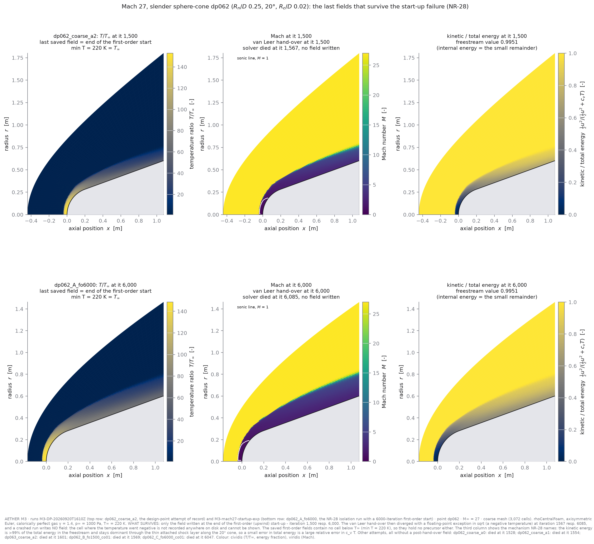

*Figure A.4. Runs `M3-DP-20260920T1610Z` (top row: `dp062_coarse_a2`, the design-point attempt of record) and `M3-mach27-startup-exp` (bottom row: `dp062_A_fo6000`, the NR-28 isolation run with a 6,000-iteration first-order start), point `dp062`, M∞ = 27, coarse mesh (3,072 cells): T/T∞, Mach number and kinetic-energy fraction of the first-order start-up solution. rhoCentralFoam, axisymmetric Euler, calorically perfect gas γ = 1.4, p∞ = 1000 Pa, T∞ = 220 K. What survives is only the field written at the end of the first-order (upwind) start-up, iteration 1,500 and 6,000 respectively. The van Leer hand-over then diverged with a floating-point exception in sqrt (a negative temperature) at iteration 1,567 and 6,085 respectively, and a crashed run writes no field: the cell where the temperature went negative is not recorded anywhere on disk and cannot be shown. The saved first-order fields contain no cell below T∞ (minimum T = 220 K), so they hold no precursor either. The third column shows the mechanism NR-28 names: the kinetic energy is above 99% of the total energy in the freestream and stays dominant through the thin attached shock layer along the 20° cone, so a small error in total energy is a large relative error in c_v T. Other attempts, all without a post-hand-over field: `dp062_coarse_a0` died at iteration 1,528; `dp062_coarse_a1` at 1,554; `dp063_coarse_a2` at 1,601; `dp062_B_fo1500_co01` at 1,569; `dp062_C_fo6000_co01` at 6,047. Colour: cividis (T/T∞, energy fraction), viridis (Mach). File `reports/figures/cfd/M3_mach27_dp062_startup_failure.png`.*

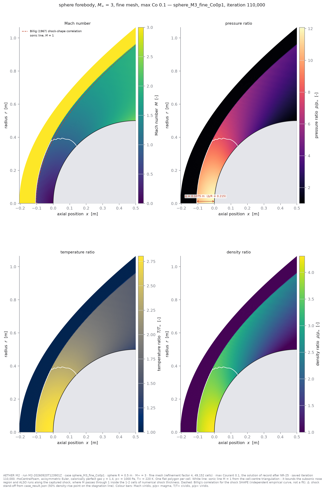

*Figure A.5. Run `M2-20260920T123901Z`, case `sphere_M3_fine_Co0p1`, sphere R = 0.5 m, M∞ = 3, fine mesh (refinement factor 4, 49,152 cells), max Courant 0.1, the solution of record after NR-25, saved iteration 110,000: Mach number, p/p∞, T/T∞ and ρ/ρ∞. rhoCentralFoam, axisymmetric Euler, calorically perfect gas γ = 1.4, p∞ = 1000 Pa, T∞ = 220 K. One flat polygon per cell. White line: sonic line M = 1 from the cell-centre triangulation; it bounds the subsonic nose region and also runs along the captured shock, where M passes through 1 inside the one to two cells of numerical shock thickness. Dashed: Billig's correlation for the shock shape (independent empirical curve, not a fit). Δ: shock stand-off from `case_result.json` (50% density-rise point on the stagnation line). Colour bars: Mach viridis, p/p∞ magma, T/T∞ cividis, ρ/ρ∞ viridis. File `reports/figures/cfd/M2_sphere_M3_fine_fourpanel.png`.*

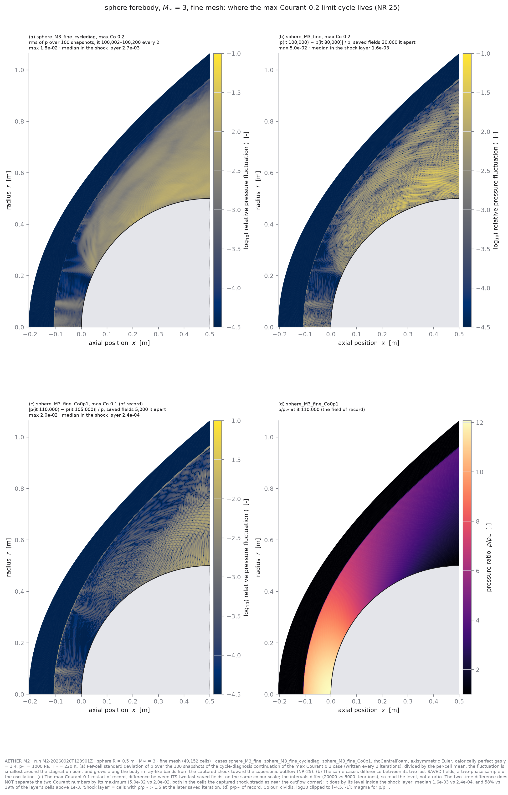

*Figure A.6. Run `M2-20260920T123901Z`, sphere R = 0.5 m, M∞ = 3, fine mesh (49,152 cells), cases `sphere_M3_fine`, `sphere_M3_fine_cyclediag`, `sphere_M3_fine_Co0p1`. rhoCentralFoam, axisymmetric Euler, calorically perfect gas γ = 1.4, p∞ = 1000 Pa, T∞ = 220 K. (a) Per-cell standard deviation of p over the 100 snapshots of the cycle-diagnosis continuation of the max-Courant-0.2 case (written every 2 iterations), divided by the per-cell mean: the fluctuation is smallest around the stagnation point and grows along the body in ray-like bands from the captured shock toward the supersonic outflow (NR-25). (b) The same case's difference between its two last saved fields, a two-phase sample of the oscillation. (c) The max-Courant-0.1 restart of record, difference between its two last saved fields, on the same colour scale; the intervals differ (20,000 against 5,000 iterations), so read the level, not a ratio. The two-time difference does not separate the two Courant numbers by its maximum (5.0×10⁻² against 2.0×10⁻², both in the cells the captured shock straddles near the outflow corner); it does by its level inside the shock layer: median 1.6×10⁻³ against 2.4×10⁻⁴, and 58% against 19% of the layer's cells above 10⁻³. "Shock layer" = cells with ρ/ρ∞ > 1.5 at the later saved iteration. (d) p/p∞ of record. Colour: cividis, log₁₀ clipped to [−4.5, −1]; magma for p/p∞. File `reports/figures/cfd/M2_sphere_M3_limit_cycle_field.png`.*

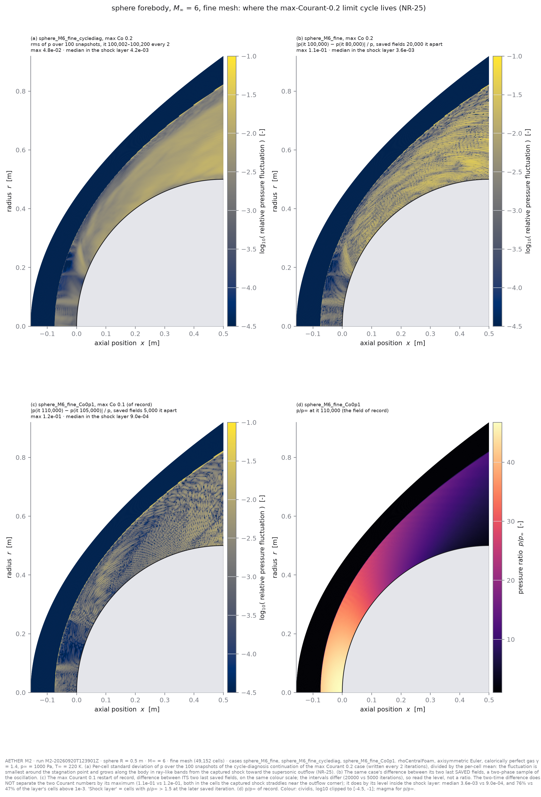

*Figure A.7. As Figure A.6, for M∞ = 6: run `M2-20260920T123901Z`, cases `sphere_M6_fine`, `sphere_M6_fine_cyclediag`, `sphere_M6_fine_Co0p1`, fine mesh (49,152 cells). Same gas model and freestream. The two-time difference does not separate the two Courant numbers by its maximum (1.1×10⁻¹ against 1.2×10⁻¹, both in the cells the captured shock straddles near the outflow corner); it does by its level inside the shock layer: median 3.6×10⁻³ against 9.0×10⁻⁴, and 76% against 47% of the layer's cells above 10⁻³. "Shock layer" = cells with ρ/ρ∞ > 1.5 at the later saved iteration. (d) p/p∞ of record. Colour: cividis, log₁₀ clipped to [−4.5, −1]; magma for p/p∞. File `reports/figures/cfd/M2_sphere_M6_limit_cycle_field.png`.*

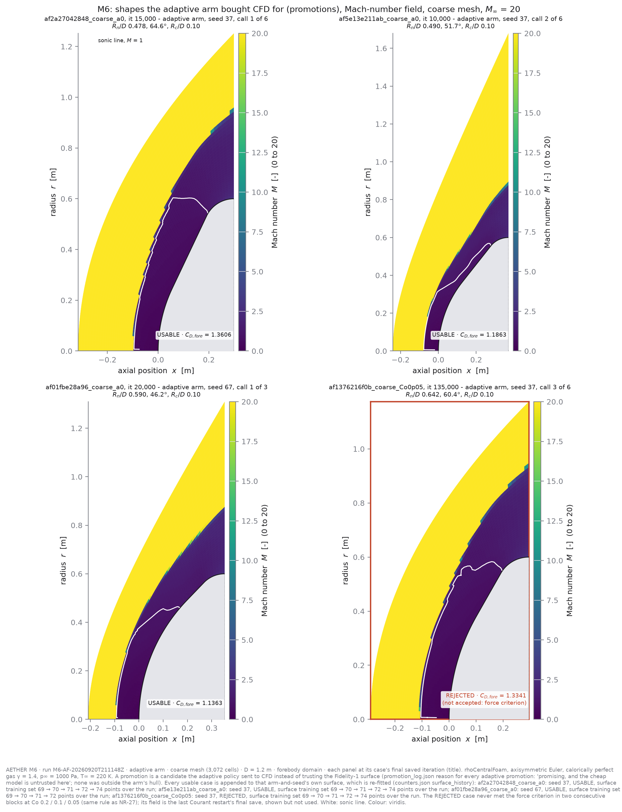

*Figure A.8. Run `M6-AF-20260920T211148Z`, adaptive arm, coarse mesh (3,072 cells), D = 1.2 m, forebody domain, M∞ = 20, each panel at its case's final saved iteration (title): Mach number. rhoCentralFoam, axisymmetric Euler, calorically perfect gas γ = 1.4, p∞ = 1000 Pa, T∞ = 220 K. A promotion is a candidate the adaptive policy sent to CFD instead of trusting the Fidelity-1 surface (`promotion_log.json` reason for every adaptive promotion: "promising, and the cheap model is untrusted here"; none was outside the arm's hull). Every usable case is appended to that arm-and-seed's own surface, which is re-fitted (`counters.json` surface history): `af2a27042848_coarse_a0`, seed 37, usable, surface training set 69 → 70 → 71 → 72 → 74 points over the run; `af5e13e211ab_coarse_a0`, seed 37, usable, 69 → 70 → 71 → 72 → 74; `af01fbe28a96_coarse_a0`, seed 67, usable, 69 → 70 → 71 → 72; `af1376216f0b_coarse_Co0p05`, seed 37, rejected, 69 → 70 → 71 → 72 → 74. The rejected case never met the force criterion in two consecutive blocks at Courant 0.2, 0.1 and 0.05 (the NR-27 rule); its field is the last Courant restart's final save, shown but not used. White: sonic line. Colour: viridis. File `reports/figures/cfd/M6_adaptive_promotions_mach.png`.*
