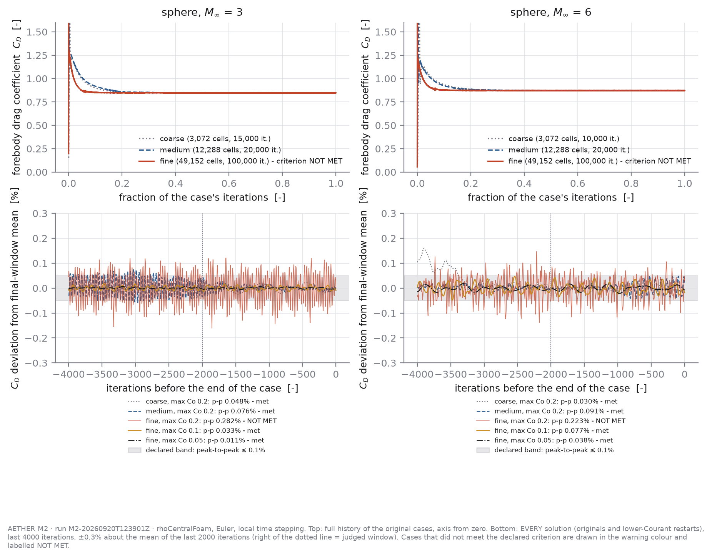
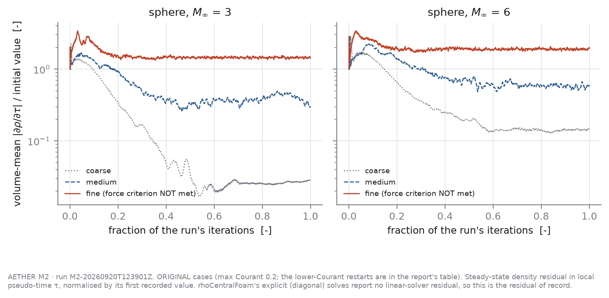
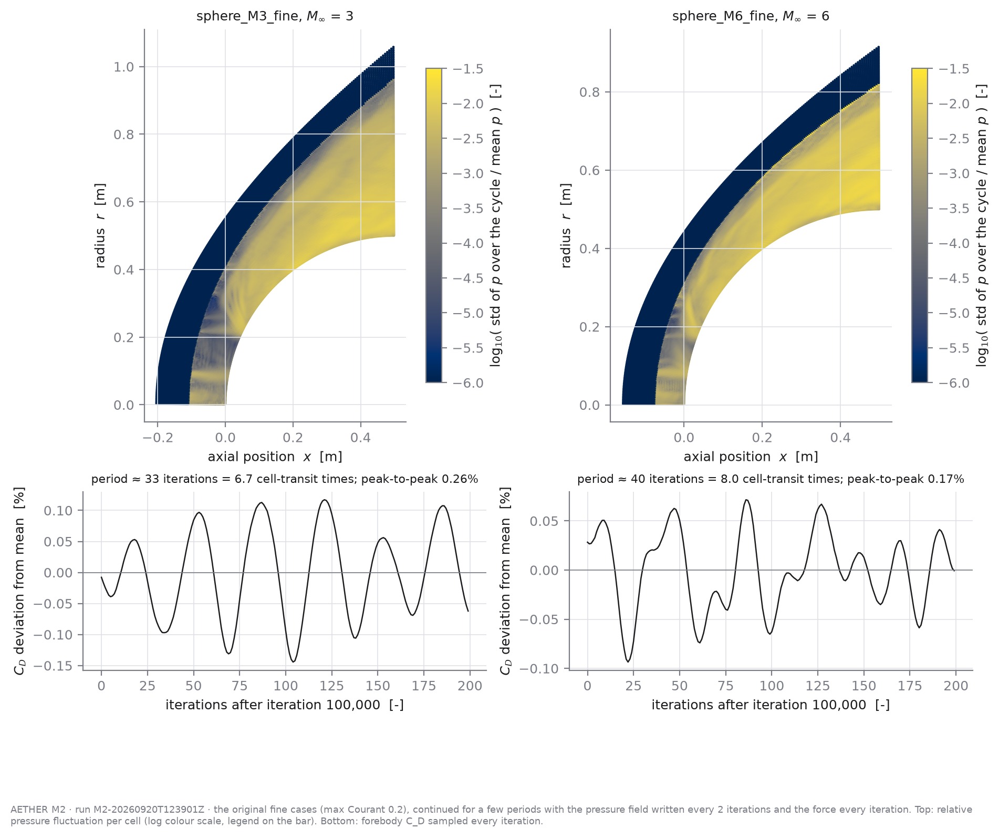
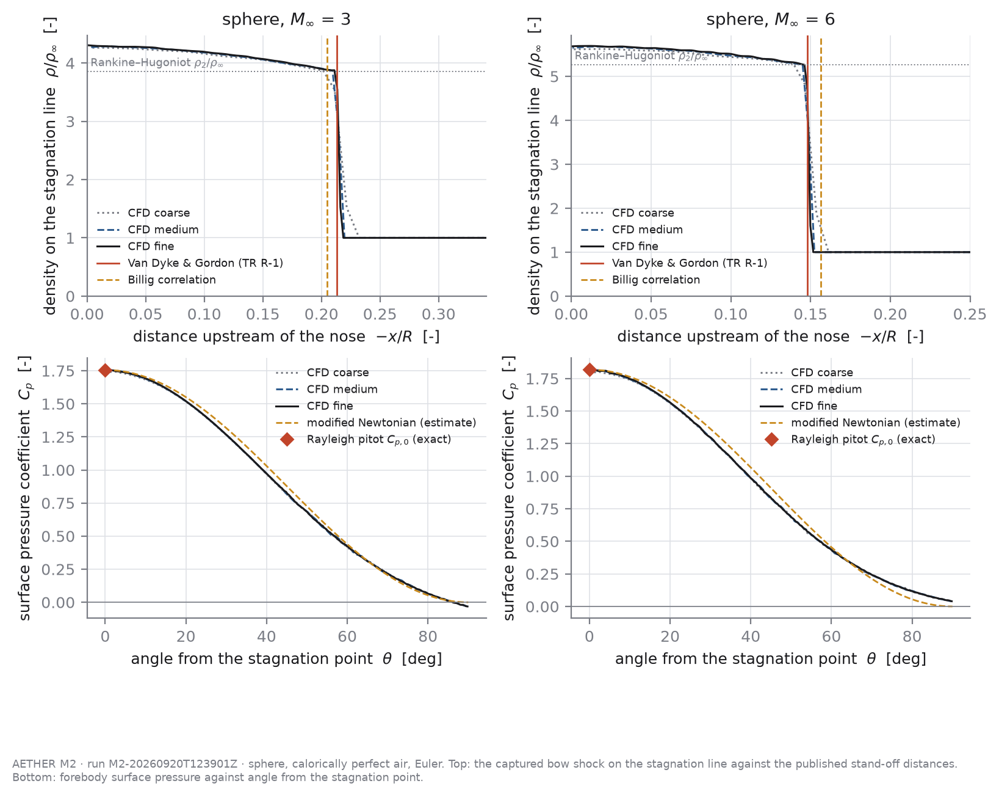
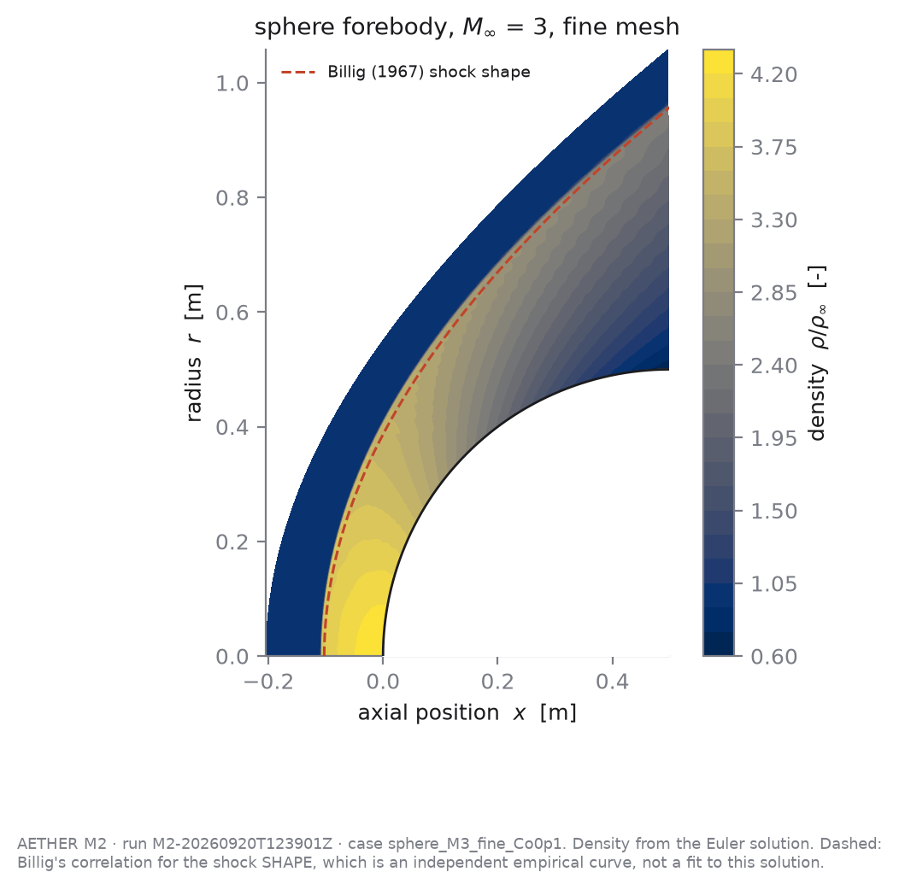
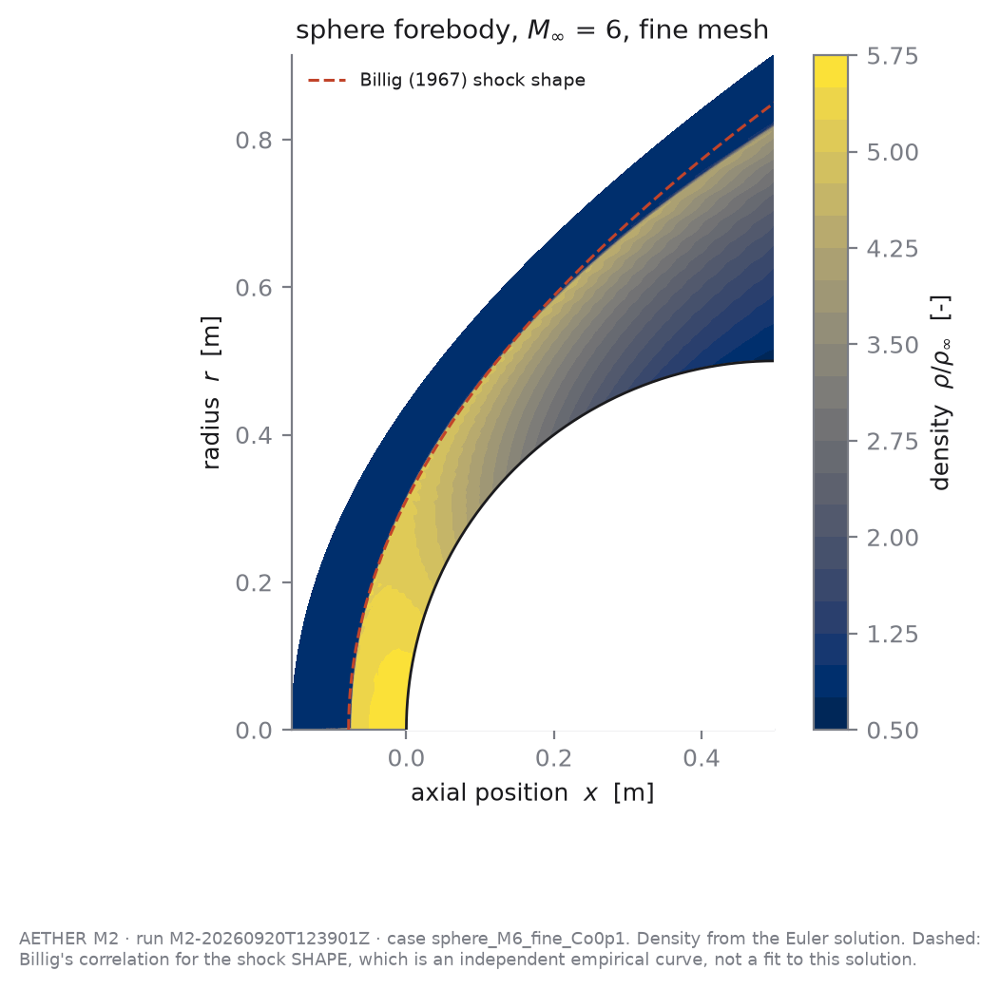
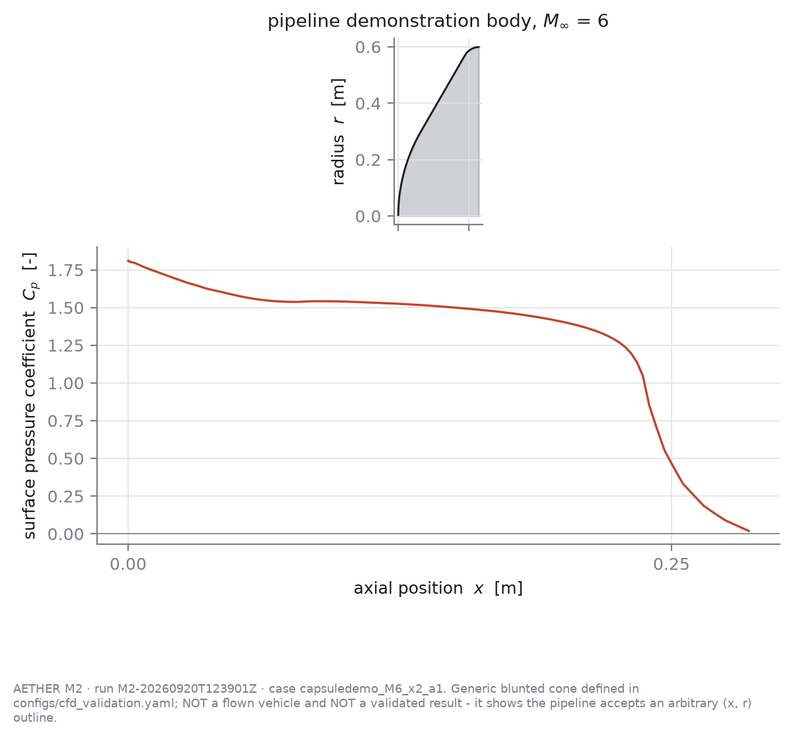
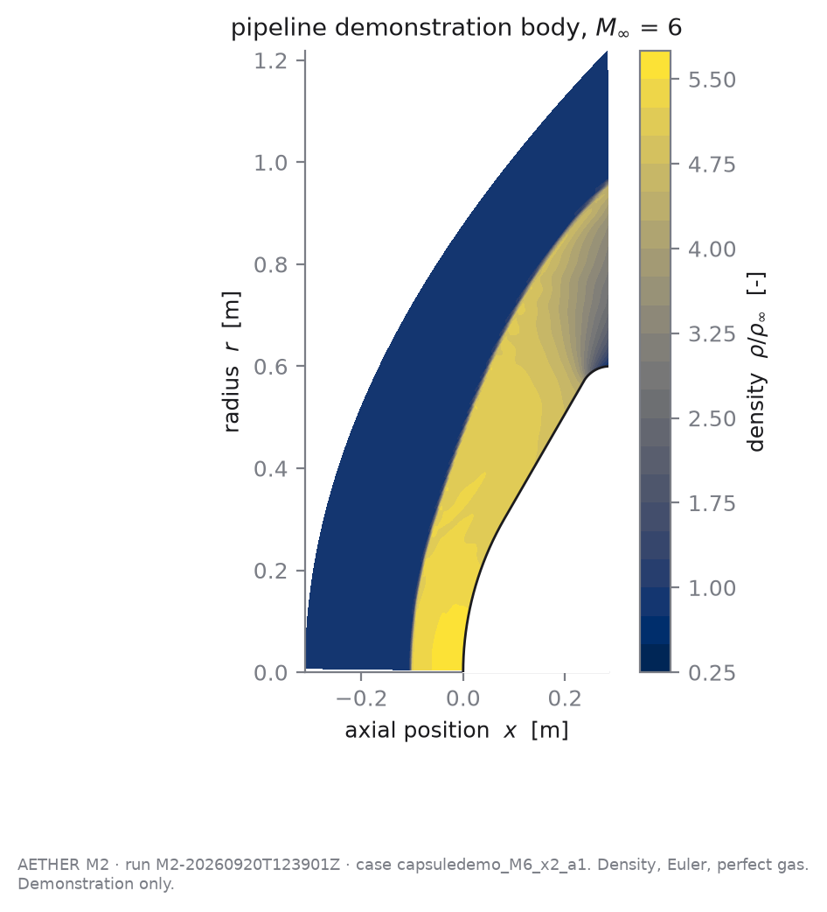

# M2 — OpenFOAM CFD validation (gate G4)

> **Generated file.** Written by `src/aether/cfd/report.py` from `results/M2/M2-20260920T123901Z/`. Every number below is read from a result file; edit the code or the config, never this file.

- Run ID: `M2-20260920T123901Z` · config hash `b5d620c4e269` · git `046e0a1` (**dirty working tree**)
- Generated: 2026-09-20T20:02:09+00:00
- OpenFOAM installed: **v2512** · specification asks for v2606 — see *Deviations*.
- Config: `configs/cfd_validation.yaml` (snapshot in `results/M2/M2-20260920T123901Z/config_snapshot.yaml`)

**Outcome: gate G4 is PASS.** All four spec §17 conditions are met by the rules declared in the config. **2 original case(s) did NOT meet the declared force criterion** (peak-to-peak ≤ 0.1%, drift ≤ 0.02% over 2000 iterations): `sphere_M3_fine` ended in a bounded limit cycle, peak-to-peak 0.282%, drift 0.0007%, after 100,000 iterations; `sphere_M6_fine` ended in a bounded limit cycle, peak-to-peak 0.223%, drift 0.0016%, after 100,000 iterations. The criterion was not changed. Following spec §36 (check the Courant number before anything else) each was continued from its final solution as a new, separately named case at a lower Courant limit; the solution of record at that level is `sphere_M3_fine_Co0p1` (max Co 0.1, peak-to-peak 0.033%, drift 0.0002%); `sphere_M6_fine_Co0p1` (max Co 0.1, peak-to-peak 0.077%, drift 0.0015%). The original cases are kept, tabulated and plotted below. Four things a reader should know before trusting any number here: (1) the observed order of convergence of forebody C_D is 1.13 at Mach 3 and 0.88 at Mach 6, against a formal order of 2 away from the shock and 1 at it; (2) the stagnation pressure at Mach 6 converges *oscillatory* with mesh (46.277 / 46.741 / 46.610), so its Richardson value is not reliable (single final-iteration snapshots; which Mach number shows this depends on the snapshot - see Condition 1); (3) Billig's stand-off correlation is used with the exponent 3.24, but one of the three secondary sources prints 3.2 and the original paper could not be opened; (4) sphere drag is compared with a **forebody pressure-drag expression**, not like-for-like with measured total drag, because this CFD computes no base pressure.

## Gate G4 status: **PASS**

| spec §17 condition | met |
|---|---|
| 1. Mesh independence completed | yes |
| 2. Force convergence demonstrated | yes |
| 3. Published blunt-body case compared | yes |
| 4. Model-form limitations documented | yes |

The convergence criterion, the mesh-independence rule and the benchmark tolerances were written into the config before the validation cases were run, and none was changed afterwards. **Two things were added after the original results had been seen**, and the status above depends on both: the lower-Courant restart of the fine cases (`courant_restarts` in the config) and the rule for which solution is 'of record' at a level. Both are described under Condition 2 and in NR-25; a reader who does not accept them should read the gate as it stood before them, **LIMITED** (`results/M2/M2-20260920T123901Z/gate_assessment_20260921_0057_before_restarts.json`). `PASS` requires all four conditions.

## What was computed

A sphere of radius 0.5 m in a uniform supersonic stream of calorically perfect air (γ = 1.4), at Mach 3 and 6. Solver `rhoCentralFoam`, axisymmetric **Euler** equations on a 5° wedge, Kurganov flux with vanLeer reconstruction, local time stepping at max Courant number 0.2 (lower for the fine-level restarts: see Condition 2). The domain covers the **forebody** only (nose to the maximum-radius station) and ends in an outflow plane; the smallest Mach number found anywhere on that plane is reported per case, because the zero-gradient outflow condition is only well posed if it exceeds 1.

Why inviscid, why forebody-only, and what that rules out: `docs/validation/M2_model_form_limits.md` and ASSUMPTIONS A-CFD-1…6.

| case | cells | iterations | extensions | status | max non-orth [deg] | max skew | min outlet Mach | solver wall time [s] | shock clearance |
|---|---|---|---|---|---|---|---|---|---|
| sphere_M3_coarse | 3,072 | 15,000 | 1 | OK | 38.67 | 0.91 | 1.92 | 93 | 0.46 |
| sphere_M3_medium | 12,288 | 20,000 | 0 | OK | 39.17 | 0.92 | 1.92 | 498 | 0.46 |
| sphere_M3_fine_Co0p1 | 49,152 | 110,000 | 0 | OK | 39.42 | 0.93 | 1.93 | 1463 | 0.47 |
| sphere_M6_coarse | 3,072 | 10,000 | 0 | OK | 35.00 | 0.94 | 2.33 | 63 | 0.51 |
| sphere_M6_medium | 12,288 | 20,000 | 0 | OK | 35.51 | 0.95 | 2.33 | 484 | 0.51 |
| sphere_M6_fine_Co0p1 | 49,152 | 110,000 | 0 | OK | 35.78 | 0.96 | 2.33 | 1464 | 0.52 |

*Shock clearance* is 1 − Δ / (distance from the nose to the inflow boundary on the axis): how much room is left between the captured shock and the fixed-value inflow boundary. Near zero would mean the shock is sitting on the boundary and the case is invalid.

*Extensions* counts how many times a case had to be continued past its planned iteration count before the force criterion was met (run-until-converged, NR-09).

Wall times are single runs on this machine with 1 MPI rank(s), with other solver processes running beside them, so they are upper-ish bounds rather than benchmarks (REPRODUCIBILITY.md). A restart's wall time covers the restart only; the original fine cases' wall times are in the Condition 2 table.

## Condition 2 — force convergence

**Criterion (declared before the runs).** Over the final 2000 iterations the forebody drag coefficient must have peak-to-peak variation ≤ 0.1% of its mean **and** a drift between the two halves of that window ≤ 0.02% of its mean. The reported C_D is the mean over that window.

| case | max Co | iterations | C_D forebody | peak-to-peak | drift | residual drop | solver wall time [s] | criterion met | solution of record |
|---|---|---|---|---|---|---|---|---|---|
| sphere_M3_coarse | 0.2 | 15,000 | 0.84440 | 0.0485% | 0.0046% | 2.92e-02 | 93 | yes | yes |
| sphere_M3_medium | 0.2 | 20,000 | 0.84613 | 0.0763% | 0.0028% | 3.02e-01 | 498 | yes | yes |
| sphere_M3_fine | 0.2 | 100,000 | 0.84721 | 0.2820% | 0.0007% | 1.43e+00 | 14247 | **NO** | no |
| sphere_M3_fine_Co0p1 | 0.1 | 110,000 | 0.84692 | 0.0327% | 0.0002% | 1.47e-01 | 1463 | yes | yes |
| sphere_M3_fine_Co0p05 | 0.05 | 110,000 | 0.84692 | 0.0107% | 0.0009% | 7.34e-02 | 1462 | yes | no |
| sphere_M6_coarse | 0.2 | 10,000 | 0.86890 | 0.0298% | 0.0031% | 1.47e-01 | 63 | yes | yes |
| sphere_M6_medium | 0.2 | 20,000 | 0.87090 | 0.0910% | 0.0018% | 5.92e-01 | 484 | yes | yes |
| sphere_M6_fine | 0.2 | 100,000 | 0.87221 | 0.2229% | 0.0016% | 1.94e+00 | 8911 | **NO** | no |
| sphere_M6_fine_Co0p1 | 0.1 | 110,000 | 0.87199 | 0.0767% | 0.0015% | 1.69e-01 | 1464 | yes | yes |
| sphere_M6_fine_Co0p05 | 0.05 | 110,000 | 0.87198 | 0.0378% | 0.0003% | 1.03e-01 | 1462 | yes | no |

Every solution that exists is listed, not only the ones used. *Solution of record* (rule fixed in `validation.collect_mesh_study`, the same for every level): the first of [original case, then restarts by descending Courant number] that met the criterion; if none did, the original. For a restart, *iterations* is the iteration count at its end including the source case's, and its *residual drop* is relative to the first residual of the restart, not of the original run.

*Residual drop* is the final volume-mean |∂ρ/∂τ| over its first recorded value. It is reported because the spec asks for residuals, and it is **not** part of the criterion: with a TVD limiter the density residual of this solver stalls once the captured shock starts flickering between neighbouring cells, while the integrated force has long since stopped moving. A reader who wants machine-zero residuals will not find them here.

### The fine-mesh limit cycle, and what was done about it (NR-25)

The original fine cases ran their planned iterations plus all 3 extensions and still missed the peak-to-peak limit. Their drift is one to two orders below its limit, so this is **a bounded oscillation about a fixed mean, not slow convergence** - waiting longer could not cure it. The criterion was left alone. Spec §36 puts the Courant number ahead of solver settings and physics, and NR-07 had already shown a C_D limit cycle on the coarse mesh that max Co 0.5 → 0.2 removed; so the same lever was pulled one level finer. Each fine case was continued from its final solution as a new case at max Co 0.1 and 0.05, in blocks of 5000 iterations, for at least 2 and at most 8 blocks, the verdict being the one at the end of the last block. This restart rule was written AFTER the original fine results had been seen; that is disclosed here and in the config.

| case | max Co | criterion met | window mean C_D | peak-to-peak | ± half p-p | rms | dominant period [iterations] | period [cell-transit times] | share of spectral power |
|---|---|---|---|---|---|---|---|---|---|
| sphere_M3_coarse | 0.2 | yes | 0.844402 | 0.0485% | 0.0242% | 0.0142% | 668 | 133.7 | 0.64 |
| sphere_M3_medium | 0.2 | yes | 0.846128 | 0.0763% | 0.0382% | 0.0102% | 334 | 66.8 | 0.16 |
| sphere_M3_fine | 0.2 | **NO** | 0.847213 | 0.2820% | 0.1410% | 0.0587% | 33 | 6.6 | 0.45 |
| sphere_M3_fine_Co0p1 | 0.1 | yes | 0.846918 | 0.0327% | 0.0163% | 0.0073% | 91 | 9.1 | 0.33 |
| sphere_M3_fine_Co0p05 | 0.05 | yes | 0.846921 | 0.0107% | 0.0054% | 0.0027% | 2005 | 100.3 | 0.25 |
| sphere_M6_coarse | 0.2 | yes | 0.868904 | 0.0298% | 0.0149% | 0.0064% | 1003 | 200.5 | 0.31 |
| sphere_M6_medium | 0.2 | yes | 0.870898 | 0.0910% | 0.0455% | 0.0176% | 87 | 17.4 | 0.33 |
| sphere_M6_fine | 0.2 | **NO** | 0.872212 | 0.2229% | 0.1114% | 0.0413% | 40 | 8.0 | 0.17 |
| sphere_M6_fine_Co0p1 | 0.1 | yes | 0.871986 | 0.0767% | 0.0384% | 0.0182% | 200 | 20.1 | 0.32 |
| sphere_M6_fine_Co0p05 | 0.05 | yes | 0.871979 | 0.0378% | 0.0189% | 0.0092% | 286 | 14.3 | 0.25 |

Force sampled every 5 iterations over the judged window; a period under 20 iterations would not be resolved. Under local time stepping each cell advances by max Co of its own transit time per iteration, so there is no global physical time and no meaningful 'flow-through time'; *cell-transit times* = period × max Co is the natural unit. A 'dominant period' with a small share of the spectral power means there is no clean cycle left, only broadband noise inside the band.

- Mach 3: max Co 0.2 → 0.1 changed the peak-to-peak from 0.282% to 0.033% and moved the window-mean C_D by -0.0348% (0.847213 → 0.846918); criterion met.
- Mach 3: max Co 0.2 → 0.05 changed the peak-to-peak from 0.282% to 0.011% and moved the window-mean C_D by -0.0345% (0.847213 → 0.846921); criterion met.
- Mach 6: max Co 0.2 → 0.1 changed the peak-to-peak from 0.223% to 0.077% and moved the window-mean C_D by -0.0260% (0.872212 → 0.871986); criterion met.
- Mach 6: max Co 0.2 → 0.05 changed the peak-to-peak from 0.223% to 0.038% and moved the window-mean C_D by -0.0267% (0.872212 → 0.871979); criterion met.

**Where it lives, `sphere_M3_fine`** (field written every 2 iterations for 100 snapshots, force every iteration): C_D peak-to-peak 0.262%, period 33 iterations = 6.7 cell-transit times. The pressure fluctuation is **not** confined to the shock: 90% of its variance is spread over 37% of the cells, all at or behind the shock (mean p/p∞ from 1.4 to 12.0), from 1° to the outflow plane. The largest single-cell swing, 0.31 p∞ peak-to-peak, is at x = 0.055 m, r = 0.229 m.
**Where it lives, `sphere_M6_fine`** (field written every 2 iterations for 100 snapshots, force every iteration): C_D peak-to-peak 0.165%, period 40 iterations = 8.0 cell-transit times. The pressure fluctuation is **not** confined to the shock: 90% of its variance is spread over 42% of the cells, all at or behind the shock (mean p/p∞ from 2.5 to 46.7), from 2° to the outflow plane. The largest single-cell swing, 1.91 p∞ peak-to-peak, is at x = 0.075 m, r = 0.263 m.

Read with the map below: the stagnation region is the quietest part of the shock layer and the fluctuation grows along the body towards the supersonic outflow, in ray-like bands that start at the captured shock. That pattern is what pressure disturbances shed by a captured shock that jitters between neighbouring cells, and then carried downstream, would look like; it is *not* what a badly posed outflow boundary or a stagnation-point instability would look like. This is an interpretation of the map, not something that was separately tested.

Evidence: `results/M2/M2-20260920T123901Z/level_candidates.csv`, `limit_cycle.csv`, `<case>_Co*/restart_blocks.json`, `<case>_cyclediag/`.

## Condition 1 — mesh independence

Three geometrically similar meshes, refinement factors [1, 2, 4] in both directions (constant ratio r = 2), same block layout and grading. Richardson extrapolation and GCI follow Celik et al. (2008) with safety factor 1.25. **Rule:** forebody C_D must converge monotonically with GCI_fine ≤ 2% and a fine–medium change ≤ 1%. The stand-off distance and stagnation pressure are reported with their GCI but are judged against the references (condition 3), not against this rule.

| Mach | quantity | coarse | medium | fine | behaviour | observed order p | Richardson | fine–medium | GCI_fine | asymptotic ratio |
|---|---|---|---|---|---|---|---|---|---|---|
| 3 | C_D forebody | 0.84440 | 0.84613 | 0.84692 | monotone | 1.13 | 0.84758 | 0.093% | 0.098% | 1.001 |
| 3 | Δ/R | 0.21697 | 0.21581 | 0.21502 | monotone | 0.54 | 0.21328 | 0.370% | 1.011% | 0.996 |
| 3 | p0/p∞ | 11.96486 | 12.04470 | 12.07825 | monotone | 1.25 | 12.10255 | 0.278% | 0.252% | 1.003 |
| 6 | C_D forebody | 0.86890 | 0.87090 | 0.87199 | monotone | 0.88 | 0.87329 | 0.125% | 0.187% | 1.001 |
| 6 | Δ/R | 0.15057 | 0.14956 | 0.14896 | monotone | 0.74 | 0.14807 | 0.403% | 0.747% | 0.996 |
| 6 | p0/p∞ | 46.27706 | 46.74141 | 46.61050 | oscillatory | 1.83 | 46.55909 | 0.281% | 0.138% | 0.997 |

**Not monotone:** p0/p∞ at Mach 6 is *oscillatory* (eps32/eps21 < 0: oscillatory convergence. p and GCI are computed per Celik et al. but Richardson extrapolation is not reliable here.)

**The observed order of forebody C_D is below first order at Mach 6** (p = 1.13 at Mach 3, p = 0.88 at Mach 6). The milestone's written hypothesis was 'between 1 and 2'; it is **not** borne out there. A captured shock makes a TVD scheme locally first order, and NASA's NPARC verification tutorial (*Examining Spatial (Grid) Convergence*, opened 2026-09-21) says the observed order 'will likely be lower' than the theoretical one and lists the 'presence of shocks' among the causes - but it gives no number, and no opened source states that a sub-first-order p is normal for this problem. Two consequences: a low p makes the Richardson correction and the GCI LARGER than a first-order assumption would (conservative); and an asymptotic ratio near 1 only shows the three meshes are mutually consistent with that p, not that p is the scheme's true order. The 'p range' column of the next table shows how weakly p is determined: it is computed from a fine–medium difference of about 0.1%, which is not large against the iterative band.

**p0/p∞ and Δ/R are read from the field at the LAST iteration, not averaged over a window** (only the force has a history). Where several solutions exist on the same mesh, that snapshot noise can be read directly - Mach 3 fine: p0/p∞ from 11.995 to 12.078 (0.69%), Δ/R from 0.21501 to 0.21502 (0.00%); Mach 6 fine: p0/p∞ from 46.610 to 46.852 (0.52%), Δ/R from 0.14895 to 0.14896 (0.00%). For p0/p∞ it is as large as the differences between mesh levels, so whether its mesh convergence comes out 'monotone' or 'oscillatory' depends on which snapshot is used: with the original fine cases it was oscillatory at Mach 3, with the solutions of record it is oscillatory at Mach 6 (compare `gci_original_fine_cases.csv`). Its Richardson value and GCI should not be relied on at either Mach number; it is judged against the exact Rayleigh-pitot value in condition 3 instead.

The shock position moves in steps tied to the cell size (the captured shock is 1.5–1.6 cells thick on the stagnation line), which is why its convergence is less clean than that of C_D.

**Iterative (limit-cycle) band, kept separate from the GCI.** Columns of the same names are in `gci.csv` for the M3 surface's GCI hook to read.

| Mach | fine case of record | ± half p-p, coarse | medium | fine | discretisation band, coarse | … with fine at its cycle extremes (max) | GCI_medium … (max) | GCI_fine … (max) | p range |
|---|---|---|---|---|---|---|---|---|---|
| 3 | sphere_M3_fine_Co0p1 | 0.0242% | 0.0382% | 0.0163% | 0.469% | 0.550% | 0.296% | 0.159% | 0.90–1.41 |
| 6 | sphere_M6_fine_Co0p1 | 0.0149% | 0.0455% | 0.0384% | 0.628% | 0.991% | 0.710% | 0.506% | 0.49–1.41 |

*± half p-p* is half the peak-to-peak of each level's judged window: the most the instantaneous C_D departs from the reported window mean. The *cycle extremes* columns repeat the whole Celik procedure with the fine value moved to the top and bottom of its cycle. The *coarse* band is 1.25 × the Richardson error estimate of the coarse mesh - the quantity the M3 surface (built on the coarse mesh, A-CFD-10) actually consumes.

**Same study computed with the ORIGINAL (non-converged) fine cases**, window means, for comparison - `gci_original_fine_cases.csv`:

| Mach | fine C_D (original) | fine C_D (of record) | p (original) | p (of record) | GCI_fine (original) | GCI_fine (of record) | coarse band (original) | coarse band (of record) |
|---|---|---|---|---|---|---|---|---|
| 3 | 0.847213 | 0.846918 | 0.67 | 1.13 | 0.271% | 0.098% | 0.684% | 0.469% |
| 6 | 0.872212 | 0.871986 | 0.60 | 0.88 | 0.363% | 0.187% | 0.835% | 0.628% |

The mean of a limit cycle is not the fixed point: the window-mean of the oscillating solution and the converged value differ by a few hundredths of a percent, which is small against every tolerance here but not small against the fine–medium difference the observed order is computed from.

## Condition 3 — comparison with published references

Fine-mesh values. *Like-for-like* marks references that describe the same physics as the computation (inviscid, perfect gas, pressure only); only those decide the condition. The others are shown because a reader will want them, with the reason they are not decisive.

| Mach | quantity | CFD (fine) | reference | difference | tolerance | within | GCI_fine | like-for-like | source (how read) |
|---|---|---|---|---|---|---|---|---|---|
| 3 | p_stag/p_inf | 12.0782 | 12.0610 | +0.14% | ±1% | yes | 0.25% | yes | Rayleigh pitot relation, NACA Report 1135 eq. 100 (closed form) |
| 3 | standoff/R | 0.2150 | 0.2130 | +0.95% | ±5% | yes | 1.01% | yes | Van Dyke & Gordon, NASA TR R-1 (1959), Table III (tabulated) |
| 3 | standoff/R (Billig) | 0.2150 | 0.2050 | +4.90% | ±10% | yes | 1.01% | no | Billig, J. Spacecraft Rockets 4(6) 1967 (formula verified via secondary sources) (correlation) |
| 3 | C_D forebody (pressure) | 0.8469 | 0.8497 | -0.32% | ±3% | yes | 0.10% | yes | Clark's expression as quoted in Bailey & Hiatt, AEDC-TR-70-291 Sec. 4.5 (equation in text) |
| 3 | C_D total (measured) vs C_D forebody (CFD) | 0.8469 | 0.9440 | -10.28% | — | — | — | no | Bailey & Hiatt, AEDC-TR-70-291 (1971), Table II (tabulated) |
| 3 | C_D forebody (modified Newtonian, sanity only) | 0.8469 | 0.8779 | -3.52% | — | — | — | no | modified Newtonian theory (closed form) |
| 6 | p_stag/p_inf | 46.6105 | 46.8152 | -0.44% | ±1% | yes | 0.14% | yes | Rayleigh pitot relation, NACA Report 1135 eq. 100 (closed form) |
| 6 | standoff/R | 0.1490 | 0.1480 | +0.65% | ±5% | yes | 0.75% | yes | Van Dyke & Gordon, NASA TR R-1 (1959), Table III (tabulated) |
| 6 | standoff/R (Billig) | 0.1490 | 0.1565 | -4.80% | ±10% | yes | 0.75% | no | Billig, J. Spacecraft Rockets 4(6) 1967 (formula verified via secondary sources) (correlation) |
| 6 | C_D forebody (pressure) | 0.8720 | 0.8882 | -1.82% | ±3% | yes | 0.19% | yes | Clark's expression as quoted in Bailey & Hiatt, AEDC-TR-70-291 Sec. 4.5 (equation in text) |
| 6 | C_D total (measured) vs C_D forebody (CFD) | 0.8720 | 0.9400 | -7.24% | — | — | — | no | Bailey & Hiatt, AEDC-TR-70-291 (1971), Table II (tabulated) |
| 6 | C_D forebody (modified Newtonian, sanity only) | 0.8720 | 0.9090 | -4.08% | — | — | — | no | modified Newtonian theory (closed form) |

- Mach 3, standoff/R: inviscid numerical reference
- Mach 3, standoff/R (Billig): empirical correlation of experiments; no verified accuracy statement
- Mach 3, C_D total (measured) vs C_D forebody (CFD): NOT COMPARED LIKE-FOR-LIKE. Reference row M=3.171, Re=21104: free-flight TOTAL drag (forebody + base + friction). The difference is the part this CFD does not compute.
- Mach 3, C_D forebody (modified Newtonian, sanity only): engineering estimate, not a validation reference; no tolerance applied
- Mach 6, standoff/R: inviscid numerical reference
- Mach 6, standoff/R (Billig): empirical correlation of experiments; no verified accuracy statement
- Mach 6, C_D total (measured) vs C_D forebody (CFD): NOT COMPARED LIKE-FOR-LIKE. Reference row M=5.929, Re=9934: free-flight TOTAL drag (forebody + base + friction). The difference is the part this CFD does not compute.
- Mach 6, C_D forebody (modified Newtonian, sanity only): engineering estimate, not a validation reference; no tolerance applied

Tolerances and their justification are in `configs/cfd_validation.yaml`; the reference values and exactly how each was verified are in `data/reference/sphere_supersonic.yaml`, including the list of values that could **not** be verified from a fetched source and were therefore not used.

**Billig's exponent is ambiguous in the sources that could be opened.** The comparison above uses Δ/R = 0.143 exp(3.24/M²), confirmed in two secondary sources; a third prints 3.2. The original paper (J. Spacecraft Rockets 4(6), 822–823, 1967; bibliographic record verified via Crossref) is paywalled and was not read. With the other exponent: Mach 3: reference 0.2041 instead of 0.2050, CFD difference +5.37% instead of +4.90%; Mach 6: reference 0.1563 instead of 0.1565, CFD difference -4.69% instead of -4.80%. Either way inside the ±10% project tolerance, and either way this row is not like-for-like and does not decide condition 3.

**Total sphere drag is not validated.** The published free-flight C_D is a total (forebody + base + friction). This CFD computes the forebody pressure drag only, so the row above is a statement of how much is left over, not a comparison. Comparison (c) of the milestone brief is therefore **LIMITED**: it was made against the forebody pressure-drag expression quoted in the same AEDC report, not against the measured totals.

## What did not work

**The negative case: can the gate say no?** The full-body configuration (sphere plus inviscid wake, NR-06) is re-run inside the audited pipeline as case `spherefullbody_M3_x1`. It is SUPPOSED to fail the force criterion; a criterion that this case passed would be worthless. Status OK.
After 25,000 iterations (3 extensions): total-C_D criterion met: **no** (peak-to-peak 0.172%, drift 0.058%). Forebody C_D 0.8452, peak-to-peak 0.135%; **afterbody C_D 0.1259 with drift 0.475% and peak-to-peak 0.971%** over the assessment window; minimum outflow Mach 1.85. 
Every failed or abandoned attempt is logged in `docs/negative_results.md` (NR-05 onwards); none has been deleted.

## Pipeline demonstration on a capsule-like body

One generic blunted cone (nose radius 0.6 m, diameter 1.2 m, 60° half-angle, shoulder radius 0.06 m) was passed to the same `run_case` call as an (x, r) outline at Mach 6, refinement factor 2. 2 attempt(s); every one is kept.

| attempt | Billig sizing radius [m] | inflow boundary on axis x [m] | status | verdict (M3 acceptance rules) | reason |
|---|---|---|---|---|---|
| capsuledemo_M6_x2 | 0.60 | -0.188 | SOLVER_FAILED | SOLVER_FAILED | rhoCentralFoam returned -4 rhoCentralFoam returned -4 |
| capsuledemo_M6_x2_a1 | 1.00 | -0.313 | OK | USABLE |  |

Attempt 0 uses the domain M2 sizes for a sphere (Billig stand-off of the NOSE radius). Later attempts reuse, unchanged, what M3 built for capsules: blunt-cone domain sizing (NR-20), a first-order start (NR-19), on- and off-axis shock-clearance checks, and automatic domain enlargement (`design_points.py`, parameters read from `configs/cfd_design_points.yaml`).

Because the first retry changes two things at once, one more case separates them: `capsuledemo_M6_x2_isolate_startup` keeps attempt 0's domain and adds ONLY the first-order start. Status: **SOLVER_FAILED** (rhoCentralFoam returned -4). It fails the same way, so the start-up is not the cause and the domain is: a 60° cone at Mach 6 carries a detached shock that the sphere-sized inflow boundary does not contain. Where the shock meets the boundary was not observed (a crashed case writes no field). NR-26.

Final attempt `capsuledemo_M6_x2_a1`: 12,288 cells, checkMesh max non-orthogonality 54.6°, solver wall time 1047 s, 30,000 iterations. Model predicts forebody C_D = 1.3967 (convergence criterion met: peak-to-peak 0.0445%, drift 0.0096%), stand-off Δ/R_max = 0.1691, p0/p∞ = 46.629, minimum outflow Mach 1.52, shock clearance on the axis 0.68, outer-outflow Mach deficit -0.000%.

This is a demonstration that the pipeline generalises beyond the sphere. It is **one mesh, no mesh study, no reference data**, and its numbers are not validated results. The project capsule (`aether.geometry.capsule`) exposes `.profile(n) -> (x_m, r_m)`, which is exactly what `make_outline` accepts.

## Condition 4 — what this CFD may and may not be used for

Written out in full in `docs/validation/M2_model_form_limits.md`. In one paragraph: the model is inviscid, calorically perfect, chemistry-free, radiation-free, steady, axisymmetric at zero incidence, and stops at the maximum-radius station. Within tested assumptions it may be used for **forebody pressure-drag coefficients, forebody surface pressure, and perfect-gas shock shape**, preferably for comparing geometries with each other. It may **not** be used for heating of any kind — heating stays with Sutton–Graves — nor for base drag, flight shock stand-off, shock-layer temperatures, lift, moments or stability.

## Sizes of the uncertainty terms (facts for the downstream decision)

Gate status in `gate_assessment.json`: **PASS**. What that status permits downstream is not decided here. The terms, largest value over the benchmark Mach numbers, relative to C_D,fore:

| term | size | as a fraction of the declared perfect-gas model-form half-band |
|---|---|---|
| discretisation band, COARSE mesh (what the M3 surface is built on; 1.25 × Richardson error) | 0.628% | 0.126 |
| … same, with the fine value at its cycle extremes | 0.991% | 0.198 |
| GCI, medium mesh | 0.343% | 0.069 |
| GCI, fine mesh | 0.187% | 0.037 |
| iterative band (± half peak-to-peak), coarse | 0.024% | 0.005 |
| iterative band, medium | 0.045% | 0.009 |
| iterative band, fine (solution of record) | 0.038% | 0.008 |

The declared perfect-gas model-form half-band is ±5% (`configs/aero_surface.yaml`, A-CFD-12) - a project declaration that is **not validated** by this milestone.

The sphere's bands are transferred to capsules by assumption (A-CFD-9). The M3 design-point runner accepts a case only if it individually met the same force criterion, so no limit-cycling case is in the M3 surface (NR-21).

## Deviations from the specification

- **OpenFOAM version.** Spec §16 standardises on v2606; the build installed and used is **v2512**. Nothing was installed or upgraded for this milestone. Recorded as ASSUMPTIONS A-CFD-6.
- **Base drag is outside the validated envelope** (see above and A-CFD-5).

## Evidence

- Tables: `results/M2/M2-20260920T123901Z/mesh_study.csv`, `gci.csv`, `benchmark_comparison.csv`, `gate_assessment.json`, `level_candidates.csv`, `limit_cycle.csv`, `gci_original_fine_cases.csv`, `pipeline_demo.csv`, `negative_cases.csv`
- Per case: `results/M2/M2-20260920T123901Z/<case>/` — `force_history.csv`, `stagnation_line.csv`, `body_pressure.csv`, `metrics.csv`, `case_result.json`, `dictionaries/`, `log_tails/`
- Figures: `reports/figures/M2_force_convergence.png`, `reports/figures/M2_residuals.png`, `reports/figures/M2_benchmark.png`, `reports/figures/M2_mesh_convergence.png`, `reports/figures/M2_limit_cycle.png`, `reports/figures/M2_flowfield_sphere_M3.png`, `reports/figures/M2_flowfield_sphere_M6.png`, `reports/figures/M2_demo_capsule_pressure.png`, `reports/figures/M2_flowfield_demo_capsule.png` (+ PDF)
- Reproduce: `make cfd-validate` (solver stages take hours; `make cfd-report RUN_ID=<id>` rebuilds tables, figures and this file only)
