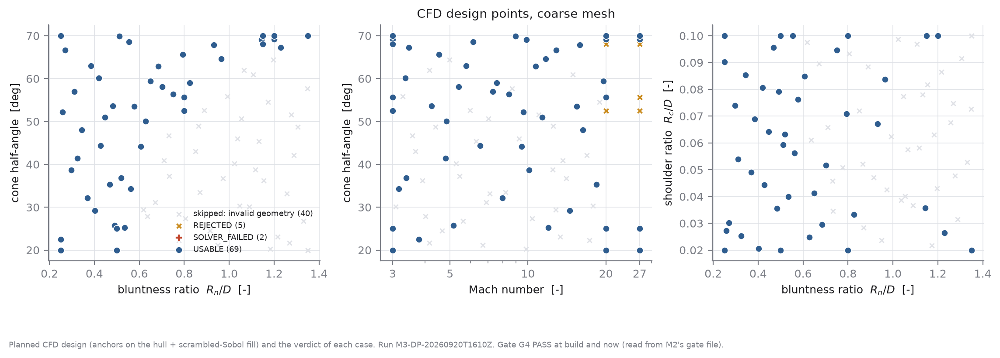
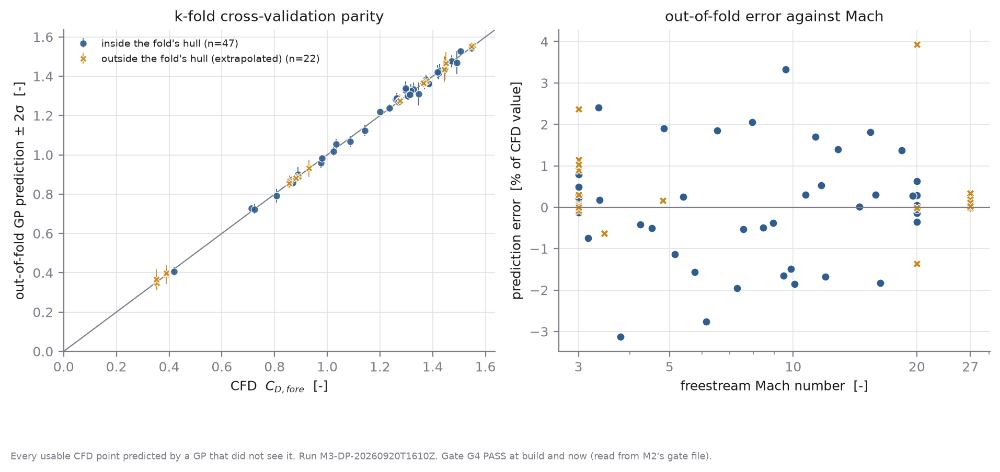
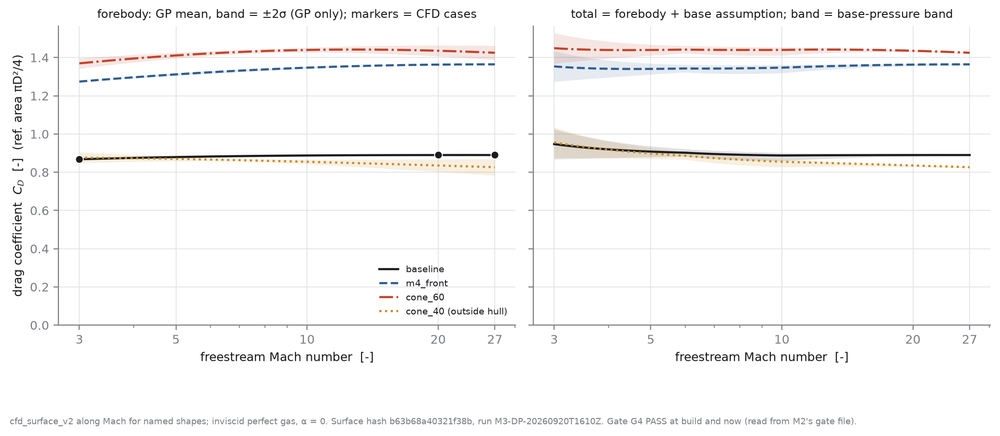
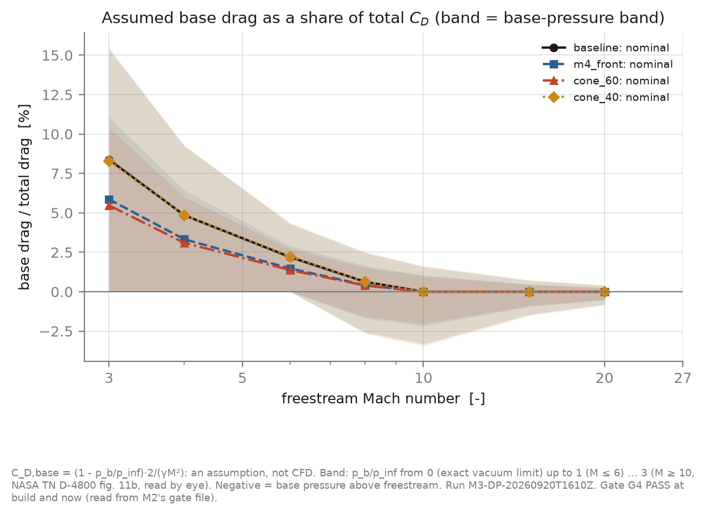
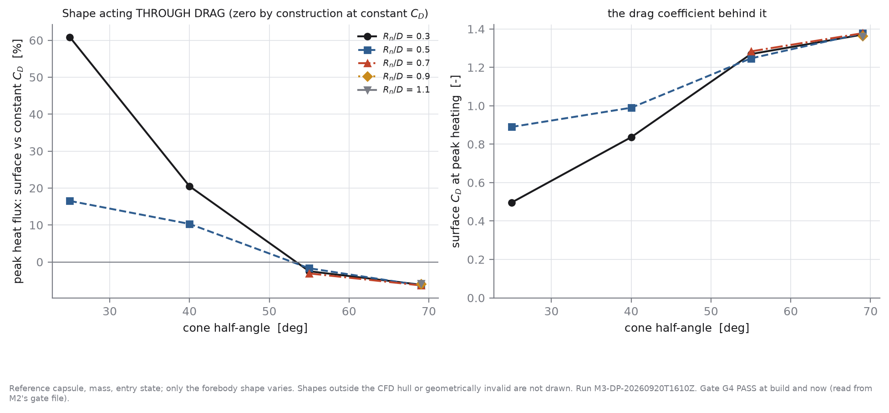

# M3 - Coupled geometry / CFD / trajectory / TPS model: the CFD-derived drag surface

*Generated by `scripts/run_m3_coupled.py` from `results/M3/M3-DP-20260920T1610Z/`. Every number below is read from a result file.*

> **Gate G4: PASS**, read - not typed - from `results/M2/M2-20260920T123901Z/gate_assessment.json` both when `cfd_surface_v2` was built (`gate_G4_status_at_build: PASS` in its `surface.json`) and when this report was generated. The surface is served without `allow_provisional`, and nothing in this study sets that flag. **What PASS does and does not cover:** G4 judges the solver, mesh family, convergence criterion and post-processing on a sphere at Mach 3 and 6. Most design points here were computed BEFORE the gate passed, by the same pipeline with the same settings; the gate validates that pipeline, not a date. It does not validate the perfect-gas model at Mach 20+, the coarse mesh on capsule shapes, or the assumed base drag - those limits are below. NR-25's caveat carries over: the restart rule that turned G4 from LIMITED to PASS was written after the original result had been seen.

> **This is `cfd_surface_v2`.** `cfd_surface_v1` (56 points, Mach 3-20, built while G4 was IN_PROGRESS) stays on disk in `data/aero/cfd_surface_v1/` and registered, PROVISIONAL for ever by its own `surface.json`; its tables are in `results/M3/M3-DP-20260920T1610Z/v1_tables/`. v2 = the same design + the cases a lower Courant limit recovered (§3) + a Mach-extension node (§7), top CFD Mach number **27**.

> **Mesh level: COARSE, not the medium mesh the brief asked for.** Reason and evidence in §2. Discretisation uncertainty is taken from the M2 GCI through a hook that reads `results/M2/<run>/gci.csv` (`aerodynamics.cfd_surface.discretisation_band`); right now that hook returns `available = True`, band = 0.628% from `results/M2/M2-20260920T123901Z/gci.csv`. The rebuilt file also carries LABELLED iterative columns, passed through under their own names: half peak-to-peak of the residual C_D limit cycle at this level 0.024%, band re-computed at the cycle's extremes 0.991%, discretisation + iterative 0.642% - the last is what `z_discretisation` scales.

## 1. What the model is

```
C_D(M, shape) = C_D,fore(M, shape)   Gaussian process through converged CFD cases (inviscid, perfect gas, alpha = 0)
              + C_D,base(M)          stated assumption with a band - NOT computed (A-CFD-5)
```

Inputs: log(Mach) and three forebody ratios - bluntness R_n/D, cone half-angle, shoulder ratio R_c/D. The forebody-only CFD domain (A-CFD-4) ends at the maximum-radius station, so the aft cone angle and the length cannot influence C_D,fore and are not inputs. **Angle of attack is zero by construction** (axisymmetric wedge mesh): no lift, no moments, no stability - a model limit, acceptable only because the entry studied is ballistic (spec §18: C_L only if required). The trajectory consumes a per-capsule 1-D interpolant of the surface; it never calls CFD or the GP inside a time step.

## 2. Design points

- Planned: **76** design points = 28 hull anchors (run at both ends of the core Mach range) + **14 Mach-extension anchors** (every anchor shape once more at Mach 27; added for v2 after v1 had been seen, §7) + 34 scrambled-Sobol fill points (seed 20260920), of which 8 were marked as the held-out test set before any case ran; plus 2 scale-check cases.
- 6 of those anchor cases (3 shapes) are **late anchors, added after the first pass**: the hull did not enclose the M4 front (NR-22). They were chosen from the front's shape range, not from any CFD value.
- **40** candidate shapes were skipped as geometrically invalid, each with its reason, in `results/M3/M3-DP-20260920T1610Z/design_skipped.csv`.
- Ranges: Mach 3-20 (log-spaced), bluntness 0.25-1.35, cone half-angle 20-70 deg, shoulder ratio 0.02-0.1 (the M4 design-space box).
- Wall time (coarse mesh, 4 serial cases side by side): median **201 s** per completed case (min 22, max 1137); sum over all 115 attempts 7.94 core-hours. Driver wall time, summed over 6 invocation(s) of the resumable driver: 2.36 h.
- The same pipeline on the **medium** mesh: median **1630 s** per completed case (8 cases) - the measured reason the full design was not run there.

**Why coarse.** The brief asked for the M2 medium mesh. Measured on this machine (fanless 4-performance-core laptop, M2 benchmark still running, interactive use), a medium case costs roughly eight times a coarse one (4x the cells, 2x the iterations), which put the full design at 7-8 hours against a ~2 hour budget. Running ~15 medium points instead would not support a 4-input surface. So every point was run on the coarse mesh, and a seeded subset was re-run on the medium mesh to MEASURE the coarse-to-medium change on capsule shapes (§5). `make cfd-design-points LEVEL=medium RUN_ID=M3-DP-20260920T1610Z` produces the all-medium table (resumable).



## 3. What converged, what did not, and why

| verdict | cases |
|---|---|
| USABLE | 69 |
| REJECTED | 5 |
| SOLVER_FAILED | 2 |

A case is USABLE only if it ran, met the **unchanged M2 force-convergence criterion**, left the outflow plane supersonic everywhere (A-CFD-4), and kept the bow shock clear of the inflow boundary - checked on the axis (stand-off vs distance to the boundary) and off it (outermost outflow faces still at freestream Mach). Nothing else is used to fit the surface. Every failed or rejected case stays on disk and is listed here:

| point_id | role | mach | bluntness_ratio | cone_half_angle_deg | shoulder_ratio | verdict | attempts | reasons |
|---|---|---|---|---|---|---|---|---|
| dp011 | anchor | 20.00 | 0.800 | 52.5 | 0.020 | REJECTED | 4 | force criterion not met (p2p 0.0005337286144733092, drift 0.0002743139953701283) after 0 extensions |
| dp061 | anchor | 20.00 | 1.150 | 68.1 | 0.100 | REJECTED | 4 | force criterion not met (p2p 0.0009350141136131253, drift 0.000609809259587605) after 0 extensions |
| dp062 | anchor | 27.00 | 0.250 | 20.0 | 0.020 | SOLVER_FAILED | 3 | rhoCentralFoam returned -4 |
| dp063 | anchor | 27.00 | 0.250 | 20.0 | 0.100 | SOLVER_FAILED | 3 | rhoCentralFoam returned -4 |
| dp067 | anchor | 27.00 | 0.800 | 52.5 | 0.020 | REJECTED | 4 | force criterion not met (p2p 0.008127640834431939, drift 0.004638302675971788) after 0 extensions |
| dp068 | anchor | 27.00 | 0.800 | 55.7 | 0.100 | REJECTED | 4 | force criterion not met (p2p 0.0009033349781733245, drift 0.0003651930500323636) after 0 extensions |
| dp075 | anchor | 27.00 | 1.150 | 68.1 | 0.100 | REJECTED | 4 | force criterion not met (p2p 0.0018064030420120803, drift 0.0006419811855758081) after 0 extensions |

Domain re-runs: **7** extra attempts over 4 design points (a crash or a failed shock-clearance check triggers a re-run in an enlarged domain; every attempt is a row of `attempts_coarse.csv`).
Patience pass: **14** cases missed the force criterion after M2's 3 extensions in the first pass and were given one more attempt with up to 9 - the criterion itself unchanged (NR-09's rule). **5** then met it (dp015, dp051, dp059, dp069, dp074); 9 still did not and stay REJECTED. This rule was added after the first pass had been seen, which the config says.

**Courant pass (v2; NR-25's lever on NR-21's cases).** **9** cases still rejected ONLY for the force criterion were continued from their final solution as new, separately named cases at max Courant 0.1 then 0.05 - blocks of 5000 iterations, never fewer than 2 (two consecutive windows), verdict at the end of the last block, criterion unchanged. **4** then met it and are USABLE (dp001, dp032, dp043, dp053); 5 still did not (dp011, dp061, dp067, dp068, dp075). The original attempts stay on disk and in the attempts table. This rule was written after both the v1 rejections and M2's NR-25 result had been seen, which the config says.

| case | max_co | status | verdict | cd_fore | p2p | drift | blocks |
|---|---|---|---|---|---|---|---|
| dp001_coarse_Co0p1 | 0.1 | OK | REJECTED | 0.35253 | 1.03e-03 | 3.51e-05 | 8 |
| dp001_coarse_Co0p05 | 0.05 | OK | USABLE | 0.35252 | 6.89e-04 | 2.01e-05 | 2 |
| dp067_coarse_Co0p1 | 0.1 | OK | REJECTED | 1.39024 | 6.94e-03 | 2.52e-03 | 8 |
| dp067_coarse_Co0p05 | 0.05 | OK | REJECTED | 1.39451 | 8.13e-03 | 4.64e-03 | 8 |
| dp075_coarse_Co0p1 | 0.1 | OK | REJECTED | 1.36678 | 6.68e-03 | 4.03e-03 | 8 |
| dp075_coarse_Co0p05 | 0.05 | OK | REJECTED | 1.37186 | 1.81e-03 | 6.42e-04 | 8 |
| dp032_coarse_Co0p1 | 0.1 | OK | USABLE | 0.88892 | 9.81e-04 | 5.20e-05 | 2 |
| dp043_coarse_Co0p1 | 0.1 | OK | USABLE | 0.72324 | 9.87e-04 | 3.26e-05 | 4 |
| dp068_coarse_Co0p1 | 0.1 | OK | REJECTED | 1.31842 | 1.04e-03 | 4.79e-04 | 8 |
| dp068_coarse_Co0p05 | 0.05 | OK | REJECTED | 1.31874 | 9.03e-04 | 3.65e-04 | 8 |
| dp011_coarse_Co0p1 | 0.1 | OK | REJECTED | 1.39105 | 8.82e-04 | 3.69e-04 | 8 |
| dp011_coarse_Co0p05 | 0.05 | OK | REJECTED | 1.39134 | 5.34e-04 | 2.74e-04 | 8 |
| dp053_coarse_Co0p1 | 0.1 | OK | REJECTED | 1.49537 | 9.64e-04 | 1.79e-04 | 8 |
| dp053_coarse_Co0p05 | 0.05 | OK | USABLE | 1.49116 | 6.16e-04 | 7.51e-05 | 3 |
| dp061_coarse_Co0p1 | 0.1 | OK | REJECTED | 1.36948 | 3.55e-03 | 2.04e-03 | 8 |
| dp061_coarse_Co0p05 | 0.05 | OK | REJECTED | 1.37035 | 9.35e-04 | 6.10e-04 | 8 |

Among USABLE cases: minimum outflow Mach 1.300; smallest axis clearance fraction 0.471; extensions needed: {0.0: 22, 1.0: 21, 2.0: 13, 3.0: 8, 4.0: 3, 5.0: 1, 6.0: 1}.

## 4. Two checks the surface leans on

**Scale invariance.** Inviscid perfect-gas flow has no length scale, so C_D should not depend on diameter. Checked, not assumed: the same shape at Mach 6 at D = 1.2 m and 3 m gives C_D,fore = 0.88690 and 0.88690, a relative difference of 0.0000% (declared tolerance 0.20%): scale-invariant. All design points were therefore run at one diameter.

**Stagnation pressure against the exact Rayleigh-pitot relation**, on every usable case (a check that holds at ANY Mach number, including above the M2 benchmark's Mach 6): median error -0.708%, worst 1.634% (dp066).

## 5. Discretisation: coarse vs medium on capsule shapes

| point_id | mach | bluntness_ratio | cone_half_angle_deg | cd_fore_coarse | cd_fore_finer | change [%] |
|---|---|---|---|---|---|---|
| dp013 | 20.00 | 0.800 | 55.7 | 1.31749 | 1.31734 | -0.011 |
| dp015 | 20.00 | 1.200 | 69.2 | 1.36333 | 1.36467 | +0.098 |
| dp017 | 20.00 | 0.500 | 25.0 | 0.88993 | 0.89211 | +0.245 |
| dp027 | 6.14 | 0.554 | 68.6 | 1.34686 | 1.34325 | -0.268 |
| dp030 | 7.96 | 0.368 | 32.1 | 0.71281 | 0.71574 | +0.411 |
| dp040 | 4.53 | 0.794 | 65.6 | 1.36968 | 1.36623 | -0.252 |

8 points were re-run on the medium mesh (seeded subset + the M4-front and baseline shapes at Mach 20); 2 of them (dp003, dp019) did not meet the force criterion there and are not paired. The medium runs did not get the patience pass.

Largest coarse-to-medium change in C_D,fore over 6 paired capsule cases: **0.411%**. This is a two-level difference, not a GCI: it shows the size of the effect, it does not bound the error.

## 6. Response surface (spec §25)

Gaussian process (`aether.surrogate.GPSurrogate`: Matern-5/2, one length scale per input, white-noise term) on **69** usable CFD points. Surface hash `b63b68a40321f38b`; persisted as the training table plus pinned kernel hyper-parameters in `data/aero/cfd_surface_v2/`, so a reload is bit-for-bit.

| set | n | rmse | mae | r2 | z_std | cov50 | cov68 | cov90 | cov95 |
|---|---|---|---|---|---|---|---|---|---|
| held-out test, inside hull | 8 | 0.0234 | 0.0191 | 0.9958 | 1.70 | 0.12 | 0.25 | 0.62 | 0.62 |
| held-out test, all | 8 | 0.0234 | 0.0191 | 0.9958 | 1.70 | 0.12 | 0.25 | 0.62 | 0.62 |
| k-fold, inside fold hull | 47 | 0.0151 | 0.0110 | 0.9965 | 1.35 | 0.45 | 0.62 | 0.81 | 0.85 |
| k-fold, all | 69 | 0.0130 | 0.0088 | 0.9983 | 1.13 | 0.58 | 0.74 | 0.87 | 0.90 |
| k-fold, outside fold hull | 22 | 0.0066 | 0.0043 | 0.9997 | 0.38 | 0.86 | 1.00 | 1.00 | 1.00 |

Held-out test set: 8 planned, 8 usable (the others failed the acceptance rules in §3). k = 5 folds. RMSE/MAE are in C_D units; C_D,fore spans 0.352-1.553. `cov68` is the fraction of truths inside the predicted central 68% interval (nominal 0.68); `z_std` > 1 means overconfident. With this few points the coverage figures are themselves uncertain by roughly ±1/sqrt(n).

**Calibration.** Where the k-fold z-score spread exceeds 1 the GP is overconfident. The **sigma inflation factor is 1.21** (max of the k-fold z-score std over all usable points (1.134) and over the core Mach range only (1.207)), stored with the surface and applied to the GP term before M7 samples it. The Mach-extension points are near-copies of their Mach-20 twins and therefore easy to predict, which flatters the pooled spread; that is why the core-range spread is taken when it is larger - a rule tightened for v2 after that effect was seen. This is a one-number recalibration, not a fix: the held-out set's own z-score spread is 1.70 on n = 8, LARGER than the factor applied, and n is small.

**Extrapolation guard.** A capsule whose shape lies outside the convex hull of the usable CFD points is refused: `evaluate_design` returns it as a rejected candidate (`status: aero surface extrapolation: ...`, NaN metrics) that stays in the candidate log. `on_extrapolation: flag` overrides and labels the result. Failed CFD cases therefore shrink the usable design space - see §3 for where.





## 7. Mach range: where the entry actually happens

Baseline capsule, constant C_D: entry Mach 19.5, maximum 27.1, Mach at peak heating **19.4**, at peak deceleration **12.2**.

| mach_lo | mach_hi | heat load [%] | flight time [s] |
|---|---|---|---|
| 0 | 1 | 0.00 | 0.7 |
| 1 | 3 | 0.23 | 32.5 |
| 3 | 6 | 1.07 | 16.8 |
| 6 | 10 | 3.70 | 13.5 |
| 10 | 20 | 39.98 | 40.2 |
| 20 | 27 | 51.72 | 119.6 |
| 27 | 99 | 3.29 | 21.2 |

So a surface over the M2 benchmark's Mach 3-6 alone would cover almost none of the heating. The core design therefore runs to Mach 20, and v2 adds a Mach-extension node at Mach 27 - and the perfect-gas solver can, because its equations contain only Mach number and gamma. What that does and does not mean:

- **Mach extension (v2).** v1 held its Mach-20 value above Mach 20, where most of the heat load accrues. Every anchor shape was therefore run once more at Mach 27 with the same first-order start (NR-19), domain sizing and clearance checks (NR-20, NR-26) and acceptance rules: **9 of 14 are USABLE**; the rest (dp062, dp063, dp067, dp068, dp075) failed and stay on record (§3, NR-27). Between Mach 20 and 27 the hull is spanned by those anchors only, so it is SMALLER than below wherever an extension anchor failed. A shape is not rejected for that: its table stops at the last extension node still inside the hull and holds the value there, exactly as v1 did at Mach 20. The top CFD Mach number is therefore **per shape**, recorded in every evaluation's provenance (`mach_range`, `mach_top_truncated_by_hull`), and the heat-load share above it is reported per design (§10).

  **What this closes and what it does not.** Running the perfect-gas solver to Mach 27 removes an *extrapolation in Mach number* of the perfect-gas model. It does NOT touch the *model-form* error: at these speeds air dissociates and ionises, and a calorically perfect gas with gamma = 1.4 is the wrong gas at Mach 20 and equally wrong at Mach 27. Real-gas effects are exactly what the declared ±5% model-form band is for, and it stays, unchanged and unvalidated.

- **Above the top CFD Mach number (27, or lower for a shape the hull truncates) the top value is held.** The basis is Mach-number independence of blunt-body pressure drag (Anderson, *Hypersonic and High-Temperature Gas Dynamics*, 2nd ed., AIAA 2006, ch. 4 'Hypersonic Inviscid Flowfields: Approximate Methods', §4.3 'Mach-Number Independence' - chapter and section titles verified against the Library of Congress table of contents, catdir.loc.gov/catdir/toc/ecip0618/2006025724.html; **the book's text itself was not opened for this project**, so the principle is cited, not quoted). It is also measured on this surface:

  **This matters: 55% of the baseline capsule's heat load (constant-C_D trajectory) is accumulated above Mach 20** - the part v1 flew on a held value - and **3.3% above Mach 27**, which is what is still held when the shape's table reaches the top node. Per-design shares on the surface's own trajectory are in §10.

  Largest change in C_D,fore between Mach 10 and 20 among the named shapes inside the hull: 2.25%. Not zero: holding a top value is an approximation of about that size, not an identity.

  Between Mach 20 and 27 - i.e. what v1's hold had cost, measured - the largest change among the named shapes inside the hull is 0.74%.

| shape | mach_lo | mach_hi | cd_fore_lo | cd_fore_hi | change [%] | extrapolated |
|---|---|---|---|---|---|---|
| baseline | 10 | 20 | 0.8877 | 0.8899 | +0.254 | False |
| baseline | 6 | 20 | 0.8824 | 0.8899 | +0.857 | False |
| baseline | 20 | 27 | 0.8899 | 0.8900 | +0.007 | False |
| m4_front | 10 | 20 | 1.3472 | 1.3632 | +1.184 | False |
| m4_front | 6 | 20 | 1.3232 | 1.3632 | +3.019 | False |
| m4_front | 20 | 27 | 1.3632 | 1.3645 | +0.100 | False |
| cone_60 | 10 | 20 | 1.4399 | 1.4357 | -0.292 | False |
| cone_60 | 6 | 20 | 1.4219 | 1.4357 | +0.965 | False |
| cone_60 | 20 | 27 | 1.4357 | 1.4251 | -0.737 | False |
| cone_40 | 10 | 20 | 0.8547 | 0.8354 | -2.251 | False |
| cone_40 | 6 | 20 | 0.8664 | 0.8354 | -3.573 | False |
| cone_40 | 20 | 27 | 0.8354 | 0.8264 | -1.082 | True |

- **The perfect gas is wrong for the shock layer at these speeds** (no dissociation, far too hot, shock too far out - `docs/validation/M2_model_form_limits.md`). It is adequate *to first order for pressure drag only*: surface pressure is set by the normal momentum flux, and the stagnation Cp moves only from about 1.84 (gamma = 1.4) to the Newtonian 2.0. That argument is **not validated here**; it is carried as a declared half-band of ±5% on C_D,fore for M7 to sample, and it biases in a known direction (real-gas C_D slightly HIGHER).
- **Below Mach 3 the value at Mach 3 is held.** Not physics: transonic and subsonic capsule drag is base-dominated and outside this model's permitted use. It is tolerable because of how little of the entry happens there - quantified in §10.
- M2 validated the solver at Mach 3 and 6 only. Between Mach 6 and 27 the only per-case check is the exact stagnation pressure (§4).

## 8. Base drag (closes A-CFD-5 as an assumption, not as a result)

`C_D,base = (1 - p_b/p_inf) * 2/(gamma M^2) * (A_base/A_ref)` - algebra. All the uncertainty is in the base-pressure ratio, which is **bounded, not predicted**: from 0 (exact vacuum limit) up to 1 for Mach <= 6 and up to 3 for Mach >= 10. The upper value comes from NASA TN D-4800 (Miller 1968) figure 11(b), opened and read for this milestone: area-mean p_b/p_inf for blunted 9-degree cones at Mach 10-20 lies between about 0.2 and about 3, rising with Mach and bluntness (read off a log-scale graph by eye, ±30%). The same report states base drag was under about 2% of total for bluntness 0.55-0.8. Nominal p_b/p_inf is 0.5 (Mach <= 6) rising to 1.0 (Mach >= 10): declared choices inside the band. A_base/A_ref = 1 (largest possible). No source found gives a flight-Reynolds-number value (sourcing report, unresolved gap).

| shape | mach | cd_fore | cd_base_low | cd_base_nominal | cd_base_high | frac low [%] | frac nominal [%] | frac high [%] |
|---|---|---|---|---|---|---|---|---|
| baseline | 3 | 0.8680 | +0.0000 | +0.0794 | +0.1587 | +0.00 | +8.38 | +15.46 |
| baseline | 4 | 0.8749 | +0.0000 | +0.0446 | +0.0893 | +0.00 | +4.85 | +9.26 |
| baseline | 6 | 0.8824 | +0.0000 | +0.0198 | +0.0397 | +0.00 | +2.20 | +4.30 |
| baseline | 8 | 0.8859 | -0.0223 | +0.0056 | +0.0223 | -2.58 | +0.63 | +2.46 |
| baseline | 10 | 0.8877 | -0.0286 | +0.0000 | +0.0143 | -3.33 | +0.00 | +1.58 |
| baseline | 15 | 0.8894 | -0.0127 | +0.0000 | +0.0063 | -1.45 | +0.00 | +0.71 |
| baseline | 20 | 0.8899 | -0.0071 | +0.0000 | +0.0036 | -0.81 | +0.00 | +0.40 |
| m4_front | 3 | 1.2744 | +0.0000 | +0.0794 | +0.1587 | +0.00 | +5.86 | +11.08 |
| m4_front | 4 | 1.2968 | +0.0000 | +0.0446 | +0.0893 | +0.00 | +3.33 | +6.44 |
| m4_front | 6 | 1.3232 | +0.0000 | +0.0198 | +0.0397 | +0.00 | +1.48 | +2.91 |
| m4_front | 8 | 1.3380 | -0.0223 | +0.0056 | +0.0223 | -1.70 | +0.42 | +1.64 |
| m4_front | 10 | 1.3472 | -0.0286 | +0.0000 | +0.0143 | -2.17 | +0.00 | +1.05 |
| m4_front | 15 | 1.3588 | -0.0127 | +0.0000 | +0.0063 | -0.94 | +0.00 | +0.47 |
| m4_front | 20 | 1.3632 | -0.0071 | +0.0000 | +0.0036 | -0.53 | +0.00 | +0.26 |
| cone_60 | 3 | 1.3698 | +0.0000 | +0.0794 | +0.1587 | +0.00 | +5.48 | +10.38 |
| cone_60 | 4 | 1.3949 | +0.0000 | +0.0446 | +0.0893 | +0.00 | +3.10 | +6.02 |
| cone_60 | 6 | 1.4219 | +0.0000 | +0.0198 | +0.0397 | +0.00 | +1.38 | +2.71 |
| cone_60 | 8 | 1.4343 | -0.0223 | +0.0056 | +0.0223 | -1.58 | +0.39 | +1.53 |
| cone_60 | 10 | 1.4399 | -0.0286 | +0.0000 | +0.0143 | -2.02 | +0.00 | +0.98 |
| cone_60 | 15 | 1.4411 | -0.0127 | +0.0000 | +0.0063 | -0.89 | +0.00 | +0.44 |
| cone_60 | 20 | 1.4357 | -0.0071 | +0.0000 | +0.0036 | -0.50 | +0.00 | +0.25 |
| cone_40 | 3 | 0.8767 | +0.0000 | +0.0794 | +0.1587 | +0.00 | +8.30 | +15.33 |
| cone_40 | 4 | 0.8733 | +0.0000 | +0.0446 | +0.0893 | +0.00 | +4.86 | +9.28 |
| cone_40 | 6 | 0.8664 | +0.0000 | +0.0198 | +0.0397 | +0.00 | +2.24 | +4.38 |
| cone_40 | 8 | 0.8601 | -0.0223 | +0.0056 | +0.0223 | -2.66 | +0.64 | +2.53 |
| cone_40 | 10 | 0.8547 | -0.0286 | +0.0000 | +0.0143 | -3.46 | +0.00 | +1.64 |
| cone_40 | 15 | 0.8437 | -0.0127 | +0.0000 | +0.0063 | -1.53 | +0.00 | +0.75 |
| cone_40 | 20 | 0.8354 | -0.0071 | +0.0000 | +0.0036 | -0.86 | +0.00 | +0.43 |

Across the named shapes the nominal base share of total C_D is 5.5-8.4% at Mach 3 and 0.00% or less in magnitude at Mach >= 10, where the band spans -3.46% to +1.64%. A negative share means base pressure above freestream (a small thrust).



## 9. Uncertainty exposed to M7

```
C_D = C_D,fore * (1 + z_disc*s_disc + u_form*h_form) + z_gp*s_gp(M) + C_D,base(M; u_base)
```

| term | draw | size | status |
|---|---|---|---|
| GP predictive | z_gp ~ N(0,1), one per trajectory | s_gp(M) from the GP (max over report shapes in the figure) | measured (§6) |
| discretisation | z_disc ~ N(0,1) | s_disc = band/2, band from the M2 GCI hook | band = 0.628% read from `results/M2/M2-20260920T123901Z/gci.csv`; sampled band incl. the labelled iterative term 0.642% |
| model form (perfect gas) | u_form ~ U(-1,1) | h_form = 5% | declared, NOT validated |
| base pressure | u_base ~ U(-1,1) | band of §8 | sourced band, declared nominal |

Set through `vehicle.aero.uncertainty: {z_gp, z_discretisation, u_model_form, u_base}`; all default to zero (the nominal surface). Transferring a sphere's GCI to a capsule is itself an assumption (A-CFD-9).

## 10. Gate G5 and the coupled comparison

**G5 status: PASS** - determinism and provenance checks met on a surface built and evaluated with gate G4 PASS. G5 is a SOFTWARE gate (spec §19): it says the coupled evaluator is deterministic and labels its aerodynamics, not that the drag is right. Surface limits - coarse mesh, perfect gas, alpha = 0, assumed base drag - are in the report..

| check | met |
|---|---|
| deterministic | True |
| design_id_stable | True |
| fidelity_is_1 | True |
| provenance_complete | True |
| extrapolation_flags_recorded | True |
| gate_status_recorded | True |

`evaluate_design` was run 3 times on the same config with the surface on; result fingerprints (every metric, margin, diagnostic, the provenance block and the velocity history, bit for bit): `beb2fee560940620`, `beb2fee560940620`, `beb2fee560940620`.

### Constant C_D vs CFD surface, same design

| design | C_D const | C_D surface @ peak q | peak flux [%] | bondline [K] | max g [%] | heat load [%] | feasible const→surf | outside hull |
|---|---|---|---|---|---|---|---|---|
| baseline_capsule | 1.200 | 0.8899 | +16.52 | +9.56 | +3.04 | +16.08 | False→False | False |
| M4:C-52b4dbb040f4 | 1.200 | 1.3634 | -6.02 | -3.15 | +0.07 | -6.19 | True→True | False |
| M4:C-31adf2fd40ab | 1.200 | 1.3643 | -6.00 | -3.00 | +0.16 | -6.28 | True→True | False |
| M4:C-ce6d29101514 | 1.200 | 1.3643 | -5.95 | -2.76 | +0.26 | -6.33 | True→True | False |
| M4:C-8464df4a18da | 1.200 | 1.3637 | -5.91 | -2.59 | +0.31 | -6.34 | True→True | False |
| M4:C-bafff098d167 | 1.200 | 1.3639 | -5.89 | -2.46 | +0.37 | -6.37 | True→False | False |

Heat-load share flown outside the CFD Mach range (surface arm): below Mach 3: 0.37% at most; above each design's own top CFD Mach number (§7; 27 unless the hull truncates it): 0.0-2.9% (value held).


**Sensitivity to the strict convergence rule.** 5 cases (`dp011`, `dp061`, `dp067`, `dp068`, `dp075`) passed every acceptance rule except force convergence and stayed inside a 1% band. They are NOT in `cfd_surface_v2`. A second, labelled INCLUSIVE surface that also takes them was fitted only to see how much the strict rule costs in the corner of the shape space it removes:

| design | outside hull strict→inclusive | C_D @ peak q strict | C_D @ peak q inclusive | peak flux [%] strict | peak flux [%] inclusive | bondline [K] strict | bondline [K] inclusive |
|---|---|---|---|---|---|---|---|
| baseline_capsule | False→False | 0.8899 | 0.8899 | +16.52 | +16.52 | +9.56 | +9.56 |
| M4:C-52b4dbb040f4 | False→False | 1.3634 | 1.3649 | -6.02 | -6.07 | -3.15 | -3.18 |
| M4:C-31adf2fd40ab | False→False | 1.3643 | 1.3643 | -6.00 | -6.00 | -3.00 | -3.00 |
| M4:C-ce6d29101514 | False→False | 1.3643 | 1.3643 | -5.95 | -5.95 | -2.76 | -2.76 |
| M4:C-8464df4a18da | False→False | 1.3637 | 1.3643 | -5.91 | -5.93 | -2.59 | -2.60 |
| M4:C-bafff098d167 | False→False | 1.3639 | 1.3640 | -5.89 | -5.89 | -2.46 | -2.46 |


### Does capsule shape matter now?

At constant C_D the forebody shape had **no aerodynamic consequence at all**. With the surface, over 12 swept shapes inside the CFD hull (of 12 swept; same diameter, mass and entry state), C_D at peak heating ranges **0.496-1.378**. Acting through drag alone (each shape compared with ITS OWN constant-C_D evaluation, so the heating model's shape dependence cancels), that moves peak heat flux by -6.35% to +60.84%, peak bondline temperature by -4.2 to +29.7 K, and peak deceleration by -1.77% to +10.18%. The model predicts that shape now matters; how much of that survives the medium mesh and real-gas effects is not established here, and what it does to the optimum is M4's re-run to report.



### How much do the objectives care about what the surface cannot know?

| case | peak flux [%] | bondline [K] | max g [%] |
|---|---|---|---|
| surface:low_mach_x0.7 | +0.000 | +0.236 | +0.000 |
| surface:low_mach_x1.3 | +0.000 | -0.190 | +0.000 |
| surface:u_base=+1 | -0.186 | -0.525 | +0.334 |
| surface:u_base=-1 | +0.376 | +0.706 | -0.664 |
| surface:z_gp=+2 | -0.015 | -0.112 | +0.207 |
| surface:z_gp=-2 | +0.011 | +0.109 | -0.207 |
| surface:u_model_form=+1 | -2.503 | -1.579 | -0.494 |
| surface:u_model_form=-1 | +2.698 | +1.651 | +0.521 |

`low_mach_x0.7 / x1.3` scale the HELD value below the lowest CFD Mach by ∓30%: that is the quantified form of the claim that the low-supersonic and subsonic tail does not matter to the thermal objectives. Baseline capsule, surface arm.

## 11. Limits (what this surface is not)

- Inviscid, calorically perfect gas, zero angle of attack, steady, forebody only. Not a flight C_D. Permitted and forbidden uses: `docs/validation/M2_model_form_limits.md`. **No heating quantity comes from this CFD.**
- Gate G4 PASS covers the pipeline on a sphere at Mach 3 and 6, nothing more; coarse mesh, not the medium mesh the brief asked for; discretisation band 0.63% from a SPHERE's GCI (A-CFD-9), not a capsule's.
- Base drag is an assumption with a band, not a computation.
- Held constant outside Mach 3-27 (lower top for shapes the hull truncates). Extending the perfect-gas CFD in Mach closes an extrapolation in Mach, not the model-form error.
- A few dozen CFD points in four inputs: the GP's error bars are the honest summary of what it knows, and its coverage statistics rest on a small sample.
- Failed CFD cases remove their corner of the shape space from the usable hull (§3).

## 12. Reproduce

```
make cfd-design-points                      # hours; OpenFOAM; resumable with RUN_ID=
make cfd-design-points LEVEL=medium SUBSET=mesh-check RUN_ID=<run>
make aero-surface RUN_ID=<run>              # seconds
make m3-coupled   RUN_ID=<run>              # ~1 min; writes this report
```
