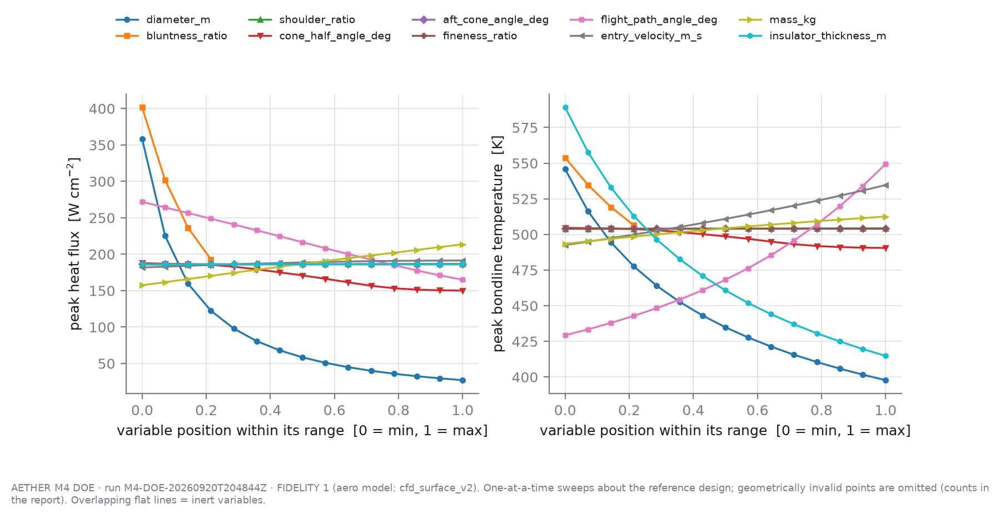
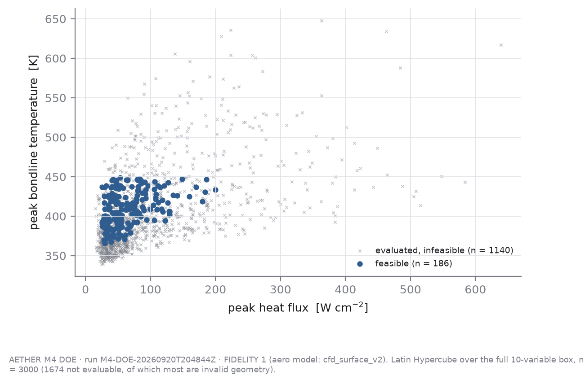
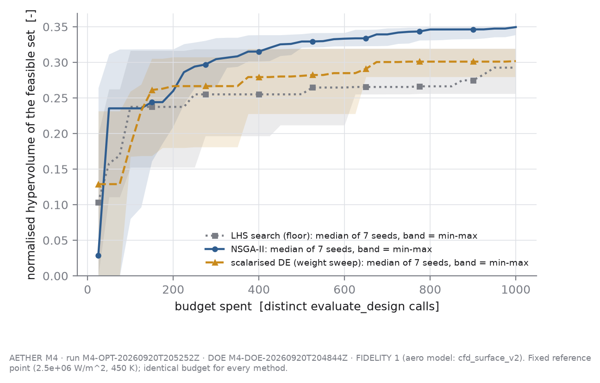

# M4 — DOE, sensitivity and Pareto optimisation

> **fidelity: 1** · aerodynamic model: `cfd_surface_v2` · generated file, do not edit by hand
>
> DOE run `M4-DOE-20260920T204844Z` (git `f5a55b6`, dirty tree) · optimisation run `M4-OPT-20260920T205252Z` (git `f5a55b6`, dirty tree)

*Produced from an uncommitted working tree; the config snapshot beside each result is the authoritative record of what ran.*

**Read this first.** This is the Fidelity-1 re-run of M4 on the final physics: drag from the CFD-derived response surface `cfd_surface_v2` (inviscid, calorically perfect gas, zero angle of attack, coarse mesh, assumed base drag; `reports/milestones/M3_coupled_model.md`), stagnation heating from Sutton–Graves with the effective nose radius taken from the measured stagnation-point velocity gradient (A-GEO-3), 1-D conduction. **No heating quantity comes from CFD.** The Fidelity-0 report is archived unchanged as `M4_pareto_optimisation_fidelity0.md`; its screening and fronts are void for this model twice over (the shoulder ratio now moves heating through R_eff, and shape now moves drag) and nothing here reuses them. Every statement below is "the model predicts, within the tested assumptions" - the limits are in §12 and they are not small.

## 1. Cost of one evaluation

Measured over 7607 coupled evaluations inside worker processes: median **0.150 s**, mean 0.151 s, 95th percentile 0.182 s, maximum 0.354 s per `evaluate_design` call. With 6 worker processes the DOE sustained 47.5 evaluations/s (9292 evaluations in 196 s). The conduction solve dominates. At this cost a variance-based global sensitivity analysis is affordable, so Sobol' indices were used rather than Morris screening.

## 2. Design space

| variable | role | units | min | max | reference |
|---|---|---|---|---|---|
| `diameter_m` | design | m | 0.8 | 4.5 | 1.2 |
| `bluntness_ratio` | design | - | 0.25 | 1.35 | 0.5 |
| `shoulder_ratio` | design | - | 0.02 | 0.1 | 0.1 |
| `cone_half_angle_deg` | design | deg | 20 | 70 | 25 |
| `aft_cone_angle_deg` | design | deg | 0 | 35 | 20 |
| `fineness_ratio` | design | - | 0.5 | 1.2 | 0.875 |
| `flight_path_angle_deg` | design | deg | -8 | -1.5 | -3 |
| `entry_velocity_m_s` | given | m/s | 7200 | 7800 | 7400 |
| `mass_kg` | given | kg | 250 | 450 | 350 |
| `insulator_thickness_m` | deferred | m | 0.01 | 0.03 | 0.015 |

Geometry is parametrised by diameter plus shape *ratios* (nose radius/D, shoulder radius/D, length/D); the evaluator converts to `CapsuleGeometry` fields and `CapsuleGeometry.validate()` decides validity. `given` variables are mission givens, screened because M7 needs them as uncertainties, never optimised. `deferred` is a real design variable held out of M4 (ASSUMPTIONS A-OPT-2).

### What Fidelity 1 can and cannot explore

The drag surface refuses a forebody shape outside the convex hull of the CFD cases it was fitted to (A-AERO-1): such a design is returned as a rejected candidate, never an extrapolated number. Measured by Monte Carlo over the shape box (20000 seeded samples of bluntness, cone half-angle and shoulder ratio; surface `b63b68a40321f38b`): **46.4%** of the box is a forebody that can exist at all, **46.3%** of the box is both valid and inside the CFD hull, i.e. **99.8% of the valid shapes** are evaluable (Monte-Carlo standard error ±0.4 points). The rest is closed to every optimiser at this fidelity - not by physics, but by where CFD was run and where it converged (M3 report §3). That is a real limit on what the front below can be said to have searched.

The Saltelli sub-box of §5 was verified BEFORE the run to lie wholly inside that region (8 vertices + 4096 seeded interior shapes, all valid and inside the hull); the run refuses to start otherwise, because a Saltelli design cannot tolerate one rejected sample. The sub-box covers **11.8% of the shape box** (25.5% of its evaluable part). What keeps it that small is mostly GEOMETRIC VALIDITY (a rectangle in which every capsule exists has to stay at wide cone angles and moderate bluntness), not the CFD hull; either way, the Sobol' indices of §5 - and the freeze decisions made from them - describe that fraction of the box and nothing outside it.

## 3. One-at-a-time sweeps

Range of each output over a sweep of one variable across its full range, all others at the reference design. A range of exactly 0 means the model is structurally blind to that variable.

| variable | Δ peak flux [W/m²] | Δ bondline T [K] | Δ max g [g] | Δ shield mass fraction [-] | invalid geometry | feasible |
|---|---|---|---|---|---|---|
| `diameter_m` | 3.308e+06 | 148 | 2.647 | 2.283 | 0/15 | 3/15 |
| `bluntness_ratio` | 2.084e+06 | 47.41 | 1.07 | 0.05517 | 11/15 | 0/15 |
| `shoulder_ratio` | 8209 | 0.3607 | 0.004167 | 0.006899 | 0/15 | 0/15 |
| `cone_half_angle_deg` | 3.774e+05 | 14.16 | 0.5712 | 0.04659 | 0/15 | 0/15 |
| `aft_cone_angle_deg` | 0 | 0 | 0 | 0 | 0/15 | 0/15 |
| `fineness_ratio` | 0 | 0 | 0 | 0 | 0/15 | 0/15 |
| `flight_path_angle_deg` | 1.068e+06 | 120.1 | 12.8 | 0 | 0/15 | 0/15 |
| `entry_velocity_m_s` | 9.616e+04 | 42.14 | 2.119 | 0 | 0/15 | 0/15 |
| `mass_kg` | 5.618e+05 | 19.12 | 0.7289 | 0.1043 | 0/15 | 0/15 |
| `insulator_thickness_m` | 0 | 174.2 | 0 | 0.03009 | 0/15 | 0/15 |



## 4. Latin Hypercube over the full box

3000 seeded LHS samples (seed 20260920): **1328** geometrically valid, 1326 evaluated cleanly, **186** feasible. Invalid geometries are recorded as infeasible candidates with `CapsuleGeometry.validate()`'s own message as the failure reason; none was dropped.

Constraint violations among evaluated samples: `max_g` 910, `peak_bondline_temperature_k` 190, `heatshield_mass_fraction` 481.

Most common failure reasons (numbers masked as #):

- 1606 × invalid geometry: cone_half_angle_deg (# deg) is too small for this nose_radius_m / diamet
- 476 × constraint violated: max_g
- 359 × constraint violated: heatshield_mass_fraction, max_g
- 115 × constraint violated: heatshield_mass_fraction
- 108 × constraint violated: peak_bondline_temperature_k
- 75 × constraint violated: max_g, peak_bondline_temperature_k
- 40 × invalid geometry: aft_cone_angle_deg (# deg) closes the aft body to a point before reachin
- 25 × invalid geometry: length_m (# m) is too short to contain the nose, fore cone and shoulder,

Which variables decide whether a geometry is *valid* (given-data first-order index on the validity indicator, 95% bootstrap CI):

| variable | S₁(validity) | CI |
|---|---|---|
| `bluntness_ratio` | 0.533 | [0.508, 0.567] |
| `cone_half_angle_deg` | 0.138 | [0.123, 0.167] |
| `diameter_m` | 0.010 | [0.008, 0.025] |
| `aft_cone_angle_deg` | 0.009 | [0.009, 0.023] |
| `insulator_thickness_m` | 0.008 | [0.007, 0.022] |
| `shoulder_ratio` | 0.008 | [0.008, 0.023] |
| `flight_path_angle_deg` | 0.007 | [0.007, 0.021] |
| `entry_velocity_m_s` | 0.006 | [0.007, 0.021] |
| `mass_kg` | 0.005 | [0.006, 0.020] |
| `fineness_ratio` | 0.005 | [0.006, 0.020] |



## 5. Global sensitivity (Sobol')

Saltelli design, n_base = 512, 6144 evaluations, Saltelli-2010 first-order and Jansen total-order estimators, percentile-bootstrap 95% confidence intervals. A Saltelli design needs a box in which every point can be evaluated, so it was run on an all-valid sub-box: `bluntness_ratio` ∈ [0.25, 0.9], `cone_half_angle_deg` ∈ [60, 70], `aft_cone_angle_deg` ∈ [0, 20], `fineness_ratio` ∈ [0.6, 1.2]; all other ranges as in §2. Indices are therefore statements about that sub-box. The full box is covered by the LHS analysis above.

**peak_heat_flux_w_m2** [W/m²] — ranked by total-order index

| rank | variable | S_T | 95% CI | S₁ | 95% CI |
|---|---|---|---|---|---|
| 1 | `diameter_m` | 0.8963 | [0.7972, 1.0122] | 0.8393 | [0.6942, 0.9971] |
| 2 | `bluntness_ratio` | 0.0629 | [0.0486, 0.0816] | 0.0426 | [0.0134, 0.0665] |
| 3 | `flight_path_angle_deg` | 0.0544 | [0.0405, 0.0703] | 0.0382 | [0.0155, 0.0628] |
| 4 | `mass_kg` | 0.0193 | [0.0137, 0.0265] | 0.0100 | [-0.0074, 0.0292] |
| 5 | `entry_velocity_m_s` | 0.0058 | [0.0042, 0.0078] | 0.0049 | [-0.0048, 0.0146] |
| 6 | `shoulder_ratio` | 0.0006 | [0.0005, 0.0008] | -0.0006 | [-0.0045, 0.0030] |
| 7 | `cone_half_angle_deg` | 0.0001 | [0.0000, 0.0001] | -0.0002 | [-0.0012, 0.0008] |
| 8 | `aft_cone_angle_deg` | 0.0000 | [0.0000, 0.0000] | 0.0000 | [0.0000, 0.0000] |
| 9 | `fineness_ratio` | 0.0000 | [0.0000, 0.0000] | 0.0000 | [0.0000, 0.0000] |
| 10 | `insulator_thickness_m` | 0.0000 | [0.0000, 0.0000] | 0.0000 | [0.0000, 0.0000] |

**peak_bondline_temperature_k** [K] — ranked by total-order index

| rank | variable | S_T | 95% CI | S₁ | 95% CI |
|---|---|---|---|---|---|
| 1 | `diameter_m` | 0.4294 | [0.3486, 0.5065] | 0.3879 | [0.3090, 0.4655] |
| 2 | `insulator_thickness_m` | 0.3767 | [0.3197, 0.4366] | 0.3120 | [0.2306, 0.4043] |
| 3 | `flight_path_angle_deg` | 0.2392 | [0.1876, 0.2989] | 0.1915 | [0.1360, 0.2513] |
| 4 | `bluntness_ratio` | 0.0176 | [0.0142, 0.0215] | 0.0118 | [-0.0038, 0.0280] |
| 5 | `entry_velocity_m_s` | 0.0111 | [0.0087, 0.0142] | 0.0066 | [-0.0061, 0.0209] |
| 6 | `mass_kg` | 0.0063 | [0.0052, 0.0076] | 0.0103 | [-0.0003, 0.0204] |
| 7 | `shoulder_ratio` | 0.0003 | [0.0002, 0.0003] | 0.0002 | [-0.0017, 0.0022] |
| 8 | `cone_half_angle_deg` | 0.0000 | [0.0000, 0.0000] | 0.0002 | [-0.0003, 0.0007] |
| 9 | `aft_cone_angle_deg` | 0.0000 | [0.0000, 0.0000] | 0.0000 | [0.0000, 0.0000] |
| 10 | `fineness_ratio` | 0.0000 | [0.0000, 0.0000] | 0.0000 | [0.0000, 0.0000] |

**max_g** [g] — ranked by total-order index

| rank | variable | S_T | 95% CI | S₁ | 95% CI |
|---|---|---|---|---|---|
| 1 | `flight_path_angle_deg` | 0.9786 | [0.8932, 1.0742] | 0.9732 | [0.8699, 1.0841] |
| 2 | `diameter_m` | 0.0265 | [0.0225, 0.0312] | 0.0183 | [-0.0021, 0.0398] |
| 3 | `entry_velocity_m_s` | 0.0077 | [0.0066, 0.0088] | 0.0007 | [-0.0108, 0.0127] |
| 4 | `mass_kg` | 0.0024 | [0.0020, 0.0028] | -0.0007 | [-0.0070, 0.0051] |
| 5 | `shoulder_ratio` | 0.0001 | [0.0001, 0.0001] | -0.0005 | [-0.0017, 0.0005] |
| 6 | `cone_half_angle_deg` | 0.0000 | [0.0000, 0.0000] | 0.0002 | [-0.0004, 0.0007] |
| 7 | `bluntness_ratio` | 0.0000 | [0.0000, 0.0000] | 0.0001 | [-0.0003, 0.0004] |
| 8 | `aft_cone_angle_deg` | 0.0000 | [0.0000, 0.0000] | 0.0000 | [0.0000, 0.0000] |
| 9 | `fineness_ratio` | 0.0000 | [0.0000, 0.0000] | 0.0000 | [0.0000, 0.0000] |
| 10 | `insulator_thickness_m` | 0.0000 | [0.0000, 0.0000] | 0.0000 | [0.0000, 0.0000] |

**heatshield_mass_fraction** [-] — ranked by total-order index

| rank | variable | S_T | 95% CI | S₁ | 95% CI |
|---|---|---|---|---|---|
| 1 | `diameter_m` | 0.9453 | [0.8453, 1.0431] | 0.9105 | [0.7999, 1.0094] |
| 2 | `mass_kg` | 0.0818 | [0.0673, 0.0975] | 0.0684 | [0.0344, 0.1050] |
| 3 | `insulator_thickness_m` | 0.0071 | [0.0059, 0.0085] | 0.0033 | [-0.0065, 0.0139] |
| 4 | `shoulder_ratio` | 0.0040 | [0.0033, 0.0048] | 0.0037 | [-0.0042, 0.0115] |
| 5 | `cone_half_angle_deg` | 0.0005 | [0.0004, 0.0006] | 0.0003 | [-0.0031, 0.0035] |
| 6 | `bluntness_ratio` | 0.0002 | [0.0001, 0.0002] | -0.0002 | [-0.0017, 0.0013] |
| 7 | `aft_cone_angle_deg` | 0.0000 | [0.0000, 0.0000] | 0.0000 | [0.0000, 0.0000] |
| 8 | `fineness_ratio` | 0.0000 | [0.0000, 0.0000] | 0.0000 | [0.0000, 0.0000] |
| 9 | `flight_path_angle_deg` | 0.0000 | [0.0000, 0.0000] | 0.0000 | [0.0000, 0.0000] |
| 10 | `entry_velocity_m_s` | 0.0000 | [0.0000, 0.0000] | 0.0000 | [0.0000, 0.0000] |


## 6. Screening decision

Rule, declared in `configs/design_space.yaml` before the run: a `design` variable is frozen at its reference value iff its total-order upper confidence bound is below 0.01 for every screened output **and** its validity-index upper bound is below 0.03.

| variable | role | decision | max S_T upper bound (output) | validity upper bound | reason |
|---|---|---|---|---|---|
| `diameter_m` | design | **active** | 1.0431 (heatshield_mass_fraction) | 0.025 | total-order index on heatshield_mass_fraction is not below 0.01 |
| `bluntness_ratio` | design | **active** | 0.0816 (peak_heat_flux_w_m2) | 0.567 | total-order index on peak_heat_flux_w_m2 is not below 0.01 |
| `shoulder_ratio` | design | **frozen** | 0.0048 (heatshield_mass_fraction) | 0.023 | total-order upper bound < 0.01 on every output and validity index upper bound < 0.03 |
| `cone_half_angle_deg` | design | **active** | 0.0006 (heatshield_mass_fraction) | 0.167 | moves no objective or constraint, but decides which geometries are valid |
| `aft_cone_angle_deg` | design | **frozen** | 0.0000 (peak_heat_flux_w_m2) | 0.023 | total-order upper bound < 0.01 on every output and validity index upper bound < 0.03 |
| `fineness_ratio` | design | **frozen** | 0.0000 (peak_heat_flux_w_m2) | 0.020 | total-order upper bound < 0.01 on every output and validity index upper bound < 0.03 |
| `flight_path_angle_deg` | design | **active** | 1.0742 (max_g) | 0.021 | total-order index on max_g is not below 0.01 |
| `entry_velocity_m_s` | given | **frozen** | 0.0142 (peak_bondline_temperature_k) | 0.021 | mission given, not a design choice |
| `mass_kg` | given | **frozen** | 0.0975 (heatshield_mass_fraction) | 0.020 | mission given, not a design choice |
| `insulator_thickness_m` | deferred | **frozen** | 0.4366 (peak_bondline_temperature_k) | 0.022 | deferred design variable (A-OPT-2) |

Optimised: `diameter_m`, `bluntness_ratio`, `cone_half_angle_deg`, `flight_path_angle_deg`. Frozen at reference: `shoulder_ratio`, `aft_cone_angle_deg`, `fineness_ratio`, `entry_velocity_m_s`, `mass_kg`, `insulator_thickness_m`.

This screening was derived on the Fidelity-1 model from scratch; the Fidelity-0 decision (which froze the shoulder ratio because constant C_D could not see it) was not consulted. The rule and its thresholds were declared in the config before the run and applied as written. Note what the indices are: variance shares **inside the Saltelli sub-box**, which at this fidelity also has to sit inside the CFD hull - a variable's index says nothing about the part of its range the sub-box leaves out.

## 7. Optimisation set-up

Active variables: `diameter_m`, `bluntness_ratio`, `cone_half_angle_deg`, `flight_path_angle_deg`. Objectives, both minimised: peak external heat flux and peak bondline temperature. The third candidate objective of spec §3, a cumulative thermal-penetration metric, was studied and discarded as rank-redundant with the bondline peak (`reports/milestones/TPI_study.md`); integrated external heat load is therefore *reported* on every design but not optimised, since adding a redundant objective only dilutes selection pressure. No weighted single score is formed anywhere.

Every method received exactly **1000 evaluations per seed**, 7 seeds (11, 23, 37, 41, 59, 67, 73), through the same `BudgetedEvaluator`. Accounting: each distinct design costs 1 whether feasible, infeasible or geometrically invalid; a repeated design is served from cache, logged, and costs 0 (ASSUMPTIONS A-OPT-3).

Hypervolume is measured against the fixed reference point (2.5e+06 W/m², 450 K) and normalised by the rectangle down to the ideal point (0 W/m², 300 K). 0 feasible candidates lie outside that rectangle and contribute nothing.

## 8. Method comparison

| method | final HV mean ± s.d. | min – max | feasible found (mean) | front size (mean) | spacing (mean) | budget to 95% of own final HV (median) | cache hits (mean) | wall s/seed (mean) |
|---|---|---|---|---|---|---|---|---|
| `lhs_search` | **0.2874 ± 0.0214** | 0.2560 – 0.3194 | 38 | 3.0 | 0.0120 | 450 | 0.0 | 11 |
| `nsga2` | **0.3467 ± 0.0055** | 0.3386 – 0.3512 | 703 | 32.1 | 0.0043 | 550 | 0.0 | 28 |
| `scalarised_de` | **0.2997 ± 0.0150** | 0.2797 – 0.3193 | 112 | 4.3 | 0.0299 | 400 | 0.9 | 24 |

s.d. is the sample standard deviation over 7 seeds. Combined front of all methods and seeds: 78 designs, normalised hypervolume 0.3514.



## 9. Pareto front and feasible region


## 10. Peak-flux-only optimum versus the joint knee design

All three designs are taken from the combined feasible front. The knee is the front point furthest from the chord joining the front's two extremes in normalised objective space — a definition with no weights in it.

| design | id | peak flux [W/m²] | heat load [J/m²] | peak surface T [K] | peak bondline T [K] | penetration depth [mm] | max g | max q_dyn [Pa] | duration [s] | feasible |
|---|---|---|---|---|---|---|---|---|---|---|
| reference (unoptimised) | `reference` | 1.868e+06 | 1.306e+08 | 2476.1 | 504.3 | 24.75 | 12.25 | 4.184e+04 | 240 | NO |
| peak-flux-only optimum | `C-0bcf8ab8e836` | 2.295e+05 | 1.975e+07 | 1427.7 | 418.4 | 12.81 | 9.22 | 2618 | 391 | yes |
| joint knee design | `C-f8216a3607b0` | 2.51e+05 | 1.781e+07 | 1458.7 | 403.5 | 12.56 | 10.35 | 2940 | 340 | yes |
| bondline-only optimum | `C-65e5a1b15d18` | 2.783e+05 | 1.621e+07 | 1495.7 | 391.7 | 12.44 | 11.98 | 3426 | 303 | yes |

Design variables of the selected designs:

| design | `diameter_m` | `bluntness_ratio` | `cone_half_angle_deg` | `flight_path_angle_deg` |
|---|---|---|---|---|
| peak-flux-only optimum | 3.37 | 1.182 | 69.3 | -1.502 |
| joint knee design | 3.367 | 1.198 | 69.94 | -2.497 |
| bondline-only optimum | 3.355 | 1.194 | 69.91 | -3.565 |

What stops each selected design (box bound within 1% of the range, or a constraint within 1% of active):

- **peak-flux-only optimum:** flight_path_angle_deg at its upper box bound -1.5; constraint `heatshield_mass_fraction` active
- **joint knee design:** cone_half_angle_deg at its upper box bound 70
- **bondline-only optimum:** cone_half_angle_deg at its upper box bound 70; constraint `max_g` active

A design stopped by a *box bound* is an optimum of the box, not of the physics: read it as 'at least this far', not as a located minimum.

Relative to the peak-flux-only optimum, the joint knee design's bondline runs **-14.9 K** and its peak heat flux **+2.146e+04 W/m²**; its integrated heat load differs by -1.939e+06 J/m². Across the whole front the bondline spans 26.6 K and the peak flux 4.882e+04 W/m². These are absolute differences on purpose: no ratio against the bondline allowable is quoted anywhere in this report (the allowable is a substrate-specific limit, A-LIM-1a, and a margin ratio would inherit it).

### H1 under this model

H1: *joint optimisation of peak heat flux and in-depth TPS response can identify safer feasible designs than peak-heat-only optimisation.* In absolute terms, at Fidelity 1:

- the peak-flux-only optimum reaches **2.295e+05 W/m²** and a peak bondline temperature of **418.4 K**;
- the joint knee design reaches **2.51e+05 W/m²** and **403.5 K**: -14.9 K at the bondline for +2.146e+04 W/m² of peak flux;
- the bondline-only end of the front reaches **2.783e+05 W/m²** and **391.7 K**: -26.6 K for +4.882e+04 W/m².

**The model predicts a trade-off, so H1 is supported within the tested assumptions:** the front spans 26.6 K of bondline temperature, and a search that looked at peak flux alone would have stopped at its hottest-bondline end. How much weight that carries depends on what the difference is compared with, and both comparisons belong next to the claim: (i) the front's whole bondline span is an absolute temperature difference inside a 1-D conduction model with a placeholder TPS stack (A-TPS-7), not a margin against a qualified material limit; (ii) M3 measured (`results/M3/M3-DP-20260920T1610Z/coupled/summary.json`) that the declared, unvalidated ±5% perfect-gas band on C_D alone moves the baseline capsule's bondline peak by up to ±1.7 K and its peak flux by up to ±2.7%. The knee's 14.9 K and the front's 26.6 K are LARGER than that one band - one band, on one capsule, of several. The ±20% band on the effective-nose-radius data (A-GEO-3a) has not been propagated at all - that is M7's job; this section states the numbers and leaves the propagated verdict to M7.


## 11. Metric-gaming audit

Performed on the 78 designs of the combined feasible front. The question for each check: is the optimiser winning on physics, or on something the model gets wrong?

| variable | box | front range | parked at lower | parked at upper |
|---|---|---|---|---|
| `diameter_m` | [0.8, 4.5] | [3.355, 3.376] | 0 | 0 |
| `bluntness_ratio` | [0.25, 1.35] | [1.15, 1.199] | 0 | 0 |
| `cone_half_angle_deg` | [20, 70] | [69.17, 70] | 0 | 64 |
| `flight_path_angle_deg` | [-8, -1.5] | [-3.565, -1.502] | 0 | 2 |

| constraint | front designs with margin < 1% | smallest margin |
|---|---|---|
| `max_g` | 4 | 0.0019 |
| `peak_bondline_temperature_k` | 0 | 0.0703 |
| `heatshield_mass_fraction` | 50 | 0.0050 |

Counterfactual — the front the same candidates would give *without* each constraint, and how many of its designs violate that constraint:

| constraint removed | front size | of which violate it | worst margin |
|---|---|---|---|
| `max_g` | 93 | 15 | -0.694 |
| `peak_bondline_temperature_k` | 78 | 0 | 0.070 |
| `heatshield_mass_fraction` | 6 | 6 | -0.790 |

- **Flagged atmosphere (> 86 km, A-ATM-2).** Largest share of any front design's external heat load accumulated there: 0.2086 (audit limit 0.05); 78 designs over.
- **Soak-out truncation (NR-02).** Largest bondline warming rate at the end of the thermal window: -2.21e-02 K/s; 0 front designs were still warming when the window closed.
- **(i) Shoulder ratio.** Frozen by the screening at its reference 0.1 (the box is [0.02, 0.1]), so the optimiser could not move it and the sharp-shoulder exploit was not available in this run. That is a property of the freeze rule applied to the Saltelli sub-box, not evidence that the shoulder does not matter: see the one-at-a-time sweep in §3 for what it does to peak flux across its full range.
- **(ii) CFD hull boundary.** Each front design's shape was stepped by ±1% of the box range in each shape input. **28 of 78** designs have at least one step that stays a valid forebody inside the box but LEAVES the CFD hull (by input and direction: `bluntness_ratio` + (28), `cone_half_angle_deg` - (1)). **The optimiser is being stopped by where CFD happened to be run**, in those directions: a better design in this model may lie outside the hull, and the front is an optimum of the hull, not of the physics. Over the whole run 103 paid candidates (0.5%) were rejected for lying outside the hull; they stay in the log.
- **(iii) Heat-shield mass fraction.** 50 of 78 front designs are within 1% of the limit (smallest margin 0.0050); limit = 1.0, i.e. the forebody TPS stack weighing as much as the whole vehicle. That is a logical necessity, not a mass budget (A-OPT-6): vehicle mass is held fixed while diameter grows, so the optimiser buys a low ballistic coefficient with a shield no real vehicle could carry. There is still no sourced mass budget in this project, so the constraint stays where it is and is labelled a FENCE. A design with a mass fraction near 1 is not a candidate vehicle.
- **(iv) Heat load above 86 km.** Up to 20.9% of a front design's external heat load accrues in the flagged log-interpolated atmosphere (A-ATM-2; audit limit 5%, 78 of 78 designs over). Shallow, large-diameter designs decelerate high; the bondline objective integrates that heating, so the front leans on the least-validated part of the atmosphere model (NR-14).
- **(v) Drag above the CFD Mach range.** Front designs fly 0.0-2.4% of their heat load above their own top CFD Mach number (top node 27.0-27.0; 0 designs have a hull-truncated top), where C_D is a held value. Surface C_D at peak heating on the front: 1.363-1.364. Extending perfect-gas CFD in Mach closes an extrapolation in Mach, not the model-form error; the ±5% band stays (M3 §7).
- **(vi) What the two fences are worth - PROBES, not candidates** (`scripts/run_m4_audit_probes.py`, `audit_probes.csv`; evaluated through the canonical evaluator, entering no front and no hypervolume). *Sharp shoulder:* moving the three selected designs from the frozen shoulder ratio to the box minimum changes peak flux by **-1.988e+04 to -1.661e+04 W/m²** and the bondline peak by **-3.9 to -3.1 K** - against a whole-front span of 4.882e+04 W/m² and 26.6 K. So the lever the screening froze as negligible (total-order index below 0.01 in a sub-box whose variance is dominated by diameter) is NOT negligible at the front, and it is precisely the lever a stagnation-point-only heating model rewards for the wrong reason: the model sees the larger effective nose radius a sharp corner gives and cannot see the corner's own heating. Had the freeze rule let it go, the front would be expected to sit on the 0.02 bound. It did not, by the accident of a variance-share rule - that is a fence, and it is recorded as one (NR-29). *Beyond the CFD hull in bluntness:* stepping the same designs up to the geometric-validity limit, as LABELLED GP extrapolations, changes peak flux by -2592 to -1433 W/m² and the bondline by -0.41 to -0.33 K: the hull edge withholds about 1% of peak flux, in a direction the corrected nose model has already nearly saturated.
- **Physical inspection of the winning designs.** See §11a.

### 11a. What the joint knee design physically is

Diameter **3.37 m**, nose radius 4.03 m (R_n/D = 1.198), cone half-angle 69.9°, shoulder radius 0.34 m, entering at -2.50°; vehicle mass **350 kg** (a mission given, held fixed). Surface C_D at peak heating 1.364, so the ballistic coefficient is about **29 kg/m²**. The forebody TPS stack alone is **98.9% of the vehicle mass** (346 of 350 kg).

That is not a capsule; it is a heat shield with 4 kg left over for structure, payload and everything else. The model reaches its low heating the only way this problem statement lets it: by growing the drag area at constant mass until the one constraint that knows about mass (a logical fence at 100%, A-OPT-6) stops it. Every design on the front has a diameter within 0.021 m of this one for that reason. Bluntness is stopped by the CFD hull / geometric validity, the cone angle is squeezed into the ~1° window between the validity limit for that bluntness and the 70° box bound, and the shoulder is frozen. **The only variable that actually trades the two objectives along this front is the entry flight-path angle** - shallow entries lower the peak flux and lengthen the soak, steep ones do the opposite until the g-limit stops them. The front is a burn-versus-bake curve in flight-path angle drawn at a fenced geometry, and it should be read as that, not as a located optimum of capsule shape.

## 12. Limitations

1. **Fidelity 1 means a better drag model, not a validated one.** C_D comes from inviscid, calorically-perfect-gas, zero-angle-of-attack CFD on the COARSE mesh, with base drag assumed, interpolated by a Gaussian process over a few dozen cases. Gate G4 validates that pipeline on a sphere at Mach 3 and 6. The perfect gas is the wrong gas at entry speeds; that is carried as a declared, unvalidated ±5% band on C_D and is not reduced by running the same gas model to a higher Mach number. No lift, trim or stability exists in this model, so the 'stability' constraint of O1 is not checked at all. 100% of the valid shapes in the box lie inside the CFD hull (§2); the rest was closed to the search.
2. Heating is **stagnation-point only**: Sutton–Graves with an effective nose radius from the measured stagnation velocity gradient (NASA TN D-5121 table I, A-GEO-3/3a, ±20% between the two primaries, not yet propagated). The model has no corner, no afterbody and no radiative heating. Any design feature whose real cost is heating somewhere other than the stagnation point - above all a sharp shoulder - is invisible to it (§11 (i)).
3. Limits: 450 K is the Shuttle aluminium-structure limit (A-LIM-1a, sourced, substrate-specific); 12 g is numerically unchanged and known to be unsourceable as a flat value (A-LIM-1b); the heat-shield mass fraction limit of 1.0 is a logical fence, not a mass budget (A-OPT-6). The variable ranges are engineering choices. Together they decide where the feasible region, and therefore the front, lies.
4. Vehicle mass is fixed while diameter varies. The heat-shield mass-closure constraint only excludes the impossible (shield heavier than the vehicle); it is not a mass model.
5. TPS thickness was deliberately not optimised: with no mass objective in O1 it is a free improvement and an optimiser would simply park on its upper bound.
6. The scalarised-DE baseline divides its budget equally across its weight sweep, so each weight gets only a handful of generations (see the settings in `configs/design_space.yaml`). Its hypervolume is a statement about that declared configuration under this budget, not about differential evolution in general; the settings were fixed before the run and were not retuned after seeing the result.
7. Hypervolume differences between methods are reported with seed spread and no significance test; with this few seeds, overlapping ranges mean *no measured difference*. The model predicts these fronts within the tested assumptions; nothing here is a statement about a real vehicle.

## Reproduce

```
make doe        # a few minutes on 6 cores
make optimize   # uses the latest DOE's screening.json
```
