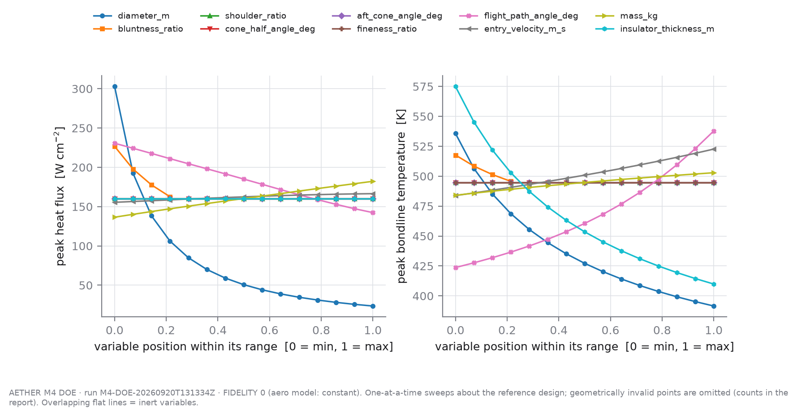
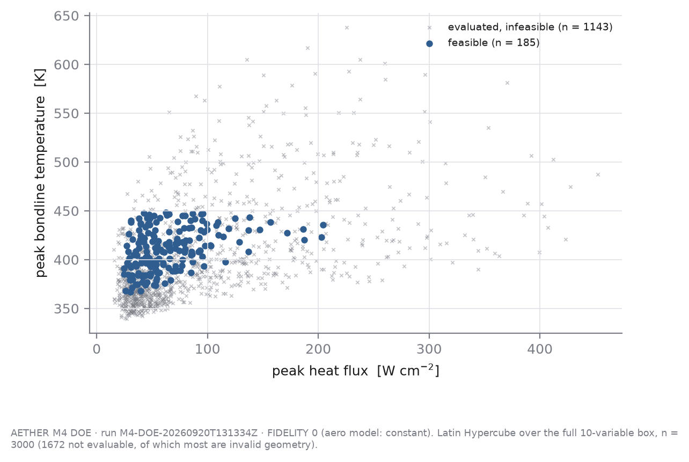
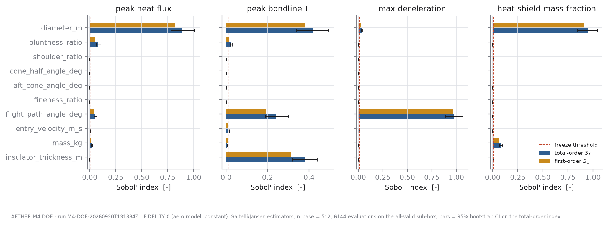
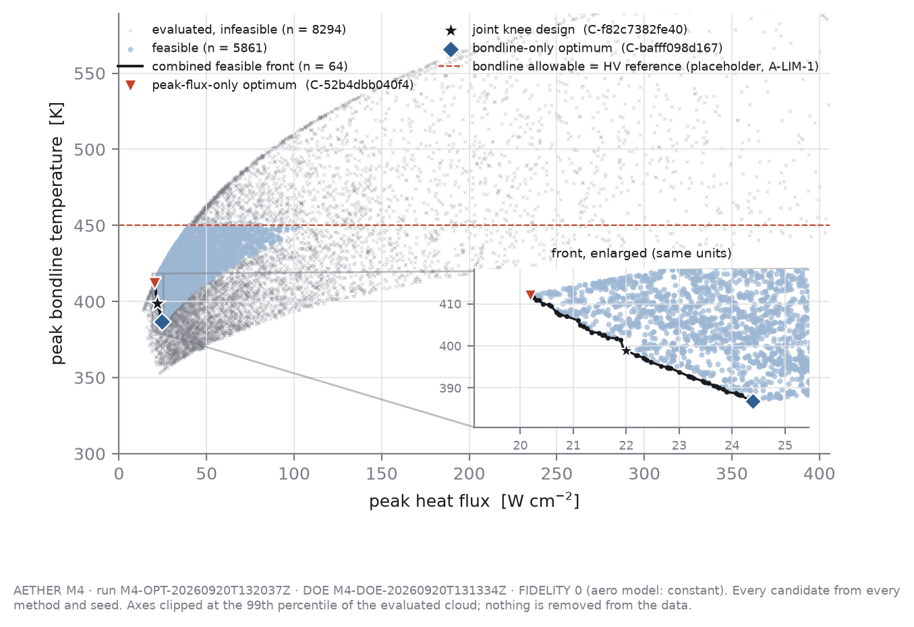
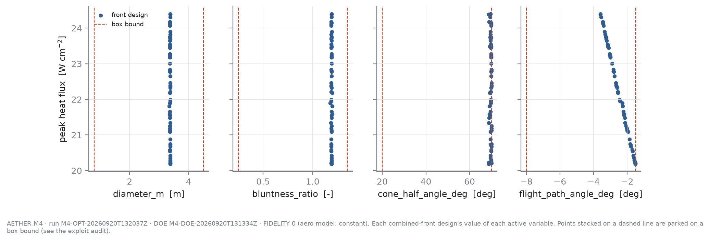

# M4 — DOE, sensitivity and Pareto optimisation (Fidelity 0, ARCHIVED)

> **ARCHIVED 2026-09-21.** This is the Fidelity-0 report exactly as generated from runs `M4-DOE-20260920T131334Z` / `M4-OPT-20260920T132037Z`, kept as history when M4 was re-run at Fidelity 1. Only this banner and the figure paths (now `../figures/M4_fidelity0/`) were changed. It predates the effective-nose-radius correction (NR-15) and the CFD drag surface; its screening and fronts are VOID for the current model. Current report: `M4_pareto_optimisation.md`.

> **fidelity: 0** · aerodynamic model: `constant` · generated file, do not edit by hand
>
> DOE run `M4-DOE-20260920T131334Z` (git `c238735`, dirty tree) · optimisation run `M4-OPT-20260920T132037Z` (git `c238735`, dirty tree)

*Produced from an uncommitted working tree; the config snapshot beside each result is the authoritative record of what ran.*

**Read this first.** Everything below is a Fidelity-0 result: constant drag coefficient, Sutton–Graves stagnation heating, 1-D conduction. No CFD-derived number enters it (the CFD gate G4 was not PASS when this ran). At this fidelity the capsule's *shape* has no aerodynamic consequence at all — only its diameter acts, through the reference area — so the design freedom the optimisers are given is much smaller than the variable list suggests. The pipeline is built so that replacing the drag model is one line of `configs/design_space.yaml` plus `make doe && make optimize`; the numbers here are expected to change when that happens and must not be quoted as final.

## 1. Cost of one evaluation

Measured over 7609 coupled evaluations inside worker processes: median **0.256 s**, mean 0.267 s, 95th percentile 0.379 s, maximum 0.755 s per `evaluate_design` call. With 6 worker processes the DOE sustained 26.6 evaluations/s (9292 evaluations in 350 s). The conduction solve dominates. At this cost a variance-based global sensitivity analysis is affordable, so Sobol' indices were used rather than Morris screening.

## 2. Design space

| variable | role | units | min | max | reference |
|---|---|---|---|---|---|
| `diameter_m` | design | m | 0.8 | 4.5 | 1.2 |
| `bluntness_ratio` | design | - | 0.25 | 1.35 | 0.5 |
| `shoulder_ratio` | design | - | 0.02 | 0.1 | 0.1 |
| `cone_half_angle_deg` | design | deg | 20 | 70 | 25 |
| `aft_cone_angle_deg` | design | deg | 0 | 35 | 20 |
| `fineness_ratio` | design | - | 0.5 | 1.2 | 0.875 |
| `flight_path_angle_deg` | design | deg | -8 | -1.5 | -3 |
| `entry_velocity_m_s` | given | m/s | 7200 | 7800 | 7400 |
| `mass_kg` | given | kg | 250 | 450 | 350 |
| `insulator_thickness_m` | deferred | m | 0.01 | 0.03 | 0.015 |

Geometry is parametrised by diameter plus shape *ratios* (nose radius/D, shoulder radius/D, length/D); the evaluator converts to `CapsuleGeometry` fields and `CapsuleGeometry.validate()` decides validity. `given` variables are mission givens, screened because M7 needs them as uncertainties, never optimised. `deferred` is a real design variable held out of M4 (ASSUMPTIONS A-OPT-2).

## 3. One-at-a-time sweeps

Range of each output over a sweep of one variable across its full range, all others at the reference design. A range of exactly 0 means the model is structurally blind to that variable.

| variable | Δ peak flux [W/m²] | Δ bondline T [K] | Δ max g [g] | Δ shield mass fraction [-] | invalid geometry | feasible |
|---|---|---|---|---|---|---|
| `diameter_m` | 2.793e+06 | 144.2 | 2.23 | 2.283 | 0/15 | 4/15 |
| `bluntness_ratio` | 6.405e+05 | 21.98 | 0 | 0.05517 | 11/15 | 0/15 |
| `shoulder_ratio` | 0 | 0 | 0 | 0.006899 | 0/15 | 0/15 |
| `cone_half_angle_deg` | 0 | 0 | 0 | 0.04659 | 0/15 | 0/15 |
| `aft_cone_angle_deg` | 0 | 0 | 0 | 0 | 0/15 | 0/15 |
| `fineness_ratio` | 0 | 0 | 0 | 0 | 0/15 | 0/15 |
| `flight_path_angle_deg` | 8.826e+05 | 114.1 | 12.51 | 0 | 0/15 | 0/15 |
| `entry_velocity_m_s` | 1.102e+05 | 38.86 | 1.982 | 0 | 0/15 | 0/15 |
| `mass_kg` | 4.567e+05 | 18.82 | 0.7322 | 0.1043 | 0/15 | 0/15 |
| `insulator_thickness_m` | 0 | 165 | 0 | 0.03009 | 0/15 | 7/15 |



## 4. Latin Hypercube over the full box

3000 seeded LHS samples (seed 20260920): **1328** geometrically valid, 1328 evaluated cleanly, **185** feasible. Invalid geometries are recorded as infeasible candidates with `CapsuleGeometry.validate()`'s own message as the failure reason; none was dropped.

Constraint violations among evaluated samples: `max_g` 908, `peak_bondline_temperature_k` 178, `bluntness_ratio` 5, `heatshield_mass_fraction` 482.

Most common failure reasons (numbers masked as #):

- 1606 × invalid geometry: cone_half_angle_deg (# deg) is too small for this nose_radius_m / diamet
- 481 × constraint violated: max_g
- 359 × constraint violated: heatshield_mass_fraction, max_g
- 120 × constraint violated: heatshield_mass_fraction
- 111 × constraint violated: peak_bondline_temperature_k
- 65 × constraint violated: max_g, peak_bondline_temperature_k
- 40 × invalid geometry: aft_cone_angle_deg (# deg) closes the aft body to a point before reachin
- 25 × invalid geometry: length_m (# m) is too short to contain the nose, fore cone and shoulder,

Which variables decide whether a geometry is *valid* (given-data first-order index on the validity indicator, 95% bootstrap CI):

| variable | S₁(validity) | CI |
|---|---|---|
| `bluntness_ratio` | 0.533 | [0.508, 0.567] |
| `cone_half_angle_deg` | 0.138 | [0.123, 0.167] |
| `diameter_m` | 0.010 | [0.008, 0.025] |
| `aft_cone_angle_deg` | 0.009 | [0.009, 0.023] |
| `insulator_thickness_m` | 0.008 | [0.007, 0.022] |
| `shoulder_ratio` | 0.008 | [0.008, 0.023] |
| `flight_path_angle_deg` | 0.007 | [0.007, 0.021] |
| `entry_velocity_m_s` | 0.006 | [0.007, 0.021] |
| `mass_kg` | 0.005 | [0.006, 0.020] |
| `fineness_ratio` | 0.005 | [0.006, 0.020] |



## 5. Global sensitivity (Sobol')

Saltelli design, n_base = 512, 6144 evaluations, Saltelli-2010 first-order and Jansen total-order estimators, percentile-bootstrap 95% confidence intervals. A Saltelli design needs a box in which every point can be evaluated, so it was run on an all-valid sub-box: `bluntness_ratio` ∈ [0.25, 0.9], `cone_half_angle_deg` ∈ [60, 70], `aft_cone_angle_deg` ∈ [0, 20], `fineness_ratio` ∈ [0.6, 1.2]; all other ranges as in §2. Indices are therefore statements about that sub-box. The full box is covered by the LHS analysis above.

**peak_heat_flux_w_m2** [W/m²] — ranked by total-order index

| rank | variable | S_T | 95% CI | S₁ | 95% CI |
|---|---|---|---|---|---|
| 1 | `diameter_m` | 0.8857 | [0.7804, 1.0070] | 0.8189 | [0.6731, 0.9784] |
| 2 | `bluntness_ratio` | 0.0805 | [0.0624, 0.1054] | 0.0537 | [0.0206, 0.0821] |
| 3 | `flight_path_angle_deg` | 0.0536 | [0.0395, 0.0696] | 0.0372 | [0.0143, 0.0628] |
| 4 | `mass_kg` | 0.0194 | [0.0137, 0.0269] | 0.0101 | [-0.0079, 0.0302] |
| 5 | `entry_velocity_m_s` | 0.0056 | [0.0040, 0.0076] | 0.0050 | [-0.0048, 0.0146] |
| 6 | `shoulder_ratio` | 0.0000 | [0.0000, 0.0000] | 0.0000 | [0.0000, 0.0000] |
| 7 | `cone_half_angle_deg` | 0.0000 | [0.0000, 0.0000] | 0.0000 | [0.0000, 0.0000] |
| 8 | `aft_cone_angle_deg` | 0.0000 | [0.0000, 0.0000] | 0.0000 | [0.0000, 0.0000] |
| 9 | `fineness_ratio` | 0.0000 | [0.0000, 0.0000] | 0.0000 | [0.0000, 0.0000] |
| 10 | `insulator_thickness_m` | 0.0000 | [0.0000, 0.0000] | 0.0000 | [0.0000, 0.0000] |

**peak_bondline_temperature_k** [K] — ranked by total-order index

| rank | variable | S_T | 95% CI | S₁ | 95% CI |
|---|---|---|---|---|---|
| 1 | `diameter_m` | 0.4187 | [0.3394, 0.4949] | 0.3776 | [0.3015, 0.4539] |
| 2 | `insulator_thickness_m` | 0.3787 | [0.3214, 0.4383] | 0.3145 | [0.2324, 0.4059] |
| 3 | `flight_path_angle_deg` | 0.2419 | [0.1892, 0.3027] | 0.1938 | [0.1374, 0.2555] |
| 4 | `bluntness_ratio` | 0.0234 | [0.0192, 0.0285] | 0.0155 | [-0.0023, 0.0342] |
| 5 | `entry_velocity_m_s` | 0.0116 | [0.0090, 0.0147] | 0.0070 | [-0.0059, 0.0218] |
| 6 | `mass_kg` | 0.0061 | [0.0051, 0.0073] | 0.0101 | [-0.0001, 0.0202] |
| 7 | `shoulder_ratio` | 0.0000 | [0.0000, 0.0000] | 0.0000 | [0.0000, 0.0000] |
| 8 | `cone_half_angle_deg` | 0.0000 | [0.0000, 0.0000] | 0.0000 | [0.0000, 0.0000] |
| 9 | `aft_cone_angle_deg` | 0.0000 | [0.0000, 0.0000] | 0.0000 | [0.0000, 0.0000] |
| 10 | `fineness_ratio` | 0.0000 | [0.0000, 0.0000] | 0.0000 | [0.0000, 0.0000] |

**max_g** [g] — ranked by total-order index

| rank | variable | S_T | 95% CI | S₁ | 95% CI |
|---|---|---|---|---|---|
| 1 | `flight_path_angle_deg` | 0.9718 | [0.8860, 1.0675] | 0.9675 | [0.8651, 1.0809] |
| 2 | `diameter_m` | 0.0328 | [0.0279, 0.0389] | 0.0246 | [0.0027, 0.0493] |
| 3 | `entry_velocity_m_s` | 0.0075 | [0.0064, 0.0086] | 0.0005 | [-0.0114, 0.0120] |
| 4 | `mass_kg` | 0.0025 | [0.0021, 0.0029] | -0.0007 | [-0.0068, 0.0051] |
| 5 | `bluntness_ratio` | 0.0000 | [0.0000, 0.0000] | 0.0000 | [0.0000, 0.0000] |
| 6 | `shoulder_ratio` | 0.0000 | [0.0000, 0.0000] | 0.0000 | [0.0000, 0.0000] |
| 7 | `cone_half_angle_deg` | 0.0000 | [0.0000, 0.0000] | 0.0000 | [0.0000, 0.0000] |
| 8 | `aft_cone_angle_deg` | 0.0000 | [0.0000, 0.0000] | 0.0000 | [0.0000, 0.0000] |
| 9 | `fineness_ratio` | 0.0000 | [0.0000, 0.0000] | 0.0000 | [0.0000, 0.0000] |
| 10 | `insulator_thickness_m` | 0.0000 | [0.0000, 0.0000] | 0.0000 | [0.0000, 0.0000] |

**heatshield_mass_fraction** [-] — ranked by total-order index

| rank | variable | S_T | 95% CI | S₁ | 95% CI |
|---|---|---|---|---|---|
| 1 | `diameter_m` | 0.9453 | [0.8453, 1.0431] | 0.9105 | [0.7999, 1.0094] |
| 2 | `mass_kg` | 0.0818 | [0.0673, 0.0975] | 0.0684 | [0.0344, 0.1050] |
| 3 | `insulator_thickness_m` | 0.0071 | [0.0059, 0.0085] | 0.0033 | [-0.0065, 0.0139] |
| 4 | `shoulder_ratio` | 0.0040 | [0.0033, 0.0048] | 0.0037 | [-0.0042, 0.0115] |
| 5 | `cone_half_angle_deg` | 0.0005 | [0.0004, 0.0006] | 0.0003 | [-0.0031, 0.0035] |
| 6 | `bluntness_ratio` | 0.0002 | [0.0001, 0.0002] | -0.0002 | [-0.0017, 0.0013] |
| 7 | `aft_cone_angle_deg` | 0.0000 | [0.0000, 0.0000] | 0.0000 | [0.0000, 0.0000] |
| 8 | `fineness_ratio` | 0.0000 | [0.0000, 0.0000] | 0.0000 | [0.0000, 0.0000] |
| 9 | `flight_path_angle_deg` | 0.0000 | [0.0000, 0.0000] | 0.0000 | [0.0000, 0.0000] |
| 10 | `entry_velocity_m_s` | 0.0000 | [0.0000, 0.0000] | 0.0000 | [0.0000, 0.0000] |



## 6. Screening decision

Rule, declared in `configs/design_space.yaml` before the run: a `design` variable is frozen at its reference value iff its total-order upper confidence bound is below 0.01 for every screened output **and** its validity-index upper bound is below 0.03.

| variable | role | decision | max S_T upper bound (output) | validity upper bound | reason |
|---|---|---|---|---|---|
| `diameter_m` | design | **active** | 1.0431 (heatshield_mass_fraction) | 0.025 | total-order index on heatshield_mass_fraction is not below 0.01 |
| `bluntness_ratio` | design | **active** | 0.1054 (peak_heat_flux_w_m2) | 0.567 | total-order index on peak_heat_flux_w_m2 is not below 0.01 |
| `shoulder_ratio` | design | **frozen** | 0.0048 (heatshield_mass_fraction) | 0.023 | total-order upper bound < 0.01 on every output and validity index upper bound < 0.03 |
| `cone_half_angle_deg` | design | **active** | 0.0006 (heatshield_mass_fraction) | 0.167 | moves no objective or constraint, but decides which geometries are valid |
| `aft_cone_angle_deg` | design | **frozen** | 0.0000 (peak_heat_flux_w_m2) | 0.023 | total-order upper bound < 0.01 on every output and validity index upper bound < 0.03 |
| `fineness_ratio` | design | **frozen** | 0.0000 (peak_heat_flux_w_m2) | 0.020 | total-order upper bound < 0.01 on every output and validity index upper bound < 0.03 |
| `flight_path_angle_deg` | design | **active** | 1.0675 (max_g) | 0.021 | total-order index on max_g is not below 0.01 |
| `entry_velocity_m_s` | given | **frozen** | 0.0147 (peak_bondline_temperature_k) | 0.021 | mission given, not a design choice |
| `mass_kg` | given | **frozen** | 0.0975 (heatshield_mass_fraction) | 0.020 | mission given, not a design choice |
| `insulator_thickness_m` | deferred | **frozen** | 0.4383 (peak_bondline_temperature_k) | 0.022 | deferred design variable (A-OPT-2) |

Optimised: `diameter_m`, `bluntness_ratio`, `cone_half_angle_deg`, `flight_path_angle_deg`. Frozen at reference: `shoulder_ratio`, `aft_cone_angle_deg`, `fineness_ratio`, `entry_velocity_m_s`, `mass_kg`, `insulator_thickness_m`.

A shape variable frozen here is frozen **because the Fidelity-0 drag model cannot see it**, not because capsule shape is unimportant. This screening must be re-run, not reused, when the drag model changes.

## 7. Optimisation set-up

Active variables: `diameter_m`, `bluntness_ratio`, `cone_half_angle_deg`, `flight_path_angle_deg`. Objectives, both minimised: peak external heat flux and peak bondline temperature. The third candidate objective of spec §3, a cumulative thermal-penetration metric, was studied and discarded as rank-redundant with the bondline peak (`reports/milestones/TPI_study.md`); integrated external heat load is therefore *reported* on every design but not optimised, since adding a redundant objective only dilutes selection pressure. No weighted single score is formed anywhere.

Every method received exactly **1000 evaluations per seed**, 7 seeds (11, 23, 37, 41, 59, 67, 73), through the same `BudgetedEvaluator`. Accounting: each distinct design costs 1 whether feasible, infeasible or geometrically invalid; a repeated design is served from cache, logged, and costs 0 (ASSUMPTIONS A-OPT-3).

Hypervolume is measured against the fixed reference point (2.5e+06 W/m², 450 K) and normalised by the rectangle down to the ideal point (0 W/m², 300 K). 0 feasible candidates lie outside that rectangle and contribute nothing.

## 8. Method comparison

| method | final HV mean ± s.d. | min – max | feasible found (mean) | front size (mean) | spacing (mean) | budget to 95% of own final HV (median) | cache hits (mean) | wall s/seed (mean) |
|---|---|---|---|---|---|---|---|---|
| `lhs_search` | **0.3010 ± 0.0263** | 0.2569 – 0.3457 | 40 | 2.6 | 0.0143 | 525 | 0.0 | 20 |
| `nsga2` | **0.3773 ± 0.0070** | 0.3661 – 0.3850 | 694 | 23.1 | 0.0076 | 625 | 0.0 | 47 |
| `scalarised_de` | **0.2951 ± 0.0192** | 0.2724 – 0.3241 | 104 | 3.3 | 0.0295 | 375 | 1.0 | 41 |

s.d. is the sample standard deviation over 7 seeds. Combined front of all methods and seeds: 64 designs, normalised hypervolume 0.3851.


## 9. Pareto front and feasible region



## 10. Peak-flux-only optimum versus the joint knee design

All three designs are taken from the combined feasible front. The knee is the front point furthest from the chord joining the front's two extremes in normalised objective space — a definition with no weights in it.

| design | id | peak flux [W/m²] | heat load [J/m²] | peak surface T [K] | peak bondline T [K] | penetration depth [mm] | max g | max q_dyn [Pa] | duration [s] | feasible |
|---|---|---|---|---|---|---|---|---|---|---|
| reference (unoptimised) | `reference` | 1.603e+06 | 1.125e+08 | 2380.8 | 494.8 | 14.31 | 11.89 | 3.008e+04 | 244 | NO |
| peak-flux-only optimum | `C-52b4dbb040f4` | 2.019e+05 | 1.738e+07 | 1377.8 | 412.0 | 12.56 | 9.22 | 2944 | 383 | yes |
| joint knee design | `C-f82c7382fe40` | 2.199e+05 | 1.58e+07 | 1406.4 | 398.9 | 12.44 | 10.27 | 3279 | 335 | yes |
| bondline-only optimum | `C-bafff098d167` | 2.439e+05 | 1.422e+07 | 1441.5 | 386.9 | 12.19 | 11.98 | 3835 | 295 | yes |

Design variables of the selected designs:

| design | `diameter_m` | `bluntness_ratio` | `cone_half_angle_deg` | `flight_path_angle_deg` |
|---|---|---|---|---|
| peak-flux-only optimum | 3.376 | 1.189 | 68.83 | -1.509 |
| joint knee design | 3.377 | 1.188 | 69.71 | -2.452 |
| bondline-only optimum | 3.372 | 1.192 | 69.49 | -3.587 |

What stops each selected design (box bound within 1% of the range, or a constraint within 1% of active):

- **peak-flux-only optimum:** flight_path_angle_deg at its upper box bound -1.5; constraint `bluntness_ratio` active; constraint `heatshield_mass_fraction` active
- **joint knee design:** cone_half_angle_deg at its upper box bound 70; constraint `bluntness_ratio` active; constraint `heatshield_mass_fraction` active
- **bondline-only optimum:** constraint `max_g` active; constraint `bluntness_ratio` active; constraint `heatshield_mass_fraction` active

A design stopped by a *box bound* is an optimum of the box, not of the physics: read it as 'at least this far', not as a located minimum.

Relative to the peak-flux-only optimum, the joint knee design's bondline runs **-13.1 K** and its peak heat flux **+1.804e+04 W/m²**; its integrated heat load differs by -1.578e+06 J/m². Across the whole front the bondline spans 25.1 K and the peak flux 4.207e+04 W/m². These are absolute differences on purpose: a margin *ratio* would be measured against the bondline allowable, which is an unsourced placeholder (A-LIM-1; see the M1b correction in PROJECT_STATUS), so no such ratio is quoted.



## 11. Metric-gaming audit

Performed on the 64 designs of the combined feasible front. The question for each check: is the optimiser winning on physics, or on something the model gets wrong?

| variable | box | front range | parked at lower | parked at upper |
|---|---|---|---|---|
| `diameter_m` | [0.8, 4.5] | [3.345, 3.38] | 0 | 0 |
| `bluntness_ratio` | [0.25, 1.35] | [1.177, 1.198] | 0 | 0 |
| `cone_half_angle_deg` | [20, 70] | [68.75, 70] | 0 | 49 |
| `flight_path_angle_deg` | [-8, -1.5] | [-3.587, -1.509] | 0 | 6 |

| constraint | front designs with margin < 1% | smallest margin |
|---|---|---|
| `max_g` | 3 | 0.0019 |
| `peak_bondline_temperature_k` | 0 | 0.0843 |
| `bluntness_ratio` | 54 | 0.0019 |
| `heatshield_mass_fraction` | 57 | 0.0024 |

Counterfactual — the front the same candidates would give *without* each constraint, and how many of its designs violate that constraint:

| constraint removed | front size | of which violate it | worst margin |
|---|---|---|---|
| `max_g` | 83 | 12 | -0.620 |
| `peak_bondline_temperature_k` | 71 | 0 | 0.084 |
| `bluntness_ratio` | 25 | 17 | -0.049 |
| `heatshield_mass_fraction` | 4 | 4 | -0.776 |

- **Flagged atmosphere (> 86 km, A-ATM-2).** Largest share of any front design's external heat load accumulated there: 0.1960 (audit limit 0.05); 64 designs over.
- **Soak-out truncation (NR-02).** Largest bondline warming rate at the end of the thermal window: -2.13e-02 K/s; 0 front designs were still warming when the window closed.
- **Inert variable parked on a bound.** Where `cone_half_angle_deg` sits at its upper bound this is not a preference for wide cones: at Fidelity 0 the angle changes no objective, and a wide cone is simply the only geometry in which a bluntness ratio near the cap is valid. It will mean something only when C_D depends on shape.
- **Geometry corner cases and mass closure.** See `docs/negative_results.md` for the two exploits the counterfactual rows expose and the constraints added in response; the offending candidates remain in the log as infeasible.

## 12. Limitations

1. **This is Fidelity 0 and will be re-run.** Drag is a constant coefficient, so cone angle, shoulder radius, afterbody angle and length change nothing but geometric validity and wetted area. Any conclusion about *shape* is a conclusion about the drag model's blindness. Once the CFD response surface exists (M3), set `base_overrides.vehicle.aero.model` and re-run `make doe` then `make optimize`; the screening, the fronts, the hypervolumes and this report all regenerate.
2. Heating is stagnation-point Sutton–Graves with `effective_nose_radius_m = nose_radius_m`. For very blunt spherical segments the stagnation velocity gradient is set by the body radius and corner, not the cap radius, so the 1/√R_n benefit saturates; the model does not capture that and is protected only by the placeholder bluntness cap.
3. The constraint limits (12 g, 450 K, bluntness 1.2) and the variable ranges are unsourced engineering placeholders. They decide where the feasible region and therefore the front lies.
4. Vehicle mass is fixed while diameter varies. The heat-shield mass-closure constraint only excludes the impossible (shield heavier than the vehicle); it is not a mass model.
5. TPS thickness was deliberately not optimised: with no mass objective in O1 it is a free improvement and an optimiser would simply park on its upper bound.
6. The scalarised-DE baseline divides its budget equally across its weight sweep, so each weight gets only a handful of generations (see the settings in `configs/design_space.yaml`). Its hypervolume is a statement about that declared configuration under this budget, not about differential evolution in general; the settings were fixed before the run and were not retuned after seeing the result.
7. Hypervolume differences between methods are reported with seed spread and no significance test; with this few seeds, overlapping ranges mean *no measured difference*. The model predicts these fronts within the tested assumptions; nothing here is a statement about a real vehicle.

## Reproduce

```
make doe        # a few minutes on 6 cores
make optimize   # uses the latest DOE's screening.json
```
