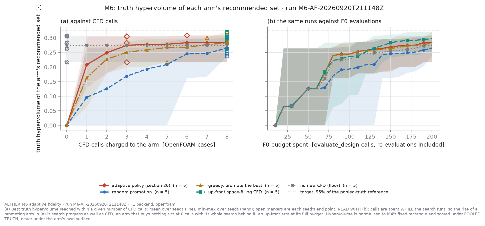
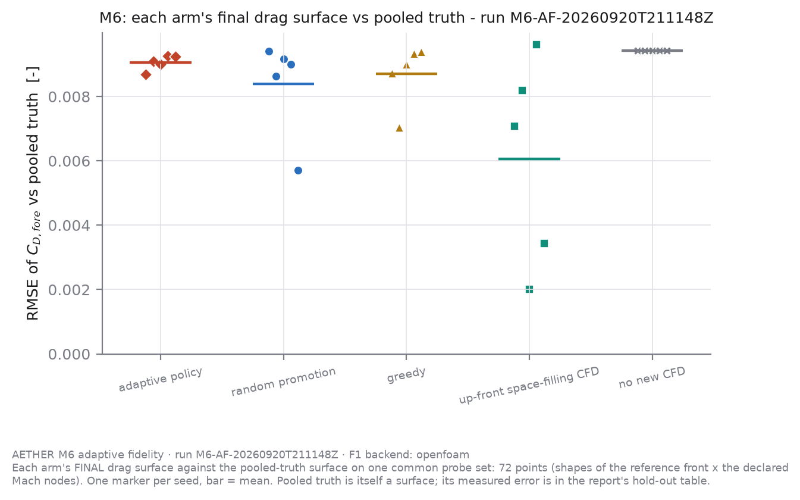

# M6 - Adaptive-fidelity optimisation: who should get the next CFD case?

*Generated by `scripts/run_adaptive_fidelity.py` from `results/M6/M6-AF-20260920T211148Z/`. Every number and every interpretive sentence below is computed from that run's files; the generator contains no pre-written finding.*

**Read this first. H2 verdict, as pre-declared: NOT_SUPPORTED** at 95% of the reference hypervolume (target 0.3264) - 'adaptive' reached the target in 0 seeds (needs 3); no arm reached it. Declared in the config and NOT run in this invocation: `ai_adaptive` (LLM calls made: 0). That is the LLM-guided arm, so **H2's "AI-guided" clause is untested by this study**; the arm is exploratory and outside the declared criterion, so the verdict above does not depend on it. **Reachability (a sizing flaw of this study, NR-35).** Every truly feasible design of all 25 arm-seeds pooled - 5000 F0 evaluations - reaches 0.3234 = 94.1% of the reference (0.3436, set by 2 x 1000-evaluation searches on the truth surface), which is below the 95% target; the best single arm-seed (`greedy`) reached 0.3217 = 93.6%. At 200 F0 evaluations per arm-seed the target was therefore beyond what the searches as run could reach, singly or pooled, so a saving in CFD calls could not have shown up in this criterion. The config's sizing checked statistical power and machine time, not reachability. The criterion is applied as written and is not re-scored.

*Hand-written companion for this run (what the verdict means, where each arm spent its CFD, failed cases, figure check): `M6_addendum_posthoc.md`. It is not generated and nothing in it overrides a number here.*

Run `M6-AF-20260920T211148Z` · git `bf4f9a3` (dirty tree) · evaluator source hash `c0a44bb0c14acd88` (re-checked after every logged batch, NR-18) · F1 backend `openfoam` · mesh level `coarse` · active variables ['diameter_m', 'bluntness_ratio', 'cone_half_angle_deg', 'flight_path_angle_deg'] (screening of M4-DOE-20260920T204844Z).

## 1. What was compared

F0 is `evaluate_design` with the arm's current GP drag surface. F1 is an OpenFOAM case for the candidate's forebody shape through M3's design-point runner, unchanged; a usable case joins the arm's training set, the surface is refitted and the candidate is re-evaluated; a case that fails M2's convergence criterion is kept, costs a call and yields no training point. Every arm starts every seed from the same surface (`b63b68a40321f38b`, 69 CFD points) and the same seeded initial population, with 200 F0 evaluations and 8 CFD calls.

| arm | promotion strategy | search | seeds | CFD budget |
|---|---|---|---|---|
| `adaptive` | adaptive | nsga2 | [37, 41, 59, 67, 73] | 8 |
| `random` | random | nsga2 | [37, 41, 59, 67, 73] | 8 |
| `greedy` | greedy | nsga2 | [37, 41, 59, 67, 73] | 8 |
| `upfront` | upfront | nsga2 | [37, 41, 59, 67, 73] | 8 |
| `f0_only` | none | nsga2 | [37, 41, 59, 67, 73] | 0 |

## 2. How every arm was scored

On POOLED TRUTH: one surface through the 69 starting points plus the 109 usable CFD points bought by any arm on any seed (`2388ddadb3245989`). An arm's score is the truth hypervolume of its RECOMMENDED set - the designs its own final belief calls feasible and non-dominated - with recommended designs that are infeasible under truth dropped. The reference hypervolume is **0.3436**: every truly feasible design of every arm (0.3234 on their own) plus a dedicated NSGA-II search on the truth surface (0.3436 on its own); 2467 distinct designs were re-scored. The reasoning, and the metric-gaming routes this closes, are in the docstring of `src/aether/optimization/adaptive_analysis.py` and in ASSUMPTIONS A-AF-7..A-AF-9.

## 3. Result against the pre-declared H2 criterion

Declared before the run (`configs/adaptive_fidelity.yaml`): subject `adaptive`, comparators ['random', 'greedy', 'upfront'], no-CFD arm `f0_only`, target 95% of the reference, at least 3 seeds reaching it, alpha = 0.05.

**Verdict at 95% of the reference hypervolume (target 0.3264): NOT_SUPPORTED** - 'adaptive' reached the target in 0 seeds (needs 3); no arm reached it.

Seeds reaching the target: `adaptive` 0 of 5, `random` 0 of 5, `greedy` 0 of 5, `upfront` 0 of 5, `f0_only` 0 of 5.

Median CFD calls charged when the target was first reached (an arm-seed that never reached it counts as 9): `adaptive` 9.0, `random` 9.0, `greedy` 9.0, `upfront` 9.0, `f0_only` 9.0.

Sensitivity to the target (reported, NOT the criterion): 90% -> NOT_SUPPORTED; 98% -> NOT_SUPPORTED.

Power: 5 seeds per arm. CFD-call counts are small integers with many ties, so the rank test rejects only when the samples barely overlap; a 'no measured difference' here is weak evidence of equivalence.



## 4. Scores, and what is needed to audit them

| arm | truth HV (mean ± sd) | min-max | belief HV | optimism gap | oracle HV | selection regret | false claims | CFD calls | failed calls |
|---|---|---|---|---|---|---|---|---|---|
| `adaptive` | 0.2835 ± 0.0389 | 0.2165-0.3088 | 0.2833 | -0.0002 | 0.2835 | +0.0000 | 0.0 | 3.6 | 0.4 |
| `random` | 0.2652 ± 0.0254 | 0.2380-0.2995 | 0.2648 | -0.0004 | 0.2652 | +0.0000 | 0.0 | 8.0 | 0.8 |
| `greedy` | 0.2823 ± 0.0395 | 0.2165-0.3217 | 0.2821 | -0.0002 | 0.2823 | +0.0000 | 0.0 | 7.2 | 0.8 |
| `upfront` | 0.2972 ± 0.0262 | 0.2542-0.3195 | 0.2969 | -0.0003 | 0.2972 | +0.0000 | 0.0 | 8.0 | 0.6 |
| `f0_only` | 0.2754 ± 0.0375 | 0.2168-0.3080 | 0.2753 | -0.0000 | 0.2754 | +0.0000 | 0.0 | 0.0 | 0.0 |

`belief HV` is what the arm's own surface says about its recommended set; `optimism gap` = belief - truth for the same designs; `oracle HV` scores EVERY design the arm paid for under truth (what perfect selection would have delivered); `false claims` are recommended designs that pooled truth calls infeasible.

Largest mean optimism gap in magnitude: `random` (-0.0004). A non-positive gap means the arm's own surface did not flatter it.

Final truth hypervolume, `adaptive` against each other arm on the same seeds (paired):

| comparator | mean difference | A12 | seeds where subject is better | rank test p (subject greater) |
|---|---|---|---|---|
| `random` | +0.0183 | 0.76 | 4 of 5 | 0.1111 |
| `greedy` | +0.0012 | 0.54 | 2 of 5 | 0.4484 |
| `upfront` | -0.0137 | 0.40 | 2 of 5 | 0.7262 |
| `f0_only` | +0.0081 | 0.52 | 1 of 5 | 0.5000 |

## 5. The hull: designs an arm could not see

| arm | hull-rejected at the end (mean/seed) | share of F0 budget | of those truly feasible | of those on the reference front | surface versions |
|---|---|---|---|---|---|
| `adaptive` | 0.0 | 0.000 | 0.0 | 0.0 | 2.8 |
| `random` | 0.0 | 0.000 | 0.0 | 0.0 | 7.2 |
| `greedy` | 0.0 | 0.000 | 0.0 | 0.0 | 6.0 |
| `upfront` | 0.0 | 0.000 | 0.0 | 0.0 | 1.0 |
| `f0_only` | 0.0 | 0.000 | 0.0 | 0.0 | 0.0 |

A design refused by an arm's hull and later made evaluable by a hull extension is not counted as lost. Pooled truth's hull contains every arm's hull, so these designs were scored; an arm simply never learnt their value.

## 6. Budgets, exactly

| arm | F0 evaluations | of which re-evaluations | probes (uncharged) | cache hits | CFD calls / budget | free repeat requests | CFD wall [s] |
|---|---|---|---|---|---|---|---|
| `adaptive` | 200 | 6.4 | 53.2 | 0.0 | 3.6 / 8 | 0.0 | 2108 |
| `random` | 200 | 20.6 | 0.0 | 0.0 | 8.0 / 8 | 0.0 | 2335 |
| `greedy` | 200 | 14.2 | 0.0 | 0.0 | 7.2 / 8 | 0.0 | 2950 |
| `upfront` | 200 | 0.0 | 0.0 | 0.0 | 8.0 / 8 | 0.0 | 2299 |
| `f0_only` | 200 | 0.0 | 0.0 | 0.0 | 0.0 / 0 | 0.0 | 0 |

CFD cases: 134 calls charged across all arms, 125 cases actually run in this invocation (0 imported from an earlier run, 114 of 125 in the store usable); at most 3 serial solvers side by side (peak observed: 3); median case wall time 156 s, sum 10.65 core-hours. LLM calls: 0.


## 7. How good is 'truth'?

| arm | final-surface RMSE vs truth (C_D,fore) | truth sigma at the arm's recommended shapes, Mach max |
|---|---|---|
| `adaptive` | 0.0091 | 0.0045 |
| `random` | 0.0084 | 0.0047 |
| `greedy` | 0.0087 | 0.0043 |
| `upfront` | 0.0061 | 0.0047 |
| `f0_only` | 0.0094 | 0.0043 |

Hold-out CFD cases - fitted by NO surface, charged to nobody - at the recommended design of each arm that lies farthest from every truth training point:

| arm | case | usable | C_D,fore CFD | truth surface | error | rel. error [%] | z |
|---|---|---|---|---|---|---|---|
| `adaptive` | M27_b0.744317_c69.7463_s0.1 | True | 1.3704 | 1.3698 | -0.0005 | -0.04 | -0.08 |
| `random` | M27_b0.786484_c69.9242_s0.1 | True | 1.3687 | 1.3698 | +0.0011 | +0.08 | +0.15 |
| `greedy` | M27_b0.795413_c63.6612_s0.1 | True | 1.3507 | 1.3546 | +0.0039 | +0.29 | +0.88 |
| `upfront` | M27_b0.984134_c64.3184_s0.1 | True | 1.3511 | 1.3545 | +0.0034 | +0.25 | +0.40 |
| `f0_only` | M27_b0.721762_c65.4967_s0.1 | True | 1.3587 | 1.3625 | +0.0038 | +0.28 | +0.84 |

Largest hold-out error of the truth surface: 0.29% of C_D,fore over 5 usable cases. That is the measured size of the gap between 'pooled truth' and CFD where the arms make their claims; it is not a bound.



## 8. Limits

- Pooled truth is a GP through CFD, not CFD, and the CFD is inviscid perfect-gas at zero angle of attack on the surface's mesh level (M3 report section 11). 'Truth' means best-known drag model, nothing more.
- Belief is the latest LOGGED value of each design. Designs an arm evaluated early and never revisited keep the value of an older surface; only the promoted design and the believed front are refreshed (and charged) after a refit. This penalises promoting arms, the subject included.
- NSGA-II's internal population is not re-scored after a refit.
- Probes are `evaluate_design` calls that are counted but not charged (A-AF-5).
- The sigma inflation factor is M3's and is not re-measured after a refit (A-AF-6).
- `ai_adaptive` (LLM-guided search, exploratory, outside the criterion) was NOT run in this invocation: nothing in this report is evidence about it.

## 9. Reproduce

```
make adaptive                          # the study: hours, OpenFOAM, gate G4 PASS
make adaptive-report RUN_ID=M6-AF-20260920T211148Z   # rebuild figures + report only
```
